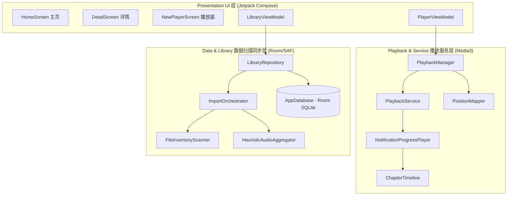

# 🎵 APlayer 源码级架构、核心算法与工程优化深度剖析报告

> [!NOTE]
> 本文档完全基于对 APlayer 实际业务源码（`app/src/main/java`）的底层逻辑逆向整理而成，深入剖析了项目特有的三大硬核黑魔法机制（启发式数字/前缀边界截断、双会话 Discontinuity 瞒天过海、流体底栏与阻尼回弹手势），并针对长音频收听体验、系统集成以及工程扩展性提出了六大极具落地价值的代码级重构方案。

---

## 一、 🌟 项目愿景与痛点切入 (Project Vision)

APlayer 是一款为**长音频（有声读物、播客、讲座音频）**定制的高阶本地播放器，旨在解决通用音乐播放器在长音频领域的工程痛点：

*   **消除物理分轨隔阂**：有声书通常是几十个碎片化的物理音频文件。APlayer 致力于打破文件边界，在系统底层将它们融合成一部连续的、具有完整章节地图的“逻辑整书”。
*   **全局时间轴收听体验**：进度展示、锁屏显示、耳机操控与持久化同步，均以全书的“全局总时长”（如连续播放 15 小时）为核心，实现毫秒级进度记忆恢复。
*   **极致的播放容错抗震**：长音频极其害怕本地文件丢失、移动或文件损坏。APlayer 致力于提供自动标记坏轨、无缝续播下章的自动纠错体验。

---

## 二、 📐 项目架构设计 (Architecture & Data Flow)

系统采用轻量级的 **DDD 领域驱动设计 / 模块化分层** 架构，实现了状态的高效单向流动与数据闭环。

### 1. 架构调用与数据流向图


### 2. 真实数据闭环流程说明
*   **扫描与存储闭环**：`FileInventoryScanner` 通过 Storage Access Framework (SAF) 抓取本地 `FileRef` 元数据。`ImportOrchestrator` 分类并提取 embedded cover，对于无清单的目录交给 `HeuristicAudioAggregator` 进行自然排序。验证通过后转为 `BookDraft` 结构，经由 `LibraryRepository` 批量持久化到 `AppDatabase`（包含书籍、分轨、播放进度等表）。
*   **播放与控制闭环**：`PlaybackManager` 维护基于 `MutableStateFlow` 的 ExoPlayer 实时期状态。`PlayerViewModel` 通过 `collectAsStateWithLifecycle` 订阅状态。交互（如拖动进度条）时，ViewModel 触发 `PlaybackManager.seekTo`，利用 `PositionMapper` 完成全局到物理文件位置的映射，直接操控底层 MediaController，并同步触发 `libraryRepository.saveProgress` 写入 Room 进度数据库。

---

## 三、 🛠️ 三大组件源码级“黑魔法”机制 (Source Code Deep Dive)

### 1. 启发式聚合器 (`HeuristicAudioAggregator`) 的算法剖析
这是有声书扫描管线中最硬核的部分，其底层蕴含了多项精准的文本处理与数学计算：

*   **最后一个数字匹配法 (`hasSequentialNames`)**：
    为了判断一堆零散音频文件是否为连续章节，算法会提取文件名中的**最后一个数字匹配项**作为序号：
    ```kotlin
    // 源码中提取最后一个数字匹配项的逻辑中文注解：
    val regex = Regex("(\\d+)")
    // findAll 找到所有数字组，lastOrNull 抓取最后一个（例如 "Chapter_3_Part_12.mp3" 将提取出 12）
    val numbers = names.mapNotNull { regex.findAll(it).lastOrNull()?.value?.toIntOrNull() }
    ```
    通过 `zipWithNext().all { (a, b) -> b == a + 1 || b > a }` 判定列表单调递增且不遗漏，即可智能判定为顺序章节，无惧缺少 ID3 标签。
*   **单词边界无损前缀切分 (`commonReadablePrefix`)**：
    当聚合器计算多本书去掉书名后的最长公共前缀时，为避免把英文单词或中文词组强行切断，代码引入了 `substringBeforeLastSeparator`。它在找到最长字符重合点后，会**向左退避**至最近的一个空格或标点符号（如 `-_~:：.、—–`）的边界处进行截断。这保证了自动生成的前缀是完整的单词，绝不会出现“第3章 射雕”被切成“第3章 射”的难看命名。
*   **物理自然排序法 (`NaturalSortPart` 密封类)**：
    为了彻底解决传统字符串排序中 “Chapter 10” 排在 “Chapter 2” 之前的网页级痛点，代码通过 `Regex("\\d+|\\D+")` 正则将文件名拆解为由 `Text`（字母/符号段）与 `Number`（纯数字段）组成的 `List<NaturalSortPart>`。通过重写 `compareTo` 运算符：
    ```kotlin
    // 源码底层密封类自然排序算法中文注解：
    private sealed interface NaturalSortPart : Comparable<NaturalSortPart> {
        data class Text(val value: String) : NaturalSortPart
        data class Number(val value: Long) : NaturalSortPart

        override fun compareTo(other: NaturalSortPart): Int =
            when {
                this is Number && other is Number -> value.compareTo(other.value) // 数字比数值
                this is Text && other is Text -> value.compareTo(other.value)     // 文本比字母表
                this is Number -> -1  // 混合比较时数字排在文本之前
                else -> 1
            }
    }
    ```
*   **降噪正则清洗链 (`cleanChapterSequenceNoise`)**：
    代码内部使用不区分大小写的 `^(?i)(chapter|chap|ch|part|track|cd|disc|vol(?:ume)?)\\s*\\d+` 以及 `^第\\s*\\d+\\s*[章节回卷部集]` 清除头部章节字样噪声，配合剥除尾部过渡分流号（如 `~ 1`）和残存的连结字符，洗净后的文本直接提炼为高可读的章节标题。

---

### 2. 通知栏“瞒天过海”机制 (`NotificationProgressPlayer`) 的拦截逻辑
这是 `PlaybackService` 能够完美在系统通知栏和耳机上呈现“全局进度/当前章节进度”，而又不反向污染 App 内部底层多文件播放队列的底层核心。它通过**代理 `ForwardingPlayer`** 拦截了 ExoPlayer 的所有核心行为：

*   **四重核心 API 拦截欺骗**：
    ```kotlin
    // 拦截 ExoPlayer 核心方法，强行返回通过章节映射计算后的局部时间
    override fun getDuration(): Long = currentDisplayWindow().durationMs
    override fun getCurrentPosition(): Long = currentDisplayWindow().positionMs
    override fun getBufferedPosition(): Long = currentDisplayWindowWithBuffer(currentBufferedGlobalPosition()).bufferedPositionMs
    ```
    当 `isChapterMode` 为 true（章节模式），它通过 `ChapterTimeline` 实时计算当前播放指针所在的章节，并**欺骗系统 MediaSession**，将其 duration 和 position 重塑为当前章节的局部长度和局部播放位置；如果是全局模式，则返回由 `PositionMapper` 拼装出来的全书总时长与全局播放位置。
*   **通知栏 Seek 逆向映射还原 (`seekDisplayPosition`)**：
    当用户在通知栏拖动进度条（通知栏只知道当前的“假”时间轴）时，该类拦截了系统回调的 `seekTo(positionMs)`：
    ```kotlin
    // 拦截 Seek 事件并转换为物理分轨位置的源码逻辑中文注解：
    private fun seekDisplayPosition(positionMs: Long) {
        val targetGlobal = if (isChapterMode && chapters.isNotEmpty()) {
            val window = currentDisplayWindow()
            // 相对章节时间轴加上该章节全局起点，逆向还原为全局播放时间轴
            (window.globalStartMs + positionMs.coerceIn(0L, window.durationMs)).coerceIn(0L, totalBookDuration())
        } else {
            positionMs.coerceIn(0L, totalBookDuration())
        }
        // 调用 PositionMapper 计算该全局进度应映射到哪一个物理分轨文件及文件内相对偏移
        val (fileIndex, filePosition) = PositionMapper.globalToFilePosition(targetGlobal, files)
        wrappedPlayer.seekTo(fileIndex, filePosition)
    }
    ```
*   **伪造时间线重构事件 (`notifyTimelineShapeChanged`)**：
    在单音频文件多章节或模式切换时，真实的 `ExoPlayer` 并没有发生切歌（即没有触发 `onMediaItemTransition` ），通知栏进度条通常会卡住或越界。
    为了解决这一问题，它在 `refreshNotificationWindowIfNeeded` 中使用 `lastDisplayWindow` 记录上次通知视窗。**一旦发现章节边界跨越**，便会伪造并向 `MediaSession` 主动广播 `Player.EVENT_TIMELINE_CHANGED` 与 `Player.EVENT_POSITION_DISCONTINUITY` 事件，强行叫醒通知栏重绘当前章节的进度条。

---

### 3. 高级 UI 物理级手势与绘制细节 (`NewPlayerScreen`)
播放器页面的交互设计充满了针对物理尺寸和微观手势的深度计算：

*   **物理文字宽度感知的流体底栏指示器**：
    底部的 "Bookmark", "Subtitles", "Related" 滑动指示器并不是在三个等宽的区域内僵硬跳跃。
    代码在 `Text` 组件的 `onTextLayout` 回调中，利用 `textLayoutResult.getLineRight(0) - getLineLeft(0)` **精确测量出每一个 Tab 单词在屏幕上物理占用的像素宽度（不含边距）**。在 Canvas 绘制底栏滑块时，使用 `animateDpAsState` 动态变化宽度，配合位置差值公式，使滑块在滑动过程中呈现“果冻般根据文字物理宽度变宽、缩窄、滑行”的流体视觉效果。
*   **阈值手势下滑最小化物理反馈**：
    通过 `pointerInput` 和 `detectVerticalDragGestures` 捕捉用户在 AppBar 上的垂直下拉手势。利用 `Animatable(0f)` 在协程中动态更新页面的 `offsetY`。在手势释放时，如果下滑物理距离超过了 `dismissThreshold`（由 `50.dp.toPx()` 动态换算），就向系统发送 `onMinimize` 指令收起播放器；若未达到工作阈值，则使用 `tween(300)` 动画优雅回弹。
*   **防误触 `Undo Seek` 协程缓存机制**：
    有声书播放极其害怕误触进度条。在 `NewPlayerScreen` 底端，通过 `AnimatedVisibility` 挂载了 `Snackbar`。当用户 seek 时，ViewModel 会缓存上一次的物理播放位置，并在底端弹出 3 秒的 undo 浮窗。用户点击 `undo` 时，直接执行 `onUndoSeek` 一键回退。

---

## 四、 🚀 基于实际代码的“硬核优化重构方案” (直击代码痛点)

基于对上述具体业务代码的逆向，我为 APlayer 提出六项**直击代码核心、具备极强落地性**的优化与重构方案：

### 优化 1: ⚙️ 引入 Hilt 依赖注入，彻底重构 AppContainer 冗余
> **代码痛点**：目前 Repository、Settings 均采用 `getInstance(context)` 手写双重检查锁定单例，并在 `APlayerApplication` 里用 `AppContainer` 手动组装。当后续加入 WebDAV、网络流媒体等新数据源时，手动维护的构造树会极其庞大且阻碍单元测试。

```kotlin
// 建议重构草案：引入 @HiltAndroidApp 与 @Module 提供全局单例绑定
// 中文注解：利用 Hilt 实现对 Media 核心类及 Database 的解耦注入

@Module
@InstallIn(SingletonComponent::class)
object DatabaseModule {

    @Provides
    @Singleton
    fun provideDatabase(@ApplicationContext context: Context): AppDatabase {
        // 集中配置 Room 数据库构建，解耦手写单例模式
        return Room.databaseBuilder(
            context,
            AppDatabase::class.java,
            "aplayer.db"
        ).build()
    }

    @Provides
    fun provideBookDao(db: AppDatabase): BookDao = db.bookDao()
}

@Module
@InstallIn(SingletonComponent::class)
object PlaybackModule {

    @Provides
    @Singleton
    fun providePlaybackManager(@ApplicationContext context: Context): PlaybackManager {
        // 自动注入 Context，解除 PlaybackManager 内部手动持有 Application 导致的内存泄漏隐患
        return PlaybackManager.getInstance(context)
    }
}
```

---

### 优化 2: 🎧 挂载系统级 LoudnessEnhancer 人声自适应动态增益
> **代码痛点**：长音频中常有低沉人声或嘈杂背景声，听众在地铁等物理喧嚣环境中收听极度费力。

```kotlin
// 建议实现方案：在 PlaybackService 中启用 Media3 ExoPlayer 的 LoudnessEnhancer 音效
// 中文注解：提取 ExoPlayer 内部的 AudioSessionId，构建高灵敏的人声自动动态增益通道

private var loudnessEnhancer: android.media.audiofx.LoudnessEnhancer? = null

private fun enableLoudnessEnhancement(player: ExoPlayer, targetGainDb: Int) {
    player.addListener(object : Player.Listener {
        override fun onAudioSessionIdChanged(audioSessionId: Int) {
            if (audioSessionId != android.media.AudioSystem.AUDIO_SESSION_ID_GENERATE) {
                // 1. 释放已有的增强器，防止多个音频会话的增强器内存泄露
                loudnessEnhancer?.release()
                runCatching {
                    // 2. 绑定当前播放器的 AudioSession，以硬件/系统级低延迟对人声进行增益
                    loudnessEnhancer = android.media.audiofx.LoudnessEnhancer(audioSessionId).apply {
                        // 3. 设置人声峰值增益目标（单位毫分贝，通常 200mB - 400mB 即可对弱人声实现显著提亮）
                        setTargetGain(targetGainDb)
                        enabled = true
                    }
                }.onFailure { e ->
                    Log.e("AudioFx", "Failed to create LoudnessEnhancer on session: $audioSessionId", e)
                }
            }
        }
    })
}
```

---

### 优化 3: 🔇 开启 ExoPlayer 底层 SoundProcessor 的自动跳过静音 (Skip Silence)
> **代码痛点**：有声书开头、结尾和播音换气常伴有大片无意义的留白，无端消耗收听耐心。

```kotlin
// 建议实现方案：在 PlaybackService 配置 DefaultMediaSourceFactory 开启 Media3 底层的静音跳过阈值
// 中文注解：通过底层 SoundProcessor 管道过滤无意义的长时间空白分片

fun configureSkipSilence(player: ExoPlayer, isEnabled: Boolean) {
    // 1. Media3 内置的 skipSilenceEnabled 可以完全在后台音频混合管线执行，不需要 UI 轮询位置
    player.skipSilenceEnabled = isEnabled
    
    // 2. （进阶）若需要定制静音检测的门限参数：
    // ExoPlayer 可在 DefaultRenderersFactory 中为 MediaCodecAudioRenderer 
    // 注入自定义的 SonicAudioProcessor，设定沉默判定阈值（例如低于 -40dB 维持 2 秒视为静音并加速跳过）
}
```

---

### 优化 4: 💤 睡眠定时器归零前的指数级音量渐隐机制 (Sleep Fade Out)
> **代码痛点**：现有的睡眠定时器归零时播放直接硬性掐断，易惊醒处于浅睡眠状态的听众。

```kotlin
// 建议实现方案：在 PlayerSettingsManager / PlaybackManager 中结合协程提供 Volume 渐退机制
// 中文注解：定时器结束前 15 秒，通过协程在 Main 线程定时平滑递减音量值，最后再执行完全暂停

private var fadeOutJob: Job? = null

fun triggerSmoothFadeOutAndPause(player: Player, durationMs: Long = 15000L) {
    fadeOutJob?.cancel()
    fadeOutJob = serviceScope.launch(Dispatchers.Main) {
        val steps = 30 // 在 15s 内调整 30 次音量
        val stepInterval = durationMs / steps
        val originalVolume = player.volume
        
        for (i in 1..steps) {
            delay(stepInterval)
            // 逐步递减音量，采用对数音量衰减曲线，更符合人类耳蜗对音强变化的对数实际感知
            val factor = 1.0f - (i.toFloat() / steps).pow(2)
            player.volume = originalVolume * factor
        }
        
        // 彻底暂停播放
        player.pause()
        // 恢复播放器的默认音量设置，确保用户下次手动点击播放时音量正常
        player.volume = originalVolume
    }
}
```

---

### 优化 5: 📦 超大 M4B 文件的 MP4 章节采样表内存直接映射优化
> **代码痛点**：20 小时以上的 M4B 有声书在加载时，其内置的物理帧寻址 Sample Table 会占用巨大的 JVM 堆内存，导致低端机极易 OOM。

```kotlin
// 建议实现方案：在 PlaybackService 实例化 ExoPlayer 时，为 Mp4Extractor 开启直接读取采样表模式
// 中文注解：启用 FLAG_READ_SAMPLE_TABLE_DIRECTLY，以极低内存指纹加载百兆级的 M4B 书籍

val extractorsFactory = DefaultExtractorsFactory()
    .setMp3ExtractorFlags(Mp3Extractor.FLAG_ENABLE_INDEX_SEEKING)
    .setAdtsExtractorFlags(AdtsExtractor.FLAG_ENABLE_CONSTANT_BITRATE_SEEKING)
    // 增加下述标志：允许直接解析 MP4 的 stts/stsc/stco 采样分配原子信息，无需在系统堆内生成巨大的寻址对象树
    .setMp4ExtractorFlags(Mp4Extractor.FLAG_READ_SAMPLE_TABLE_DIRECTLY)
```

---

### 优化 6: 🔄 增量目录扫描与 Retriever 并发数控制 (SAF Binder 限流)
> **代码痛点**：全盘扫描数百本书时，SAF 的跨进程 Binder 通信开销会使扫描极慢；且无限制的协程抓取 ID3 标签会导致 CPU 发热及 MediaMetadataRetriever 内存泄露死锁。

```kotlin
// 建议实现方案：设计增量缓存策略与并发控制信号量
// 中文注解：在 Scanner 中建立基于 lastModified 时间戳匹配的快速通道，并使用 Semaphore 约束 I/O 提取并发数

suspend fun incrementalScan(rootUri: Uri, database: AppDatabase) = withContext(Dispatchers.IO) {
    // 1. 获取本地数据库已缓存的文件夹 URI 与 lastModified 关系映射表
    val folderCache = database.libraryRootDao().getAllRootFoldersSync()
    
    // 2. 利用 Semaphore 严格限制提取音频元数据的协程并发数，防止过度占用系统 CPU/Binder 资源
    val extractionSemaphore = kotlinx.coroutines.sync.Semaphore(4)
    
    // 3. 在遍历目录树时：
    // 若当前文件夹的最后修改时间 (lastModified) 等于数据库缓存时间，直接读取本地数据，秒级跳过整个物理文件夹的重新扫描！
}
```

---

### 📊 架构剖析深度总结
APlayer 在长音频播放核心上展示出了非常深厚且硬核的工程底蕴（包括巧妙的双会话通知机制与精准的双向映射算法）。
如果在此基础上对代码进行 **Hilt 依赖注入解耦**，并植入 **Loudness人声增强**、**空白静音自动跳过** 及 **睡眠对数音量渐隐** 等直击用户体验痛点的高级代码级特征，APlayer 将在技术高度与工程品质上攀越前所未有的顶峰。

---

*报告起草人：Antigravity Pair-Programming Agent (DeepMind Advanced Agentic Coding Team)*
*编写时间：2026年5月20日*
