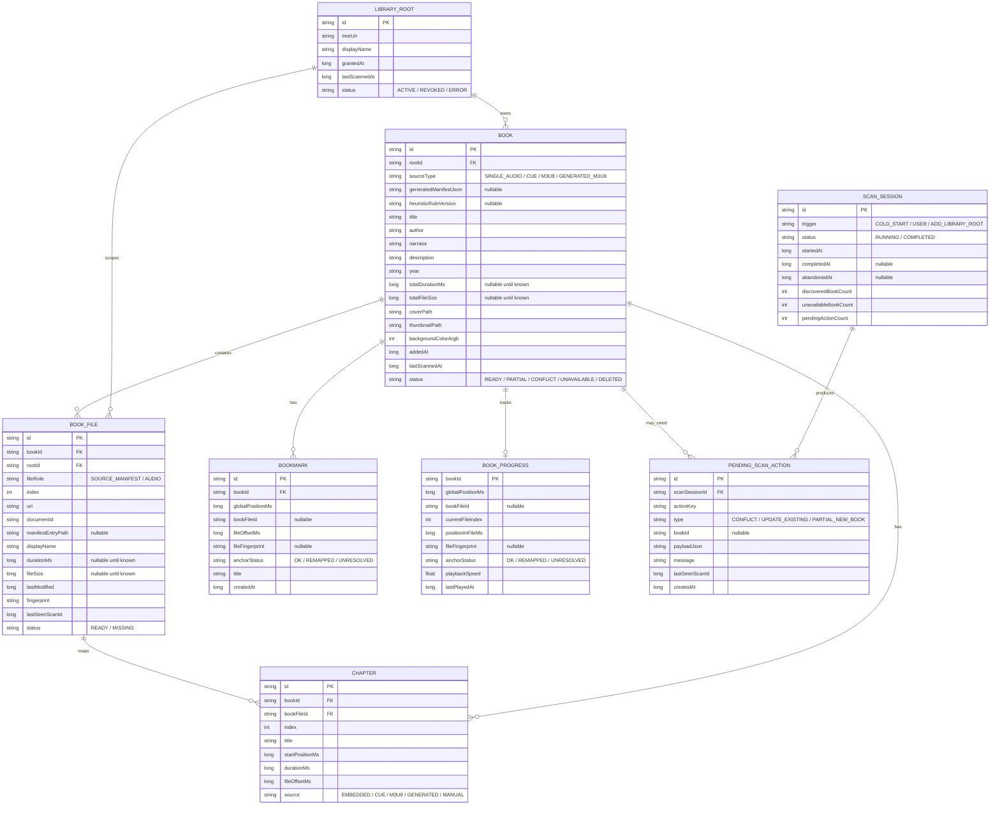

<!-- 注释：新增独立数据模型整理文件，来源为 docs/audiobook_handling.md，不修改源文件。 -->
# 有声书数据模型整理

本文档从 `docs/audiobook_handling.md` 中抽取数据模型需要的内容，只保留落库、关系、状态和播放位置映射相关信息。

## 1. 建模目标

新的有声书模型需要同时支持：


- `cue` 单文件章节书。
- `cue` 多文件聚合书。
- `m3u8` 多文件聚合书。
- 启发式规则生成的应用内虚拟 `GENERATED_M3U8` 聚合书。
- 带内嵌章节的单文件书籍。
- 不带内嵌章节普通单文件书籍。


核心变化是从旧的 `AudiobookEntity(uri = 文件 URI)` 迁移到“逻辑书 + 占用文件 + 章节 + 进度/书签锚点”的模型。

## 2. 实体关系



## 3. 枚举

### 3.1 BookSourceType

```kotlin
enum class BookSourceType {
    SINGLE_AUDIO,
    CUE,
    M3U8,
    GENERATED_M3U8
}
```

说明：

- `SINGLE_AUDIO`: 普通单文件音频，包含 m4b、mp3、m4a、flac 等。
- `CUE`: 由 `.cue` 文件声明的书籍，可以是单文件章节书，也可以是多文件聚合书。
- `M3U8`: 由 `.m3u8` 文件声明的多文件聚合书。
- `GENERATED_M3U8`: 由启发式规则生成的应用内虚拟 m3u8，不写外部 `.m3u8` 文件。

### 3.2 BookFileRole

```kotlin
enum class BookFileRole {
    SOURCE_MANIFEST,
    AUDIO
}
```

说明：

- `SOURCE_MANIFEST`: cue/m3u8 来源文件。
- `AUDIO`: 实际可播放音频文件。

### 3.3 ChapterSource

```kotlin
enum class ChapterSource {
    EMBEDDED,
    CUE,
    M3U8,
    GENERATED,
    MANUAL
}
```

说明：

- `EMBEDDED`: 音频文件内嵌章节。
- `CUE`: cue 解析得到的章节。
- `M3U8`: m3u8 解析得到的章节。
- `GENERATED`: 通过启发式聚合自动生成的章节，或
- `MANUAL`: 用户手动创建或后续编辑产生的章节。

### 3.4 BookStatus

```kotlin
enum class BookStatus {
    READY,
    PARTIAL,
    CONFLICT,
    UNAVAILABLE,
    DELETED
}
```

说明：

- `READY`: 书籍当前可正常播放。
- `PARTIAL`: 聚合书部分文件缺失或不可用。
- `CONFLICT`: 该书或来源需要用户处理归属冲突。
- `UNAVAILABLE`: 来源或音频当前完全不可用。
- `DELETED`: 用户删除后的软删除状态，普通列表隐藏，但不释放文件占用。

### 3.5 BookFileStatus

```kotlin
enum class BookFileStatus {
    READY,
    MISSING
}
```

说明：

- `READY`: 文件当前可访问、可作为对应角色使用。
- `MISSING`: manifest 已成立并解析出文件身份，但该文件当前缺失、格式不支持或必要结构不可读。

### 3.6 ScanSessionStatus

```kotlin
enum class ScanSessionStatus {
    RUNNING,
    COMPLETED
}
```

说明：

- `RUNNING`: 扫描进行中，不应用新书和结构性更新。
- `COMPLETED`: 扫描完整完成，可以事务化应用结果。

### 3.7 PendingScanActionType

```kotlin
enum class PendingScanActionType {
    CONFLICT,
    UPDATE_EXISTING,
    PARTIAL_NEW_BOOK
}
```

说明：

- `CONFLICT`: 新来源命中已入库 `BookFile`，需要用户决定保持、更新、另存或跳过。
- `UPDATE_EXISTING`: 已入库书的 manifest、文件列表或章节结构变化，需要用户确认后更新。
- `PARTIAL_NEW_BOOK`: 新候选未命中已有书，但存在缺失或不可用文件，需要用户决定是否导入不完整书。

## 4. LibraryRoot

`LibraryRoot` 表示用户授权过的媒体库目录，是扫描边界、权限边界和书籍归属边界。

关键字段：

- `id`: 授权目录主键，供 `Book.rootId` 和 `BookFile.rootId` 引用。
- `treeUri`: Android SAF 授权目录 URI。
- `displayName`: 展示给用户的目录名。
- `grantedAt`: 用户授权时间。
- `lastScannedAt`: 最近一次针对该目录完成扫描的时间。
- `status`: 授权是否仍然可用。

建模规则：

- `LibraryRoot` 不作为文件身份。
- `Book.rootId` 表示书的主授权目录。
- `BookFile.rootId` 表示具体文件来自哪个授权目录。
- cue/m3u8 中的相对路径只在解析阶段使用，必须解析到某个已授权 `LibraryRoot` 内。
- 播放和读取以 `BookFile.uri` 为准。
- 判断同一物理文件优先使用 `documentId` 或 provider 稳定 ID，再辅以 fingerprint。

## 5. Book

`Book` 是一本有声书的逻辑实体，不直接保存 source 文件身份。

关键字段：

- `id`: 稳定主键，不再使用 URI 当主键。
- `rootId`: 书的主授权目录。
- `sourceType`: 当前采用的来源类型。
- `generatedManifestJson`: `GENERATED_M3U8` 使用的应用内虚拟 manifest 信息。
- `heuristicRuleVersion`: 生成虚拟 m3u8 时使用的启发式规则版本。
- `title` / `author` / `narrator` / `description` / `year`: 展示元数据。
- `totalDurationMs`: 所有已知 `AUDIO` 文件时长之和，未知时可以为空。
- `totalFileSize`: 所有已知 `SOURCE_MANIFEST` 和 `AUDIO` 文件大小之和，未知时可以为空。
- `coverPath` / `thumbnailPath` / `backgroundColorArgb`: 封面和派生展示缓存。
- `addedAt`: 入库时间。
- `lastScannedAt`: 最近一次被重扫确认或更新的时间。
- `status`: 书籍当前可用性、冲突和删除状态。

建模规则：

- `Book` 表示逻辑书，不表示某个具体文件。
- `Book.sourceType` 只描述来源策略，不作为文件身份。
- cue/m3u8 来源文件写入 `BookFile(fileRole = SOURCE_MANIFEST)`。
- 实际音频文件写入 `BookFile(fileRole = AUDIO)`。
- m4b 不单独建 source type，统一归入 `SINGLE_AUDIO`。
- 来源级解析失败不插入 `Book`。
- 引用文件不可用时，可以通过待处理或不完整状态表达。
- 用户删除书籍时第一版只标记 `DELETED`，不释放 `BookFile` 占用。

## 6. BookFile

`BookFile` 表示一本书占用的文件，可以是来源 manifest，也可以是实际可播放音频。

不同来源对应的形态：

| 来源           | BookFile 形态                         |
| -------------- | ------------------------------------- |
| `SINGLE_AUDIO` | 一条 `AUDIO`                          |
| 带内嵌章节 m4b | 一条 `AUDIO`                          |
| 单文件 cue     | 一条 `SOURCE_MANIFEST` + 一条 `AUDIO` |
| 多文件 cue     | 一条 `SOURCE_MANIFEST` + 多条 `AUDIO` |
| m3u8           | 一条 `SOURCE_MANIFEST` + 多条 `AUDIO` |
| GENERATED_M3U8 | 多条 `AUDIO`，没有 `SOURCE_MANIFEST`  |

关键字段：

- `id`: 文件记录主键。
- `bookId`: 所属书籍。
- `rootId`: 文件来自哪个授权目录。
- `fileRole`: 文件角色。
- `index`: 在对应角色内的顺序。`AUDIO` 的 index 是播放队列顺序；`SOURCE_MANIFEST` 通常为 0。
- `uri`: SAF `content://` 文件 URI，用于播放、读取和重新打开文件。
- `documentId`: SAF `documentId` 或 provider 稳定文件 ID。
- `manifestEntryPath`: cue/m3u8 中的原始条目文本，只用于调试或导出，不作为身份字段。
- `displayName`: 展示文件名。
- `durationMs`: 文件时长，`SOURCE_MANIFEST` 可为 0 或空。
- `fileSize`: 文件大小。
- `lastModified`: 文件最后修改时间。
- `fingerprint`: 文件弱指纹或强指纹缓存，用于重扫辅助匹配。
- `lastSeenScanId`: 最近一次重扫中看到该文件的扫描批次。
- `status`: 文件当前可用性。

建模规则：

- `BookFile` 是文件占用事实的唯一持久化来源。
- 已入库文件归属判断应从 `BookFile` 派生。
- `uri` 是第一版主要访问和匹配字段。
- `documentId` 是同一 provider / 授权范围内的辅助稳定身份。
- `fingerprint` 只能辅助匹配，不能单独作为自动覆盖依据。
- manifest 相对路径不作为文件身份。
- manifest 成立但引用文件不可用时，对应 `BookFile.status = MISSING`。
- manifest 解析失败时不写入 `BookFile`。

## 7. Chapter

`Chapter` 是 UI 展示、播放跳转和位置映射使用的章节实体。

关键字段：

- `id`: 章节主键。
- `bookId`: 所属书籍。
- `bookFileId`: 章节实际落在哪个音频文件。
- `index`: 章节在整本书中的顺序。
- `title`: 章节标题。
- `startPositionMs`: 章节在整本书中的全局起始位置。
- `durationMs`: 章节时长。
- `fileOffsetMs`: 章节在对应音频文件内部的起始位置。
- `source`: 章节来源。

建模规则：

- 单文件 cue 中，`Chapter.fileOffsetMs == Chapter.startPositionMs`。
- 聚合书中，`Chapter.startPositionMs = 前面音频文件总时长 + Chapter.fileOffsetMs`。
- 章节结构来自内嵌章节、cue、m3u8、自动生成 或用户手动编辑。

## 8. BookProgress

`BookProgress` 独立保存播放进度，不放进 `Book`。

关键字段：

- `bookId`: 主键，同时关联书籍。
- `globalPositionMs`: 整本书中的连续进度。
- `bookFileId`: 当前进度所在的物理音频文件，可为空。
- `currentFileIndex`: 当前播放到第几个音频文件。
- `positionInFileMs`: 当前文件内位置。
- `fileFingerprint`: 用于 `BookFile` 重建后辅助匹配原文件。
- `anchorStatus`: 锚点状态。
- `playbackSpeed`: 播放速度。
- `lastPlayedAt`: 最近播放时间。

建模规则：


- 新书导入时不主动创建 `BookProgress`。
- 只有用户开始播放、seek、暂停、切书或自动保存进度时才 upsert。
- 缺少 `BookProgress` 表示这本书尚未开始播放。
- 单文件书籍中，`globalPositionMs == positionInFileMs`。
- `globalPositionMs` 用于 UI 进度条、详情页和书签展示。
- 更新来源时不应直接删除进度，应该通过稳定锚点重映射。
- `bookFileId + positionInFileMs + fileFingerprint` 是结构更新后的稳定锚点。

## 9. Bookmark

`Bookmark` 需要同时保存展示位置和稳定锚点。

关键字段：

- `id`: 书签主键。
- `bookId`: 所属书籍。
- `globalPositionMs`: 当前书籍结构下的整本书位置。
- `bookFileId`: 书签所在的物理音频文件，可为空。
- `fileOffsetMs`: 文件内偏移。
- `fileFingerprint`: 用于文件重建后的辅助匹配。
- `anchorStatus`: 锚点状态。
- `title`: 书签标题。
- `createdAt`: 创建时间。

建模规则：

- 不能只用 `bookId + globalPositionMs` 表示书签。
- `globalPositionMs` 适合展示和跳转，但来源更新后可能整体偏移。
- 更新来源时不应直接删除书签，应该通过稳定锚点重映射。
- 稳定锚点是 `bookFileId + fileOffsetMs + fileFingerprint`。
- 来源更新后优先通过稳定锚点找到新的 `BookFile` 和文件内 offset，再重算 `globalPositionMs`。
- 如果无法匹配原文件，保留旧 `globalPositionMs`，并将 `anchorStatus = UNRESOLVED`。

## 10. ScanSession

`ScanSession` 表示一次冷启动、用户主动触发的全库重扫，或添加新授权目录时触发的新目录重扫。

关键字段：

- `id`: 扫描批次 ID。
- `trigger`: `COLD_START`、`USER` 或 `ADD_LIBRARY_ROOT`。
- `status`: `RUNNING` 或 `COMPLETED`。
- `startedAt`: 扫描开始时间。
- `completedAt`: 扫描完成时间。
- `abandonedAt`: 未完成扫描被丢弃的时间。
- `discoveredBookCount`: 本次直接入库的新书数量。
- `unavailableBookCount`: 本次标记为不可用或部分可用的旧书数量。
- `pendingActionCount`: 本次产生的待处理操作数量。

建模规则：

- `BookFile.lastSeenScanId` 引用扫描批次。
- `Book.lastScannedAt` 记录最近完成扫描时间。
- `RUNNING` 状态下不写入新书，也不应用结构性更新。
- 只有扫描完整完成后，才在事务中写入新书、结构更新结果、创建待处理项，并标记 `COMPLETED`。
- 应用被杀、权限中断或扫描失败时，旧的 `RUNNING` session 不应被恢复为有效结果。
- `ScanSession` 可自洁，第一版只要求能正确记录和恢复扫描状态。

## 11. PendingScanAction

`PendingScanAction` 记录重扫完成后需要用户决策的当前待处理事项。它不是历史表。

关键字段：

- `id`: 待处理项主键。
- `scanSessionId`: 来源扫描批次。
- `actionKey`: 稳定去重键，用于识别同一个待处理事项。
- `type`: 待处理类型。
- `bookId`: 关联已有书时填写；纯来源冲突可以为空。
- `payloadJson`: 保存冲突或更新候选的必要数据。
- `message`: UI 展示摘要。
- `lastSeenScanId`: 最近一次扫描仍然发现该待处理项的批次。
- `createdAt`: 创建时间。

建模规则：

- 只保存当前待处理事项，不保留长期历史。
- 用户统一处理待处理队列后，应在同一事务中清空对应项。
- 处理成功后不把 action 改成 `RESOLVED`，而是直接删除。
- 用户选择跳过、暂不处理或保持现有书，也只是本批处理结果，不形成长期记忆。
- 下次扫描再次命中同一事项时，可以重新生成新的 `PendingScanAction`。

`actionKey` 建议组成：

```text
actionKey = type + existingBookId/resolvedBookFileIdsHash + sourceTypeSet + resolvedFileIdsHash + manifestContentFingerprint
```

去重语义：

- 相同 `actionKey` 的未处理项只刷新内容，不新增重复项。
- 旧 action 已被清空后再次命中，重新创建待处理项。
- 文件集合、manifest 内容或来源类型变化导致 `actionKey` 改变时，视为新的待处理事项。
- `resolvedBookFileIdsHash` 和 `resolvedFileIdsHash` 必须基于解析后的 URI、SAF document id 或文件指纹生成。
- 不要直接使用 cue/m3u8 中的原始相对路径字符串生成身份 hash。

## 12. 来源到落库结构映射

### 12.1 SINGLE_AUDIO

```text
Book.sourceType = SINGLE_AUDIO
BookFile(AUDIO) = 当前音频文件
Chapter.source = EMBEDDED  / GENERATED
```

说明：

- 有内嵌章节时，按内嵌章节生成多条 `Chapter`。
- 没有内嵌章节时，至少生成一条默认章节，默认生成章节标题为音频元数据标题，无元数据标题使用文件名。
- m4b 仍然只是 `SINGLE_AUDIO` 输入格式。

### 12.2 CUE

```text
Book.sourceType = CUE
BookFile(SOURCE_MANIFEST) = cue 文件
BookFile(AUDIO) = cue 引用音频
Chapter.source = CUE
```

说明：

- 单文件 cue 只有一条 `AUDIO`。
- 多文件 cue 有多条按播放顺序排列的 `AUDIO`。
- cue 文件自身不播放，只作为 `SOURCE_MANIFEST`。
- cue 中的原始 `FILE` 文本可写入 `BookFile.manifestEntryPath`，但不作为身份字段。

### 12.3 M3U8

```text
Book.sourceType = M3U8
BookFile(SOURCE_MANIFEST) = m3u8 文件
BookFile(AUDIO) = m3u8 条目音频，按播放顺序保存
Chapter.source = M3U8
```

说明：

- m3u8 文件自身不播放，只作为 `SOURCE_MANIFEST`。
- 每个音频条目至少生成一个章节。
- 如果没有 `#EXTINF`，章节标题回退到音频文件名。

### 12.4 GENERATED_M3U8

```text
Book.sourceType = GENERATED_M3U8
Book.generatedManifestJson = 应用内虚拟清单
Book.heuristicRuleVersion = 当前启发式规则版本
BookFile(AUDIO) = 启发式组内音频，按自然顺序保存
Chapter.source = GENERATED
```

说明：

- 不写外部 `.m3u8` 文件。
- 没有 `BookFile(SOURCE_MANIFEST)`。
- 通过 `generatedManifestJson` 保存虚拟清单。
- 通过 `heuristicRuleVersion`  保留生成依据。

## 13. 播放位置映射

manifest 书籍播放时，Media3 看到的是多个 `MediaItem`；UI 需要的是整本书连续进度。

```text
mediaId = bookId:fileIndex
uri = BookFile.uri
metadata.extras = bookId, bookFileId, fileIndex
```

`PositionMapper` 负责两类转换：

```text
globalToFilePosition(bookId, globalPositionMs)
  -> fileIndex + positionInFileMs

fileToGlobalPosition(bookId, fileIndex, positionInFileMs)
  -> globalPositionMs
```

位置规则：

- 单文件书：`globalPositionMs == positionInFileMs`。
- 单文件 cue：`globalPositionMs == positionInFileMs`，`fileIndex` 始终为 0。
- 聚合书：`globalPositionMs = previousFilesDuration + positionInFileMs`。
- 保存进度时必须记录 `bookId + fileIndex + positionInFileMs`，再换算 `globalPositionMs`。
- 这套逻辑不应散落在 ViewModel、PlaybackManager 和 UI 组件里。

## 14. 来源更新后的进度和书签重映射

进度和书签需要同时保存：

```text
globalPositionMs:
  当前 BookFile / Chapter 结构下的整本书位置，用于 UI 展示和播放跳转

bookFileId + positionInFileMs / fileOffsetMs:
  稳定锚点，用于来源更新后重算 globalPositionMs

fileFingerprint:
  BookFile 重建后辅助匹配原文件
```

重映射流程：

```text
旧 Bookmark / Progress
  -> 使用 fileFingerprint 或旧 BookFile.uri 匹配新的 BookFile
  -> 保留文件内 offset
  -> 用新的 BookFile 全局起点 + 文件内 offset 计算新的 globalPositionMs
  -> anchorStatus = REMAPPED

如果无法匹配新 BookFile:
  -> 保留旧 globalPositionMs
  -> anchorStatus = UNRESOLVED
  -> UI 可提示该书签/进度可能不准确
```

规则：

- 章节新增、删除或边界变化，只影响章节归属和全局位置计算。
- 不应因为章节结构变化直接删除书签。
- 只有物理文件无法匹配时，才把锚点标记为 `UNRESOLVED`。
- 更新现有书时应保留 `bookId`、播放进度、书签和用户编辑字段。

## 15. 删除和占用释放

第一版只做标记删除，不做彻底删除。

标记删除：

- 把 `Book.status` 改为 `DELETED`。
- 普通列表隐藏该书。
- 保留 `Book`。
- 保留 `BookFile`。
- 保留 `BookProgress`。
- 保留 `Bookmark`。
- 保留 manifest 和音频文件占用。
- 可以删除封面缓存、缩略图缓存、主题色缓存和临时解析缓存。

建模规则：

- 标记删除不释放 `SOURCE_MANIFEST` 和 `AUDIO` 文件占用。
- 冷启动重扫再次看到 `BookFile.uri` 相同的 manifest 或音频文件时，应命中已有 `BookFile`。
- 彻底删除属于后续能力；只有彻底删除才删除 `Book` 及其 `BookFile`，并释放文件占用。

## 16. 匹配和身份优先级

重扫或重新导入时，文件身份匹配建议按以下顺序：

1. 完全相同的 `BookFile.uri`。
2. 同一 provider / 授权范围内稳定的 `documentId`。
3. 聚合书文件集合强一致：source manifest、音频集合、顺序、数量和 `fileRole` 一致。
4. `GENERATED_M3U8` 虚拟来源比较 `AUDIO` 文件集合，不比较原始相对路径文本。
5. 文件名、大小、lastModified、fingerprint 等弱信号只作为辅助。

规则：

- `BookFile` 是判断文件是否已被书占用的事实来源。
- `Book` 只在命中 `BookFile` 后提供逻辑书信息。
- `Book.sourceType` 不保存文件身份，也不作为文件占用事实。
- 只有解析后的 source manifest 和实际音频文件身份都无法匹配已有 `BookFile` 时，才自动作为新书入库。

## 17. 封面字段来源

封面优先级：

1. m4b 或音频文件内嵌封面。
2. manifest 同目录下的 `cover.jpg` / `folder.jpg` / `artwork.png`。
3. 第一条可用音频文件的内嵌封面。
4. 占位封面。

落库字段：

- `Book.coverPath`: 封面缓存路径。
- `Book.thumbnailPath`: 缩略图缓存路径。
- `Book.backgroundColorArgb`: 从封面提取的主题色。

这些是派生缓存字段，不参与文件占用身份判断。
