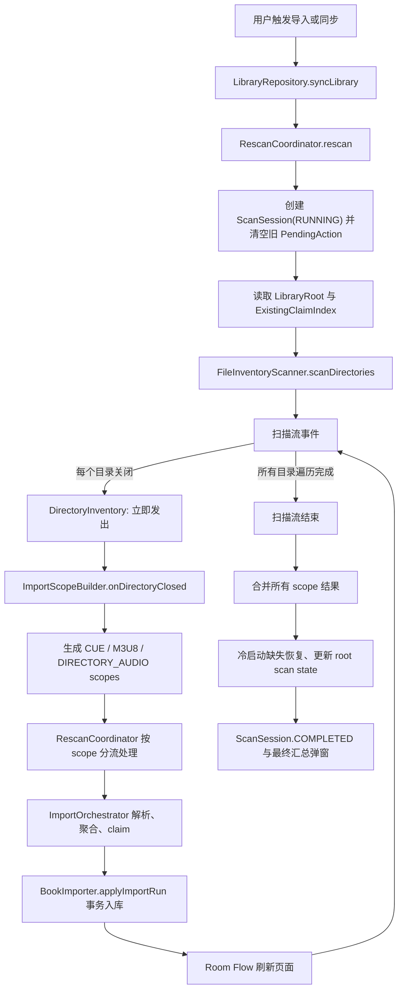

<!-- 注释：新增独立文档，汇总本轮对话中确认并落地的流式导入流程、分片规则、分流规则和后续优化方案。 -->
# 有声书流式导入流程与优化方案

<!-- 注释：说明本文档的目标，避免把它误读为旧版一次性全量导入方案。 -->
本文档记录当前有声书导入链路从用户点击导入到书籍入库、页面刷新的完整流程，并明确当前采用的保守流式优化策略。

核心目标：

- 第一批可确定书籍尽快入库，让 Room Flow 刷新页面，不再等待整棵授权目录扫描完成。
- 每个可安全裁决的分片独立解析、独立入库，最后再汇总扫描结果。
- 保留 claim 保护，避免同一音频被 manifest 和启发式聚合重复认领。
- 保留启发式聚合上下文，避免把普通多文件书拆成多本错误书。
- 第一版 manifest 不跨子目录，只处理同目录音频引用。

<!-- 注释：先给出当前主链路全景，帮助后续分片、分流、入库规则放到同一张图里理解。 -->
## 1. 主流程总览



<!-- 注释：解释流程图里的回环语义，避免误读成目录导入和扫描结束两个互斥分支。 -->
图中的 `扫描流事件` 是同一条 Flow 的连续事件：每个目录关闭都会进入 scope 构建和入库回环，所有目录都处理完以后才进入最终汇总。

用户体感上的变化是：导入结果不再等全量扫描结束，而是一个 scope 成功入库后就能刷新书架；最终弹窗仍然等所有 scope 结束后统一展示。

<!-- 注释：明确入口层职责，区分用户触发、后台 Worker 和真正导入编排入口。 -->
## 2. 入口层

入口链路：

1. 用户在界面触发同步或导入。
2. UI 调用 `LibraryRepository.syncLibrary(trigger)`。
3. 后台同步场景通过 `LibrarySyncWorker` 调用同一个 repository 入口。
4. `LibraryRepository.syncLibrary` 根据 trigger 选择 `RescanType`。
5. `RescanCoordinator.rescan(type, rootId)` 成为当前主导入链路。

`RescanCoordinator` 做三件事：

- 创建并维护 `ScanSession`。
- 按目录流式扫描和生成 import scope。
- 调用 `ImportOrchestrator` 与 `BookImporter` 完成解析、claim 和入库。

<!-- 注释：解释扫描层为什么改为目录关闭事件，而不是等待完整 FileInventory。 -->
## 3. 扫描层

当前主链路使用 `FileInventoryScanner.scanDirectories(roots)`。

扫描器按授权根递归遍历文件树，采用后序遍历：

1. 先扫描子目录。
2. 子目录关闭后发出子目录的 `DirectoryInventory`。
3. 当前目录的直接文件全部收集完成后，再发出当前目录的 `DirectoryInventory`。

`DirectoryInventory` 只包含当前物理目录的直接资产：

- `cueFiles`
- `m3u8Files`
- `audioFiles`
- `imageFiles`
- 当前 `LibraryRoot`
- 当前目录 `directoryUri`、`directoryDocumentId`、`relativePath`

这样做的原因：

- manifest 第一版只认同目录音频，目录关闭时已经拥有完整裁决上下文。
- 启发式聚合仍然以目录为边界，不会看到半个目录。
- 不需要等待整棵目录树扫描完，子目录中的书可以先入库。

`FileInventory.groupByParent()` 仍然保留，它适合旧的“先全量扫描，再按父目录切分”路径。当前主链路更进一步，直接从扫描器发出目录分片，避免全量 `FileInventory` 成为首本书入库前的阻塞点。

<!-- 注释：说明冷启动过滤位置，避免旧书重复进入新导入裁决。 -->
## 4. 冷启动过滤

冷启动轻量扫描会先从数据库 `BookFile` 建立 `ExistingClaimIndex`。

每个 `DirectoryInventory` 进入 scope 构建前，如果本轮是 `COLD_START_LIGHT`，会调用：

```kotlin
directory.onlyUnclaimed(existingIndex)
```

过滤规则：

- 已被 `BookFile` 认领过的 cue、m3u8、audio 不再进入本轮新导入解析。
- 图片不做 claim 过滤，只作为同目录 sidecar 封面候选保留。
- 这个过滤只减少新导入噪声，不负责旧书可用性检查。

<!-- 注释：把分片规则写成可执行规则表，方便后续改代码时逐条对照。 -->
## 5. 分片规则

当前分片单位叫 `ImportScope`，含义是“可以安全裁决并尝试立即入库的最小导入单元”。

`ImportScopeKind` 有三类：

| 类型 | 来源 | 释放时机 | 内容 |
| --- | --- | --- | --- |
| `CUE_MANIFEST` | 同目录 `.cue` | 目录关闭后立即释放 | 1 个 cue，加上 cue 同目录引用到的音频 |
| `M3U8_MANIFEST` | 同目录 `.m3u` / `.m3u8` | 目录关闭后立即释放 | 1 个 m3u8，加上 m3u8 同目录引用到的音频 |
| `DIRECTORY_AUDIO` | 未被 manifest 引用的散落音频 | 同目录 manifest scope 构建后释放 | 同一物理父目录下剩余音频和 sidecar 图片 |

生成顺序固定为：

1. CUE scope
2. M3U8 scope
3. DIRECTORY_AUDIO scope

排序原因：

- CUE 和 M3U8 是显式来源，优先级高于散落音频启发式聚合。
- manifest 引用过的音频会从后续 `DIRECTORY_AUDIO` 中排除。
- 最终 claim 仍由 `RunClaimLedger` 和 `ExistingClaimIndex` 裁决，scope 顺序只是减少争抢噪声。

<!-- 注释：单独强调 manifest 不跨子目录，这是用户明确修正后的第一版边界。 -->
## 6. Manifest 规则

第一版 manifest 只考虑同目录音频。

`ManifestResolver.resolveRelativePath(parentDir, relativePath)` 的规则：

- 支持 URL decode。
- 支持同目录文件名精确匹配。
- 支持同目录文件名忽略大小写匹配。
- 拒绝 `../xxx`。
- 拒绝 `subdir/xxx.mp3`。
- 拒绝任何路径分片数量不是 1 的引用。

换句话说：

| manifest 条目 | 是否参与当前 scope |
| --- | --- |
| `track01.mp3` | 是 |
| `./track01.mp3` | 是 |
| `Track01.MP3` | 是，忽略大小写匹配 |
| `disc1/track01.mp3` | 否 |
| `../track01.mp3` | 否 |
| `https://example.com/track01.mp3` | 否 |

这个边界的好处是：一个目录关闭时，manifest scope 可以安全释放，不需要等待子目录扫描完成，也不会把 claim 扩大到启发式窗口之外。

<!-- 注释：解释 DIRECTORY_AUDIO 的二次分流，这是解决“大目录有章节音频也要等全部处理完”的保守优化。 -->
## 7. 分流规则

`DIRECTORY_AUDIO` scope 进入 `RescanCoordinator.applyDirectoryAudioScope(scope)` 后，会先读取每个剩余音频的元数据。

分流规则：

1. 如果音频元数据里有章节：
   - 认为这个单音频已经有明确书籍边界。
   - metadata 任务会一次启动并用 `DEFAULT_SCOPE_IO_CONCURRENCY` 限流。
   - 按 `DIRECTORY_AUDIO_METADATA_BATCH_SIZE` 稳定顺序消费元数据结果。
   - 当前 metadata 小批次确认有章节后，立即调用 `runResolvedDirectoryAudio`。
   - 当前小批次立即 `BookImporter.applyImportRun` 入库。
   - 每个成功小批次后刷新 claim 索引。

2. 如果音频元数据里没有章节：
   - 暂存到 `heuristicRefs`。
   - 等当前 `DIRECTORY_AUDIO` scope 的音频元数据扫描结束。
   - 统一交给启发式聚合。

3. 启发式聚合仍然只处理“没有章节元数据的剩余音频”：
   - 继续按 album、文件名连号、目录上下文等规则聚合。
   - 避免普通多文件书被文件级流式拆散。

这就是当前的保守策略：有章节的音频可以在第一批 metadata 完成后小批次提前入库，无章节音频仍保留目录级启发式窗口。

<!-- 注释：写清当前流式窗口大小，回应“现在窗口有多大”和“大目录仍可能等待”的问题。 -->
## 8. 当前流式窗口

当前窗口分两层：

| 阶段 | 窗口大小 | 能否提前入库 |
| --- | --- | --- |
| 扫描到 scope | 单个物理目录 | 可以，目录关闭后生成 scope |
| manifest scope | 单个 manifest 及其同目录音频 | 可以，scope 成功后立即入库 |
| 有章节音频 | 小批次，大小与 `DEFAULT_SCOPE_IO_CONCURRENCY` 对齐 | 可以，元数据确认有章节后分批入库 |
| 无章节音频启发式 | 当前目录剩余无章节音频集合 | 需要等该目录无章节音频扫描完 |

<!-- 注释：补充 scope 内并发优化后的真实窗口语义：I/O 可以并发，但裁决窗口仍保持原边界。 -->
scope 内部现在允许有界并发读取 I/O：

- 目录剩余音频的 metadata 读取一次启动、限流并发，结果按小批次稳定顺序回到分流逻辑。
- 散落音频 metadata 读取并发执行，但启发式聚合仍串行处理稳定结果。
- 导入阶段不再同步封面解析，只生成空封面草稿并在入库成功后调用 `CoverRecoveryHelper` 异步重建缓存。
- manifest 音频缺失时长并发读取，但必须在 manifest claim 预留之后执行。
- 有章节音频提前入库现在只等待 metadata、claim 和 DB apply，封面补齐交给后台自愈流程。

<!-- 注释：补充性能诊断日志，方便用实际 Logcat 数据继续定位导入瓶颈。 -->
当前性能日志统一使用 `ImportTiming` tag，可以在 Logcat 中过滤：

```text
tag:ImportTiming
```

主要阶段：

- `scan.directoryClosed`: 单个目录直接 `listFiles()` 与文件分类耗时；日志里的 `children` 表示直接子目录数，不再把子目录 scope 导入背压计入父目录。
- `scope.build`: 目录关闭后生成了多少个 `ImportScope`。
- `directoryAudio.metadataResolve`: `DIRECTORY_AUDIO` scope 内音频元数据并发读取耗时。
- `directoryAudio.metadataResolveBatch`: 当前 metadata 小批次等待耗时；第一批完成后即可触发有章节音频导入。
- `orchestrator.manifestParse`: CUE/M3U8 解析耗时。
- `orchestrator.metadataResolve`: 散落音频 metadata 解析耗时。
- `orchestrator.heuristicGroup`: 启发式聚合裁决耗时。
- `orchestrator.coverDefer`: 生成空封面载体并跳过同步封面解码，真正封面由入库后的 `CoverRecoveryHelper` 异步重建。
- `orchestrator.conflictClaim`: claim 裁决和草稿组装耗时。
- `db.apply`: Room 事务入库耗时。
- `db.refreshClaimIndex`: 成功入库后刷新 claim 快照耗时。
- `scope.total`: 单个 scope 或目录音频子批次总耗时。
- `scan.total`: 整轮扫描导入总耗时。

仍然存在的瓶颈：

- 如果一个统计目录里有大量无章节音频，它们仍要等目录内元数据扫描完成后才能启发式聚合和入库。
- 如果一个目录下有大量文件但其中多数没有章节，第一本无章节启发式书仍不会文件级提前入库。
- 封面不会再阻塞 scope 入库，但新书会先以占位封面出现，稍后由 Room Flow 收到 `CoverRecoveryHelper` 写回的封面路径后刷新。

这个选择是有意保守的，因为无章节多文件书的边界主要依赖启发式聚合，过早拆分会显著提高误分书风险。

<!-- 注释：claim 是当前最容易出错的边界，本节明确索引、运行账本和提交时机。 -->
## 9. Claim 保护规则

当前 claim 保护由两层组成：

1. `ExistingClaimIndex`
   - 来自数据库已有 `BookFile`。
   - 防止新 scope 占用已经入库的文件。
   - 每个成功入库的 scope 或子批次后重新读取数据库刷新。

2. `RunClaimLedger`
   - 本轮扫描内的内存认领账本。
   - 防止同一轮扫描中不同 scope 重复认领同一音频。
   - `RescanCoordinator` 持有全局 `scanClaimLedger`。
   - 每个 scope 执行前调用 `scanClaimLedger.fork()` 得到隔离副本。
   - 只有 `BookImporter.applyImportRun(scopeResult)` 成功后，才 `commitFrom(scopeLedger)`。

提交规则：

- 解析失败：不提交 claim。
- 入库失败：不提交 claim。
- 入库成功：提交该 scope 产生的 claim。
- scope 成功产生 `readyImports`、`refreshedBooks` 或 `pendingActions` 后，刷新 `ExistingClaimIndex`。

这样可以避免两个问题：

- 失败 scope 把文件错误占住，导致后续启发式无法导入。
- 前一个 scope 已经入库，但后一个 scope 仍用旧 DB 快照判断，导致重复认领。

<!-- 注释：把普通 scope 和目录音频子批次的入库节奏分开写，避免误以为最终汇总才入库。 -->
## 10. 入库与页面刷新

每个 scope 或目录音频子批次都会独立执行：

1. `ImportOrchestrator.run(...)` 或 `runResolvedDirectoryAudio(...)`
2. `BookImporter.applyImportRun(scopeResult)`
3. Room 事务写入 `Book`、`BookFile`、`Chapter` 或 `PendingScanAction`
4. Room Flow 推送变化
5. 页面刷新，书架可以看到新书

`BookImporter.applyImportRun` 内部使用 Room transaction：

- `readyImports` 写入新书、新文件和章节。
- `refreshedBooks` 更新已有文件状态与扫描标记。
- `pendingActions` 插入或刷新当前待处理项。

最终扫描结束后，`RescanCoordinator` 会把所有 `ImportRunResult` 合并成一个总结果，再更新：

- `LibraryRoot.lastScannedAt`
- `ScanSession.discoveredBookCount`
- `ScanSession.unavailableBookCount`
- `ScanSession.partialBookCount`
- `ScanSession.updatedBookCount`
- `ScanSession.pendingActionCount`
- `ScanSession.summaryJson`
- `ScanSession.status = COMPLETED`

因此页面刷新和最终汇总是分离的：书先出现，汇总后出现。

<!-- 注释：把错误隔离规则写清楚，保证后续继续优化时不回退到单点失败。 -->
## 11. 失败隔离

当前失败处理规则：

- 单个 scope 解析失败，不中断整个扫描。
- 单个 scope 入库失败，不中断整个扫描。
- 目录内有章节音频子批次失败，不影响同目录其他音频继续导入。
- 失败会转换为 `ImportRunResult.failures`，最终进入扫描汇总。
- `CancellationException` 仍然向外抛出，保留协程取消语义。

失败 scope 不提交 claim，也不会刷新 DB claim 快照。

<!-- 注释：补充用户确认的进程中断语义和启动 pending 清理规则，明确当前模型是安全重扫而不是断点续扫。 -->
### 11.1 进程中断与启动 pending 清理

应用在导入过程中被系统杀死或用户强杀时，当前设计遵循“已提交保留、未提交丢弃、下次重新扫描”的规则：

- 已完成 `db.apply` 的 scope 或目录音频子批次已经持久化，下次扫描会通过 `ExistingClaimIndex` 识别并跳过，避免重复导入。
- 正在执行但尚未完成 `db.apply` 的 scope 由 Room transaction 保证原子性，要么整批写完，要么整批回滚，不会留下半本书或半批章节。
- 当前扫描会话可能停留在 `RUNNING`，因为进程被杀时不一定能执行 `markAbandoned`。
- UI 只观察最新 `COMPLETED` 扫描会话，所以残留 `RUNNING` 会话不会弹出完成结果。
- 启动时 `LibraryViewModel` 会 enqueue `COLD_START`，进入 `RescanCoordinator.rescan` 后先执行 `clearPendingActions()`，再插入新的 `RUNNING` 会话。
- `pending_scan_actions` 是本轮扫描重建队列，不做跨进程断点恢复；启动冷扫描清空旧 pending 是预期行为。
- 封面重建属于后台异步自愈；如果进程被杀时尚未补齐封面，下次列表或详情查询触发 `CoverRecoveryHelper` 时会再次检查并补齐。

<!-- 注释：列出本轮优化已经落地的部分，和还未做的部分区分开。 -->
## 12. 已落地优化

已经落地的优化：

- 主链路改为 `scanDirectories(roots)`，目录关闭后即可释放 `DirectoryInventory`。
- 新增 `ImportScopeBuilder`，按目录生成 CUE、M3U8、DIRECTORY_AUDIO scope。
- manifest 收窄为同目录规则，不考虑子目录。
- manifest 引用音频从散落音频启发式 scope 中排除。
- scope 成功入库后立即刷新页面。
- 扫描完成后再合并所有结果生成最终汇总。
- `RunClaimLedger` 支持 `fork()` 和 `commitFrom()`，保证 scope 失败不污染全局 claim。
- `ImportOrchestrator.runResolvedDirectoryAudio()` 支持复用已读取元数据，避免有章节音频提前入库时重复扫元数据。
- `DIRECTORY_AUDIO` 内部按章节元数据分流：有章节音频在 metadata 小批次完成后提前入库，无章节音频继续启发式聚合。
- `DIRECTORY_AUDIO` metadata 任务一次启动并限流执行，导入第一批有章节音频时，后续 metadata 读取仍可继续推进。
- scope 内元数据和 manifest 时长读取已经改为有界并发，后续 claim、启发式最终裁决和入库仍保持串行稳定顺序。
- 清单同目录引用现在优先用扫描阶段已有的音频文件名索引解析，避免 scope 构建和 `ManifestParseStep` 为每个条目重复调用 SAF `findFile/listFiles`。
- `scan.directoryClosed` 的耗时口径改为当前目录直接枚举耗时，父目录日志不会再被子目录 scope 导入时间拖长。
- 导入流水线跳过同步 `CoverExtractStep`，入库成功后复用 `LibraryRepository` 已有的 `CoverRecoveryHelper` 异步重建封面缓存。
- `CoverRecoveryHelper` 后台重建已增加全局并发上限，成功重建不会写入失败去重集，外置 sidecar 图像也改为流式落盘后采样缩略图。

<!-- 注释：给出后续优化方案，但保留用户担心的 claim 和启发式安全边界。 -->
## 13. 后续优化方案

下一步建议按风险从低到高推进。

### 13.1 并发参数与进度反馈调优

目标：在已经启用 scope 内有界并发的基础上，继续减少大目录等待感。

方案：

- 根据设备性能和文件类型调节并发数，默认保持 4。
- 为 metadata、cover、manifest duration 三类 I/O 分别统计耗时。
- 把 scope 内处理进度写入扫描状态，让用户看到当前目录正在处理，而不是只等最终汇总。
- 如果后续要让“有章节音频在 metadata 完成瞬间入库”，需要额外设计稳定 claim 顺序与 UI 汇总顺序。

风险控制：

- 不改变启发式输入集合。
- 不改变 claim 规则。
- 只缩短 metadata I/O 时间。

### 13.2 封面解析后移或降级

已落地：导入阶段先写入书籍和章节，后台复用 `CoverRecoveryHelper` 补齐 `coverPath`、`thumbnailPath` 和 `backgroundColorArgb`。

当前封面后台链路已经增加两层保护：

- `CoverRecoveryHelper` 使用全局信号量限制后台封面重建并发，避免大量新书同时触发图片解码。
- 外置 sidecar 图像先流式写入缓存文件，再从文件采样生成缩略图，避免大图 `readBytes()` 带来的瞬时内存压力。

后续只需要继续观察 UI 占位封面到真实封面的刷新是否足够平滑。

### 13.3 增量更新 ExistingClaimIndex

目标：减少每个 scope 入库后全量读取 `BookFile` 的成本。

方案：

- 成功入库后，从 `scopeResult` 直接推导新增或刷新的 `BookFile` identity。
- 在内存中更新 `currentExistingIndex`。
- 保留必要时的 DB 重读兜底。

风险控制：

- 必须覆盖 `readyImports`、`refreshedBooks`、`pendingActions` 对 claim 的不同影响。
- 这项比元数据并发更容易漏边界，建议放在第二阶段。

### 13.4 更激进的启发式分片

目标：让大目录里的无章节音频也能更早入库。

可选策略：

- 按 album 分组提前释放。
- 按文件名前缀和编号连续段释放。
- 按 mtime 或文件夹命名规则做候选段。

暂不建议第一版做，因为用户已经明确担心启发式聚合问题。当前保守策略是：只有内嵌章节能证明单文件边界时才提前入库；无章节音频仍让完整目录上下文参与聚合。

<!-- 注释：把当前版本的不可变规则收束成检查清单，便于以后改代码前先看。 -->
## 14. 规则检查清单

修改导入流程前，需要保持这些规则不变，除非明确重新设计：

- manifest 不考虑子目录。
- manifest scope 优先于目录启发式音频。
- manifest 引用过的音频不能再进入 `DIRECTORY_AUDIO`。
- 有章节音频可以单文件提前入库。
- 无章节音频继续按目录聚合。
- scope 入库成功后才能提交 `RunClaimLedger`。
- scope 入库成功后要刷新或增量更新 `ExistingClaimIndex`。
- 单个 scope 失败不能中断整轮扫描。
- 启动冷扫描会清空旧 `pending_scan_actions`，pending 队列只表达当前扫描结果。
- 导入过程中进程被杀后不做断点续扫，依靠已提交数据和下次扫描重新收敛。
- 书架刷新跟随每次成功入库。
- 扫描结果汇总只在整轮扫描结束后显示。
