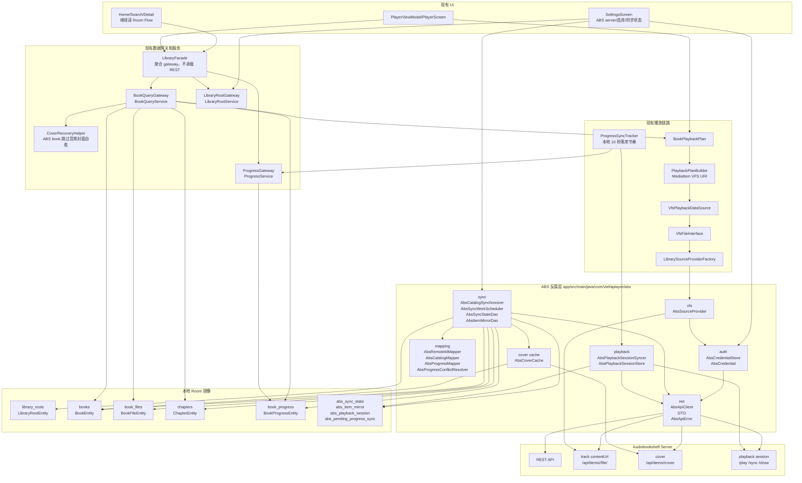

# Audiobookshelf Catalog Mirror 后端实施任务表

日期：2026-06-01

输入依据：

- 设计文档：`docs/audiobookshelf_catalog_mirror_backend_design.md`
- 当前代码：`app/src/main/java/com/viel/aplayer`
- 在线验证：Chrome DevTools MCP 登录 `https://audiobooks.dev/audiobookshelf`，用户名 `demo`，密码 `demo`

## 在线验证结论

本次重新执行了在线验证。验证结果与设计文档里的核心 API 修正一致，没有发现需要推翻文档方案的冲突。

| 验证项 | 实测结果 | 对实现任务的约束 |
|---|---|---|
| `GET /audiobookshelf/status` | `200`，返回 `serverVersion = 2.35.1` | `AbsApiClient` 连接测试必须记录 server version |
| `GET /audiobookshelf/api/authorize` | 带 Bearer token 后返回 `404` | 不实现 GET authorize 兜底 |
| `POST /audiobookshelf/api/authorize` | 带 Bearer token 后返回 `200` JSON | `authorize()` 固定用 POST |
| `GET /audiobookshelf/api/libraries` | 返回包含 `Audiobooks` 的 book library | 设置页选库只展示 `mediaType = book` 的 library |
| `GET /api/libraries/<id>/items?limit=0&minified=1&collapseseries=0` | 返回 `{ results, total, limit, page, ... }`，demo book 数量为 `16` | minified 清单只负责发现 item，不从该响应读取音轨 |
| minified item | 首条 item 没有 `media.tracks[]` | 详情同步不能依赖 minified item 的 track 字段 |
| `GET /api/items/<itemId>?expanded=1&include=progress,authors` | 返回 `media.tracks[]`；首条 track 有 `contentUrl = /api/items/<itemId>/file/<ino>` | `BookFileEntity.sourcePath` 使用详情 track 的 `contentUrl` |
| `media.audioFiles[]` | 存在 1 条，但没有 `contentUrl` | `audioFiles[]` 只作为文件元数据补充，不作为播放入口 |
| `GET /api/me/progress/<itemId>` | 无进度时返回 `404 Not Found` | `getProgressOrNull()` 把 404 映射为 `null` |
| `HEAD /api/items/<itemId>/cover` | 返回 `200 image/webp`，无稳定 `Content-Length` | 封面缓存按 `Content-Type` 或真实字节判断格式 |
| `HEAD <track.contentUrl>` | 返回 `200 audio/mpeg`、`Accept-Ranges: bytes`、`Content-Length` | `AbsSourceProvider` 必须支持 HEAD 探测 |
| `GET <track.contentUrl>` with `Range: bytes=0-15` | 返回 `206`、`Content-Range: bytes 0-15/77458087` | seek 使用 Range 请求 |
| `POST /api/items/batch/get` | body 为 `{ "libraryItemIds": [...] }`，响应为 `{ "libraryItems": [...] }` | DTO 不能按裸数组解析 |
| `POST /api/items/<itemId>/play` | 返回 `200` Playback Session JSON，`audioTracks[0].contentUrl` 与详情 track 一致 | 远端 session 只属于进度同步，不替代本地 `BookPlaybackPlan` |
| `POST /api/session/<sessionId>/sync` | 返回 `200 text/plain`，正文 `OK` | sync 成功只看 HTTP 2xx |
| `POST /api/session/<sessionId>/close` | 返回 `200 text/plain`，正文 `OK` | close 成功只看 HTTP 2xx |

## 当前代码约束

| 模块 | 当前事实 | 实施约束 |
|---|---|---|
| `AudiobookSchema.kt` | `LibrarySourceType` 只有 `SAF`、`WEBDAV`；`SourceType` 没有 ABS 值；`ChapterSource` 没有 ABS 值 | 阶段 1 必须先补 schema 常量 |
| `LibrarySourceProvider.kt` | `LibrarySourceKind.from()` 对未知值回退 `SAF` | 阶段 1 必须改为显式支持 `ABS`，未知值不能静默当 SAF |
| `LibrarySourceProviderFactory` | 只持有 `SafSourceProvider`、`WebDavSourceProvider` | 阶段 1 必须注册 `AbsSourceProvider` 占位或真实实现 |
| `AvailabilityChecker` | 按 `LibrarySourceKind` 分支；WebDAV 失败通过 provider 异常映射为统一状态 | ABS 可用性错误也必须映射为 `AvailabilityStatus` |
| `LibraryRootService` | 删除 root 时按 source kind 分支释放 SAF 授权或删除 WebDAV 凭据 | ABS root 删除必须删除 ABS 凭据，不释放 SAF 授权 |
| `AppDatabase.kt` | 当前版本 `41`，已包含 ABS 表，并以 `41.json` 作为第一条生产迁移基线；destructive migration 已禁用 | 后续新增 Room 表或字段必须从 41 之后提高版本、添加显式 migration，并导出 schema |
| `build.gradle.kts` | 已有 OkHttp；没有结构化 JSON 库；已有 WorkManager、DataStore、Room | 阶段 1 先选择并接入 JSON 库，API client 不写字符串解析 |
| `BookEntity.kt` | 有 `sourceType`、`sourceRoot`、`coverPath`、`thumbnailPath`、`status`、`readStatus` | ABS item 映射为普通 `BookEntity`，不要新增 UI 专用 DTO |
| `BookFileEntity.kt` | 播放顺序字段是 `index`；没有 `sortOrder` | Mapper 写入 `index`，禁止新增 `sortOrder` |
| `ChapterEntity.kt` | 章节必须落到具体 `bookFileId`，并同时保存全书位置与文件内偏移 | ABS chapter 映射必须做全书时间到 track 的归属计算 |
| `BookProgressEntity.kt` | 本地进度以毫秒 `globalPositionMs` 为主 | ABS `currentTime` 秒必须转换为毫秒 |
| `BookDao.kt` | 列表查询过滤 `status != 'DELETED'`；播放只取 `fileRole = AUDIO` | 远端删除使用软删除，不物理删书籍/进度/书签 |
| `BookQueryService.kt` | 列表、详情、播放计划构建都会调用 `CoverRecoveryHelper.checkAndTriggerCoverRegeneration()` | ABS 同步必须先写本地封面缓存；封面缺失时不得触发远端音频嵌入封面解析 |
| `CoverRecoveryHelper.kt` | 会读取音频嵌入封面，并枚举同目录 sidecar 图片 | ABS 书籍必须被跳过自动封面自愈，或保证 `coverPath`、`thumbnailPath` 永远指向本地缓存 |
| `VfsFileInterface.kt` | 播放热路径用 `BookFileEntity.rootId + sourcePath` 直接构造 VFS 节点 | ABS provider 可以直接吃 `contentUrl`，不需要进入扫描目录树 |
| `VfsPlaybackDataSource.kt` | 播放只通过 `BookFileEntity.id -> VfsFileInterface.open(offset)` | 阶段 3 不改 Media3 数据源，只扩展 provider |
| `ProgressSyncTracker.kt` | 每 500ms 刷新 UI，每 10 秒保存一次本地进度 | 阶段 4 复用该节奏触发 ABS session sync，不把远端 session 逻辑塞进 `ProgressService` |
| `ProgressService.kt` | 只负责本地进度落库和阅读状态联动 | 阶段 4 不在该类里加 ABS REST 调用 |

## 目标架构图

架构边界：

- UI、`LibraryFacade`、`BookQueryService`、`ProgressService` 只读写本地 Room 语义，不直接持有 ABS DTO、URL 细节或 token。
- `AbsApiClient` 是唯一理解 ABS HTTP method、query、body、错误码、短文本响应和 Bearer 鉴权的组件。
- `AbsCatalogSynchronizer` 只负责 REST 到 Room 镜像，不进入 `SourceInventoryScanner` 和 `ImportPipeline`。
- `AbsSourceProvider` 只负责播放流和 Range，不枚举 ABS catalog，不写 Room。
- `AbsPlaybackSessionSyncer` 只负责 ABS session open/sync/close，不决定本地播放位置。
- `BookPlaybackPlan -> VfsPlaybackUri -> VfsPlaybackDataSource -> VfsFileInterface` 保持现有播放主链路，ABS 只作为新的 `LibrarySourceProvider` 接入。
- `BookProgressEntity` 仍是本地播放进度真相，ABS progress 只通过 mapper/conflict resolver 进入或离开本地模型。
- ABS 凭据只在 `AbsCredentialStore`、`AbsApiClient`、`AbsSourceProvider` 内部使用，不写入 Room 普通业务字段、播放 URI、日志或 UI 状态。

## 阶段 0：协议事实固化

目标：把本次在线验证得到的协议事实变成测试输入，先锁住 API 契约，避免后续实现按旧文档或猜测写错。

| 任务 | 修改模块 | 具体改动 | 回归验证 |
|---|---|---|---|
| 0.1 固化 ABS API 样本 | 新增 `app/src/test/resources/abs/` | 添加 `status_2_35_1.json`、`authorize_success.json`、`libraries.json`、`library_items_minified.json`、`item_detail_expanded.json`、`batch_get_items.json`、`play_session.json`、`text_ok.txt`；样本内容只保留字段结构，不保存 token | 单元测试能读取全部样本 |
| 0.2 建立 API 契约测试清单 | 新增 `app/src/test/java/com/viel/aplayer/abs/net/AbsApiContractTest.kt` | 测试 POST authorize、GET authorize 404、minified 顶层 `results`、batch 顶层 `libraryItems`、progress 404/null、sync/close `OK` | `.\gradlew.bat testDebugUnitTest --tests *AbsApiContractTest` 通过 |
| 0.3 删除临时验证入口 | 无业务代码改动 | 不把 Chrome DevTools 验证脚本、demo token 或临时响应文件提交进仓库 | `rg -n "Bearer|eyJ|demo" app docs` 不出现新增敏感信息 |

阶段 0 完成标准：

- 测试样本覆盖本次在线验证表里的所有协议差异。
- 没有新增可运行功能。
- 没有写入任何 Room 数据。

## 阶段 1：基础模型、凭据与 API Client

目标：让应用能够保存 ABS server 连接信息、验证 token、列出 book library，但不写入任何书籍。

| 任务 | 修改模块 | 具体改动 | 回归验证 |
|---|---|---|---|
| 1.1 增加 schema 常量 | `AudiobookSchema.kt` | 增加 `LibrarySourceType.ABS = "ABS"`、`SourceType.ABS_REMOTE = "ABS_REMOTE"`、`ChapterSource.ABS = "ABS"`；增加 `AbsMirrorState.ACTIVE/STALE/REMOTE_DELETED` | `.\gradlew.bat compileDebugKotlin` 通过 |
| 1.2 修正 source kind 分发 | `LibrarySourceProvider.kt` | `LibrarySourceKind` 增加 `ABS`；`from(value)` 改为返回可空或抛出明确异常；所有调用点显式处理未知 source type | 单元测试覆盖未知 source type 不回退 SAF |
| 1.3 注册 ABS provider 占位 | `LibrarySourceProviderFactory` | 注入 `AbsSourceProvider`；阶段 1 的 `AbsSourceProvider.rootDirectory/listChildren` 返回 unsupported，`resolve/open/readRange` 在阶段 3 实现 | 编译通过；ABS root 不会走 SAF provider |
| 1.4 新增凭据模型 | 新增 `abs/auth/AbsCredential.kt`、`AbsCredentialStore.kt` | 保存 `credentialId`、`baseUrl`、`token`、`userId`、`username`、`serverKey`；底层先用 DataStore；日志和异常不输出 token | 单元测试验证保存、读取、删除、token 不进入 `toString()` |
| 1.5 新增 API client DTO | 新增 `abs/net/dto/*` | DTO 覆盖 status、authorize、library、minified list、item detail、batch response、progress、play session；所有可选字段声明 nullable | DTO 样本解析测试通过 |
| 1.6 接入 JSON 库 | `gradle/libs.versions.toml`、`app/build.gradle.kts` | 增加 Moshi 或 kotlinx.serialization；项目只选一种；API client 全部使用结构化解析 | `.\gradlew.bat compileDebugKotlin` 通过 |
| 1.7 实现 `AbsApiClient` | 新增 `abs/net/AbsApiClient.kt` | 用 OkHttp 统一 baseUrl、Bearer token、超时、错误映射；实现 `status()`、`login()`、`authorize()`、`getLibraries()`；`authorize()` 只发 POST | MockWebServer 验证 method、path、Authorization header |
| 1.8 连接测试用例 | 新增 `abs/sync/AbsConnectionTester.kt` | 调用 `status()`、`authorize()`、`getLibraries()`，返回 book libraries 和 server version；过滤 podcast library | 单元测试验证只返回 `mediaType = book` |
| 1.9 Library root 写入入口 | `LibraryRootService.kt`、`LibraryRootGateway.kt` | 增加 `addAbsLibraryRoot(server, library)`；写入 `LibraryRootEntity.sourceType = ABS`、`sourceUri = normalizedBaseUrl`、`basePath = libraryId`、`credentialId` | DAO 测试验证 root 字段，不触发 `scanScheduler.syncLibrary()` |
| 1.10 删除 ABS root | `LibraryRootService.kt` | `deleteLibraryRootDataOnly()` 增加 ABS 分支，删除 ABS credential，不释放 SAF 授权，不调用 WebDAV credential store | 单元测试验证 ABS 删除路径只删 ABS 凭据和 root 数据 |

阶段 1 完成标准：

- 能添加一个 ABS server 并列出 book library。
- ABS root 写入后不会被 `LibrarySourceKind.from()` 当成 SAF。
- 不产生 `BookEntity`、`BookFileEntity`、`ChapterEntity`、`BookProgressEntity`。

## 阶段 2：Catalog Mirror 入库

目标：把 ABS book catalog 同步成本地 Room 镜像，让首页、搜索、详情通过现有 Flow 看见 ABS 书籍；本阶段不要求播放成功。

| 任务 | 修改模块 | 具体改动 | 回归验证 |
|---|---|---|---|
| 2.1 新增 ABS 同步表 | 新增 `AbsSyncStateEntity.kt`、`AbsItemMirrorEntity.kt`、对应 DAO；修改 `AppDatabase.kt` | 已并入当前 `41` 基线；若未来调整该表结构，必须从当前版本提升并添加显式 migration | Room schema 导出成功 |
| 2.2 同步事务 DAO | 新增 `AbsCatalogDao.kt` 或扩展现有 DAO | 提供 `upsertCatalogMirror(...)` 事务：upsert book、files、chapters、progress、mirror state、sync state | DAO 事务测试验证异常时不留下半本书 |
| 2.3 远程 ID 映射 | 新增 `abs/mapping/AbsRemoteIdMapper.kt` | 生成 `serverKey`、`rootId`、`bookId`、`bookFileId`、`sessionLocalId`；所有 ABS ID 只从该类生成 | 单元测试验证同输入稳定、不同 user/server/library 不冲突 |
| 2.4 catalog mapper | 新增 `abs/mapping/AbsCatalogMapper.kt` | 映射 `BookEntity`、`BookFileEntity`、`ChapterEntity`；`BookFileEntity.index` 使用 track 顺序；`sourcePath` 写 `media.tracks[].contentUrl`；`audioFiles[]` 只补 size/mtime 等可用字段 | 样本映射测试验证 Pi book：1 track、56 chapters、sourcePath 为 `/api/items/.../file/...` |
| 2.5 progress mapper | 新增 `abs/mapping/AbsProgressMapper.kt` | ABS `currentTime` 秒转本地毫秒；远端 404 不写进度；`isFinished` 映射为 `readStatus` | 单元测试覆盖 404、秒到毫秒、finished 状态 |
| 2.6 chapter 归属计算 | `AbsCatalogMapper.kt` | 用 track duration 累计边界把 ABS chapter 的全书秒位置映射到 `bookFileId`、`startPositionMs`、`fileOffsetMs`、`durationMs` | 单元测试覆盖跨 track 章节边界 |
| 2.7 全量清单同步器 | 新增 `abs/sync/AbsCatalogSynchronizer.kt` | 流程固定为完整 minified 清单 -> 集合对比 -> batch detail -> mapper -> Room 事务；不接 `SourceInventoryScanner`、不接 `ImportPipeline` | MockWebServer 验证不调用扫描器 |
| 2.8 batch 拉取策略 | `AbsCatalogSynchronizer.kt` | batch size 默认 `20`；并发 `1`；单 batch 失败拆小重试；单 item 失败记录错误，不进入删除确认 | 单元测试验证失败 batch 不误删 |
| 2.9 新增处理 | `AbsCatalogSynchronizer.kt` | 新 item 写 `BookStatus.READY`、`FileStatus.READY`、mirror `ACTIVE`；首次入库写本地 `addedAt`，远端更新不刷新 `addedAt` | DAO 测试验证重复同步不产生重复书 |
| 2.10 远端更新处理 | `AbsCatalogSynchronizer.kt`、`AbsItemMirrorEntity` | 比较 `remoteUpdatedAt` 或详情签名；只有变化时替换本地元数据、files、chapters | 单元测试验证无变化同步不改 `lastScannedAt` |
| 2.11 远端删除候选 | `AbsCatalogSynchronizer.kt` | 首期只标记 `STALE`，不把 `BookEntity.status` 改为 `DELETED`；删除确认留到阶段 5 | 测试验证清单缺 item 时书籍仍可见，mirror state 变 `STALE` |
| 2.12 AppContainer 装配 | `AppContainer.kt` | 暴露 `AbsCatalogSynchronizer` 或专用 `AbsSyncGateway`；不要把方法塞进 `LibraryFacade` | 编译通过；`LibraryFacade` 构造参数不新增 ABS REST client |

阶段 2 完成标准：

- 手动调用同步后，首页列表能看到 ABS book。
- 详情页能看到标题、作者、章节和时长。
- `VfsPlaybackDataSource`、`PlaybackManager`、`ProgressService` 没有 ABS 特判。
- ABS catalog 没有进入 `SourceInventoryScanner` 或 `ImportPipeline`。

## 阶段 3：封面缓存与 Range Streaming

目标：ABS 书籍能显示本地封面并通过现有 VFS 播放链路播放、seek。

| 任务 | 修改模块 | 具体改动 | 回归验证 |
|---|---|---|---|
| 3.1 封面缓存组件 | 新增 `abs/sync/AbsCoverCache.kt` | 下载 `GET /api/items/<itemId>/cover`；按 `Content-Type` 或 magic bytes 决定扩展名；写入 app cache `covers/abs/`；生成 thumbnail 和背景色 | 单元测试覆盖 `image/webp`、`image/jpeg`、无 `Content-Length` |
| 3.2 catalog 同步写封面 | `AbsCatalogSynchronizer.kt` | 详情入库时同步或排队下载封面；`BookEntity.coverPath`、`thumbnailPath` 写本地文件路径 | 首页显示 ABS 书籍不触发音频封面解析 |
| 3.3 阻断 ABS 自动封面自愈 | `CoverRecoveryHelper.kt` 或 `BookQueryService.kt` | 对 `book.sourceType == ABS_REMOTE` 且封面缺失的书，跳过嵌入封面解析和 sidecar 枚举；只允许 ABS cover cache 负责恢复 | 单元测试验证 ABS book 缺封面时不调用 `MetadataResolver.extractWithEmbeddedCover()` |
| 3.4 实现 ABS provider | 新增 `abs/vfs/AbsSourceProvider.kt` | `kind = ABS`；`capabilities.supportsRangeRead = true`；`resolve()` 从 `contentUrl` 构造 `SourceNode`；`openInputStream(offset)` 发 GET，offset 大于 0 时加 `Range` | MockWebServer 验证 Range header |
| 3.5 URL 解析 | `AbsSourceProvider.kt` | baseUrl 去尾 `/` 但保留 `/audiobookshelf` 子路径；`/api/...` 拼成 `<baseUrl>/api/...`；完整 URL 只允许同 host 且同 basePath | 单元测试覆盖子路径、尾斜杠、外部 URL 拒绝 |
| 3.6 鉴权与日志安全 | `AbsSourceProvider.kt`、`AbsApiClient.kt` | 每个媒体请求加 Bearer token；异常 message、logger、URI 不包含 token | 单元测试扫描异常文案不含 token |
| 3.7 读取长度处理 | `AbsSourceProvider.kt` | 从 `Content-Length`、`Content-Range` 推导长度；缺失长度时允许返回 unknown length；416 映射为读取位置越界 | MockWebServer 覆盖 200、206、416、无长度 |
| 3.8 可用性检测 | `AvailabilityChecker.kt` | ABS `checkBookFile()` 使用 HEAD 或小 Range；401/403 -> `AUTH_FAILED/PERMISSION_DENIED`，404 -> `NOT_FOUND`，5xx -> `SERVER_ERROR`，timeout -> `TIMEOUT` | 单元测试覆盖状态映射 |
| 3.9 播放热路径验证 | 不改 `VfsPlaybackDataSource.kt` | 保持 `BookFileEntity.id -> VfsFileInterface.open(offset)`；只通过 provider 扩展实现 ABS 播放 | 手动播放 ABS book 成功 |
| 3.10 seek 验证 | `AbsSourceProvider.kt` | seek 后新请求带 `Range: bytes=<offset>-`；不先下载完整音频 | MockWebServer 或日志验证 seek 的 Range 请求 |

阶段 3 完成标准：

- ABS book 可以播放。
- seek 会触发 Range 请求。
- token 不出现在 URI、日志、异常文案、Room 普通字段。
- 封面缺失不会触发读取远端音频做嵌入封面恢复。

## 阶段 4：远端播放会话与进度同步

目标：保持本地毫秒进度为播放真相，同时把 ABS book 的播放进度同步回 ABS。

| 任务 | 修改模块 | 具体改动 | 回归验证 |
|---|---|---|---|
| 4.1 播放会话状态表 | 新增 `AbsPlaybackSessionEntity.kt`、`AbsPendingProgressSyncEntity.kt`、DAO；修改 `AppDatabase.kt` | 已并入当前 `41` 基线；后续新增字段从 41 之后显式迁移，并导出新的 Room schema | Room schema 导出 |
| 4.2 session syncer | 新增 `abs/playback/AbsPlaybackSessionSyncer.kt` | 封装 `openSession()`、`sync()`、`close()`；sync/close 只看 HTTP 2xx；正文 `OK`、空体、JSON 都视为成功 | MockWebServer 验证 `OK` 不被 JSON 解析失败 |
| 4.3 播放开始挂接 | `PlaybackManager.kt` 或播放计划应用点 | 当当前 `BookEntity.sourceType == ABS_REMOTE` 时打开 ABS session；普通 SAF/WebDAV 书不触发 | 单元测试或 fake gateway 验证只有 ABS book 调用 open |
| 4.4 复用本地进度节奏 | `ProgressSyncTracker.kt` | 在每 10 秒本地保存成功后，向 `AbsPlaybackSessionSyncer` 提交 ABS book 的远端 sync 事件；不把 REST 逻辑放进 `ProgressService` | 测试验证本地 `BookProgressEntity` 仍先落库 |
| 4.5 pause/stop/切书 close | `PlaybackManager.kt`、`PlaybackService.kt` | pause、stop、切书、释放播放计划时关闭当前 ABS session；close body 使用最新本地全书位置秒值 | Mock 测试验证状态切换触发 close |
| 4.6 pending sync | `AbsPlaybackSessionSyncer.kt` | 网络失败时写 `AbsPendingProgressSyncEntity`；下一次联网或下一次打开 ABS session 时补发最新位置 | 单元测试验证失败不影响本地进度 |
| 4.7 进度冲突策略 | 新增 `abs/mapping/AbsProgressConflictResolver.kt` | 非播放状态下比较本地 `lastPlayedAt` 与 ABS progress 更新时间；远端更晚才覆盖本地；不可比较时保留本地 | 单元测试覆盖本地新、远端新、相等、缺时间 |
| 4.8 ABS web 端验收 | 手动验证 | 播放 `First Fifty Digits of Pi` 一小段后暂停，刷新 ABS web 端，确认进度变化 | 手动验收记录通过 |

阶段 4 完成标准：

- 本地进度保存不退化。
- ABS web 端能看到同步后的进度。
- 断网播放不丢本地进度。
- `sync`、`close` 返回 `OK` 时不会被误判失败。

## 阶段 5：设置页入口、后台任务与删除收敛

目标：把 ABS 接入变成完整用户流程，并让同步失败、取消、删除都可解释。

| 任务 | 修改模块 | 具体改动 | 回归验证 |
|---|---|---|---|
| 5.1 设置入口 | `ui/settings/*` | 增加 ABS Server 列表、添加 server、测试连接、登录或 token、选择 book library、手动同步、删除 server | Compose UI 测试覆盖添加入口和错误状态 |
| 5.2 首次同步弹窗 | 新增设置页组件 | 展示阶段：连接、拉清单、拉详情、下封面、写库；展示数量：已处理 item/总 item、当前 batch/总 batch；支持取消 | 手动验证取消后不执行删除收敛 |
| 5.3 后台同步任务 | 新增 `abs/sync/AbsSyncWorker.kt` | 使用 WorkManager 执行手动/后台同步；读取 `AbsSyncStateEntity`；限制同 root 同时只有一个 sync | 单元测试或 Worker 测试验证并发互斥 |
| 5.4 同步错误展示 | `AbsSyncStateEntity`、设置页 | 展示 `lastError`、`lastFullSyncAt`、`serverVersion`；错误不包含 token | UI 验证错误文案脱敏 |
| 5.5 删除二次确认 | `AbsCatalogSynchronizer.kt` | 完整清单成功后，本轮没 seen 的 ACTIVE item 先 `STALE`；下一轮仍缺失或单 item 404 才 `REMOTE_DELETED` 并把 `BookEntity.status = DELETED` | DAO 测试验证清单失败时不删除 |
| 5.6 安全移除 server | `LibraryRootService.kt`、设置页 | 用户删除 ABS server 时，先停播该 root 下当前书，再删除 root；级联删除书籍/files/chapters，删除 ABS 凭据和 pending sync | 手动验证删除当前播放 ABS 书不会崩溃 |
| 5.7 大库阈值 | `AbsCatalogSynchronizer.kt`、设置页 | `<=3000` 默认同步；`3000~10000` 后台同步且 batch size 20；`>10000` 同步前要求用户确认耗时和流量 | 单元测试验证阈值策略 |
| 5.8 不支持项显式隐藏 | 设置页和 mapper | 首期过滤 podcast library；不显示上传、删除远端、元数据回写、Socket.io 开关 | UI 验证 podcast library 不可选 |

阶段 5 完成标准：

- 用户能从设置页完成添加 server、选库、同步、播放、删除 server。
- 同步失败可见且可重试。
- 删除远端条目不会在单次清单异常时误删本地书。

## 阶段 6：增量同步与体验优化

目标：在首版可用后降低同步成本，不改变阶段 2 的全量正确性路径。

| 任务 | 修改模块 | 具体改动 | 回归验证 |
|---|---|---|---|
| 6.1 增量候选判断 | `AbsCatalogSynchronizer.kt` | 使用 `remoteUpdatedAt`、详情签名或 `fullListFingerprint` 判断 item 是否需要重拉详情 | 单元测试验证无变化 item 不进详情队列 |
| 6.2 失败 item 重试 | `AbsSyncStateEntity`、新增错误表可选 | 记录单 item 失败原因；下次同步优先重试失败 item | 测试验证单 item 失败不阻断整库 |
| 6.3 封面缓存清理 | `AbsCoverCache.kt` | `REMOTE_DELETED` 后保留封面 7 到 30 天；用户清理缓存时物理删除 | 单元测试验证未确认删除不清缓存 |
| 6.4 server version 兼容 | `AbsApiClient.kt`、DTO | 按 `serverVersion` 记录字段差异；DTO 缺字段不崩溃 | 样本测试覆盖缺 `tracks`、缺 `size`、缺 progress 更新时间 |
| 6.5 Socket.io 评估入口 | 文档和 TODO 测试 | 只记录事件能力，不接入首版同步正确性路径 | 不产生运行时代码依赖 |

阶段 6 完成标准：

- 全量同步仍可独立运行。
- 增量同步失败时能回退到完整 minified 清单。
- 不引入 Socket.io 首期强依赖。

## 全阶段禁止事项

- 不把 ABS REST DTO 暴露给 ViewModel、UI、`LibraryFacade` 或 `PlaybackManager` 的公共状态。
- 不把 ABS catalog 伪装成文件树交给 `SourceInventoryScanner` 或 `ImportPipeline`。
- 不在 `LibraryFacade`、`ProgressService`、`PlaybackManager` 内堆积 ABS 协议细节。
- 不把 token 写入 `sourceUri`、`BookFileEntity.sourcePath`、播放 URI、日志、异常文案或 UI 状态。
- 不新增 `sortOrder` 字段；播放顺序使用当前 `BookFileEntity.index`。
- 不把远端删除映射为 `BookFileEntity.status = MISSING`。
- 不让 `MissingBookFileRecoveryChecker` 处理 ABS catalog 删除。
- 不支持 podcast、Socket.io、元数据回写、远端删除、上传封面、离线下载，直到第一版 book 链路完成。

## 每阶段独立回归命令

| 阶段 | 命令 | 必须验证 |
|---|---|---|
| 阶段 0 | `.\gradlew.bat testDebugUnitTest --tests *AbsApiContractTest` | 协议样本解析和 method 固化 |
| 阶段 1 | `.\gradlew.bat compileDebugKotlin`、`.\gradlew.bat testDebugUnitTest --tests *AbsApiClientTest` | API client、凭据、source kind |
| 阶段 2 | `.\gradlew.bat testDebugUnitTest --tests *AbsCatalog*`、`.\gradlew.bat compileDebugKotlin` | mapper、Room 事务、首页数据可见 |
| 阶段 3 | `.\gradlew.bat testDebugUnitTest --tests *AbsSourceProvider*`、手动播放 seek | Range、封面缓存、token 脱敏 |
| 阶段 4 | `.\gradlew.bat testDebugUnitTest --tests *AbsPlaybackSession*`、手动 ABS web 端进度验证 | session open/sync/close、本地进度不丢 |
| 阶段 5 | `.\gradlew.bat assembleDebug`、手动设置页全流程 | 添加 server、同步、删除、错误展示 |
| 阶段 6 | `.\gradlew.bat testDebugUnitTest --tests *AbsIncremental*` | 增量可回退全量 |

## 第一版完成定义

第一版完成时必须同时满足：

- 一个 ABS server 可以添加、授权、选择一个或多个 book library。
- ABS book catalog 同步到 Room，首页、搜索、详情使用现有 UI 展示。
- ABS book 有本地封面缓存。
- ABS book 通过 `BookPlaybackPlan -> VfsPlaybackUri -> VfsPlaybackDataSource -> AbsSourceProvider` 播放。
- seek 通过 HTTP Range 工作。
- 本地播放进度照常保存。
- ABS 远端进度通过 session sync/close 同步。
- 移除 ABS server 时，凭据、root、书籍镜像和 pending sync 被清理。
