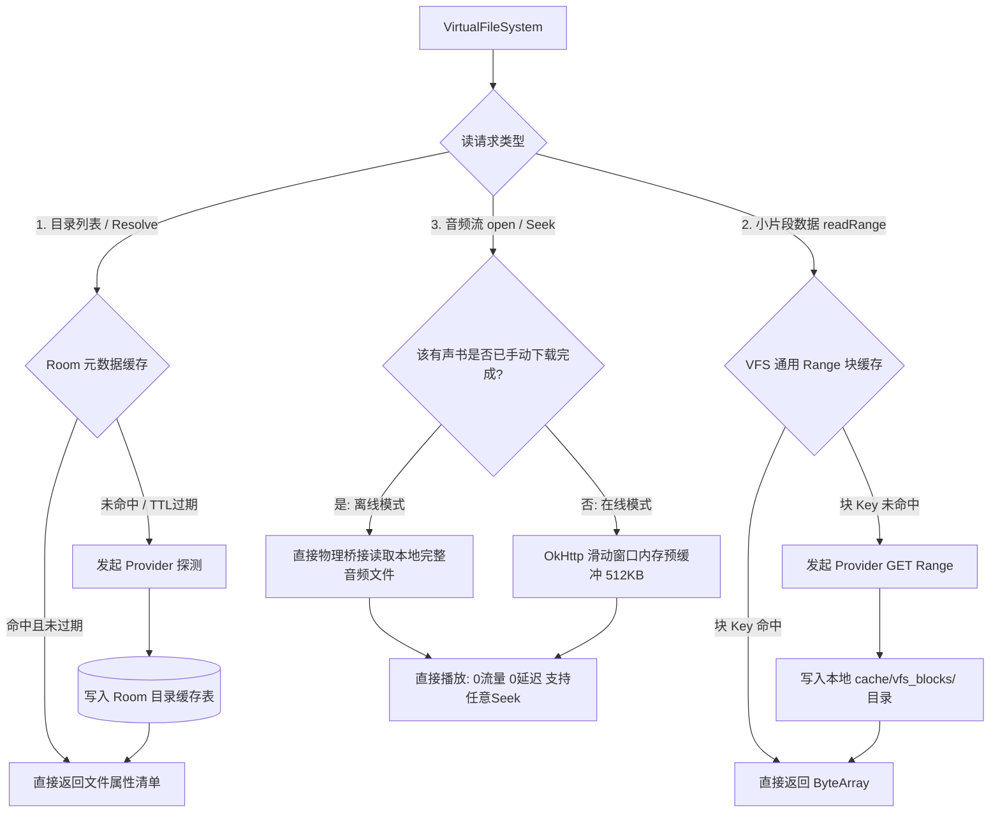

## 通用在线来源多级缓存层物理实现方案 (高性能与开闭原则演进)

基于 APlayer 的实际代码与业务特点，在线来源（包括但不限于 WebDAV、网络音频流等）的高频网络请求是导致扫描缓慢、播放首帧卡顿及封面加载延迟的主要瓶颈。

为了实现系统的高可扩展性，**缓存层被设计为在通用 VFS 底层（即 `VirtualFileSystem` 和 `VfsFileInterface`）全局闭环处理，属于所有在线来源通用的核心架构件**，而非与特定的 `WebDavSourceProvider` 深度耦合。这完美贯彻了面向对象设计中的**“开闭原则（OCP）”**：底层网络 Provider 只需要负责最纯粹的网络通信与 PROPFIND 交互，不需要管理缓存的生存状态、md5 文件指纹或磁盘回收，所有缓存逻辑对 Provider 而言完全透明。

通用多级细粒度缓存系统的具体架构设计如下：



### 7.1 第一级：通用元数据缓存 (Room 驱动 —— 免表级深度复用设计)

项目已建有的 `directory_cache`（映射 `DirectoryCacheEntity`）与 `book_files` 表在字段上高度完备，因此 `VirtualFileSystem` 框架直接进行无表级复用，实现面向所有在线 Provider 的通用扫描拦截：

1. **深度复用已有的 `directory_cache` (秒级扫描拦截)**：
   - 在后台重扫引擎调用 `VirtualFileSystem.listChildren` 前，VFS 统一在框架层拦截：优先查询 `directory_cache` 获取该在线目录缓存的 `lastModified` 和 `etag` 状态。
   - VFS 仅让具体的在线 Provider 发起单次 Depth=0 的极轻量属性探测。若发现远程时间戳/Etag 与本地缓存**完全一致**，则说明该目录**未发生任何变动**。
   - **扫描秒级拦截**：立即宣告该目录下的所有子项扫描命中，直接跳过整个目录树的遍历与解析。**这能避免 95% 以上不必要的网络 PROPFIND 请求，使扫描速度提升数十倍。**

2. **深度复用已有的 `book_files` (零网络寻址开销)**：
   - 在 `VfsFileInterface` 通用读取热路径上，对于在线来源已入库的文件，直接从 `BookFileEntity` 内存直构 `VfsNode`，并跳过 `resolve` 发送 PROPFIND 寻址的过程，达成 0 网络延迟启动。

3. **一键穿透控制自愈机制 (Force Refresh Control)**：
   - 为了让可用性校验永远反映当前真实的物理健康状态（不吃任何预处理缓存），在 `VirtualFileSystem.resolve` 中引入了 `forceRefresh: Boolean = false` 一键穿透标志。
   - **物理连通性与存在性优先**：当 `forceRefresh == true` 时，VFS 框架强制绕过 SQLite 数据库中已入库的 `book_files` 元数据免表缓存，物理穿透到底层具体 Provider。
   - **检测器强刷**：`AvailabilityChecker` 在 `checkBookFile` 寻址、`checkVfsBookFiles` 目录拦截中强制注入 `forceRefresh = true`。这完全解决了元数据免表级复用对检测连通性的影响，保障在网络失效、文件物理删除等突发边界场景下，物理自愈和检测状态机永远校验当前真实的物理状况。

4. **物理寻址接口的唯一独占宿主**：
   - 再次重申，由于应用不提供未入库文件的直接物理浏览功能，未开启穿透的 VFS `resolve` 寻址在运行期只由后台同步引擎独占，业务层在一般读取时 100% 达成 0 网络寻址延迟与绝对闭环。

### 7.2 第二级：通用区间数据块缓存 (针对 206 Range 通用磁盘拦截)

解析远程在线音频的元数据帧（如 CUE 解析、外置字幕及嵌入式封面提取）时，需要多次对文件头部或尾部进行随机的 Range 读取。由于 OkHttp 默认 Cache 不对 `206 Partial Content` 响应进行磁盘缓存，本方案设计由 **VFS 能力层统一管理 Range 缓存网关**：

1. **缓存定位指纹 (Generic Cache Key)**：
   VFS 通用块缓存生成不绑定 any 特定 Provider 的指纹：

   ```kotlin
   val cacheKey = md5("${rootId}_${sourcePath}_${etag.orEmpty()}_${offset}_$length")
   ```

2. **战役边界与通用物理拦截 (应该怎么写)**：
   - **剔除技术误区 (防范同生共死)**：必须指出，我们**绝不把**“对抗系统清理缓存后的封面自愈”作为块缓存的核心场景。因为如果 Android 系统清理了 `cacheDir` 下的缩略图（`covers/`），处于同目录下的 VFS 块缓存（`vfs_blocks/`）也已 100% 一并物理阵亡，不存在单独留存的物理条件。
   - **界定 4 大真实的物理战役场景**：通用区间 Range 缓存的核心定位是为了完美拦截和保护以下 4 个特定的“高频并发/重入微读取”阶段：
     - **【针对 CUE / M3U8 小清单文件】**
       - **场景一：后台同步引擎在“扫描导入阶段”的章节抽取**：扫描期 `.cue`/`.m3u8` 等小文件尚未完成扫描和解析入库，`SourceInventoryScanner` 和 `CueManifestParser` 在进行增量认领和导入决策校验时，短时间内需要多次重入读取该文本。通用区间缓存保障该远程小文件在扫描期只被网络请求一次，后续的并发认领和比对直接命中本地 `vfs_blocks/`，彻底消除扫描期的重复网络交互。
       - **场景二：手动触发“强制元数据与章节重建”时的网络防御**：当用户手动触发 `forceRegenerateCoverAndMetadata(bookId)` 执行数据重构时，系统需要废弃现有的 `ChapterEntity` 并重新去远程 VFS 提取最新分轨。若文件 Etag/修改时间戳未变，VFS 层 Range 缓存直接本地返回，避免因用户手动强刷而高频穿透网络拉取相同文本的开销。
     - **【针对大音频容器的数据帧】**
       - **场景三：后台多组件并发/重入解析的流量防御**：在重扫、导入或强制刷新元数据时，`SourceInventoryScanner`（重扫遍历）、`MetadataResolver`（音频头标签探测）与 `CoverRecoveryHelper`（封面物理重建）等多个组件会在极短时间（毫秒级）内并发、重复地去读取同一个大音频轨的头部标签帧（如前 32KB 盒子）。VFS 层的 Range 块缓存确保此 32KB 只发起一次网络拉取，其余并发组件的重入全部在 VFS 被拦截并秒级获取，消除网络队列阻塞。
       - **场景四：在线 Seeking 容器头帧（如 MP4/M4A 头部）的高频微寻址保护**：在线流式播放时，用户高频在进度条进行拖动 (Seeking)、或者播放器因网络抖动发起自愈重连时，ExoPlayer 为了重新寻轨，需要高频、反复去微寻址并读取远程音频容器的音视频头部盒子。VFS 通用块缓存为此提供了微秒级的磁盘读取保护，免去高频发起 Range 头请求的网络时延。
   - **通用物理拦截实现**：
     - 磁盘缓存目录统一设在 Android 系统 `context.cacheDir` 的 `vfs_blocks/` 目录下。
     - 在 VFS 统一拦截网关 `VirtualFileSystem.readRange(file, offset, length)` 执行时：
       - **命中**：VFS 直接读取本地 `vfs_blocks/cacheKey` 临时文件，**不穿透网络，极速响应（0 网络流量）**。
       - **未命中**：VFS 驱动底层在线 Provider 发起 Range 网络流拉取，数据获取后在 VFS 层写入本地 `vfs_blocks/cacheKey`，再交回上层元数据解析器。
       - **LRU 淘汰**：由 VFS 底层统一采用 LRU 淘汰限制该目录容量为 100MB，避免各 Provider 自行维护导致磁盘爆满。

### 7.3 第三级：大音频轨文件的「离线物理桥接 + 通用在线滑动预缓冲」极简高性能设计

从产品的核心业务逻辑出发，音频流同样不应该在具体的 Provider 内部编写私有的分块缓存。大音频大轨流的读取在 VFS 层面进行统一的路由控制：

1. **通用离线模式：VFS 物理文件底层桥接**：
   - 当用户手动触发下载将任何有声书缓存落盘到本地沙盒目录（如 `context.filesDir/downloads/`）后，VFS 在 `open` 读取热路径上统一智能判定。
   - 只要确认文件已下载完成，VFS 底层**自动桥接本地物理文件流，不再向具体的在线 Provider 发起网络链接**，实现 0 网络流量与绝对离线的任意 Seek 体验。

2. **通用在线模式：滑动窗口预缓冲 (Generic Sliding Buffer)**：
   - 若在线音频文件未下载，VFS 统一降级为通过 OkHttp 滑动预缓冲 `BufferedSource` 发起请求，并在内存中开辟 **`512 KB`** 的统一滑动窗口（提供约 10 - 30 秒的极佳网络抖动抵御力）。
   - **随机 Seek 与 OCP 通用性**：当播放器 Seek 定位时，由 VFS 框架将新 offset 转换为通用的 `Range: bytes=offset-` 字段传给具体的在线 Provider，Provider 仅需最纯粹地返回区间网络流，并在 VFS 层滑动窗口中平滑抖动，这完美平衡了网络抖动容忍度、系统内存占用与整机闪存寿命。
