# APlayer 能力层收口方案：LibraryFacade + VfsFileInterface 双门面架构

> 本文档基于项目**实际代码**（非现有设计文档）进行分析，以代码为第一依据。

---

## 一、现状分析（基于代码实际结构）

### 1.1 当前架构层次

```
┌─────────────────────────────────────────────────────────────┐
│                    业务层（ViewModel / Service）               │
│  LibraryViewModel · DetailViewModel · PlayerViewModel       │
│  PlaybackManager · PlaybackService · PlayerWidgetProvider   │
├──────────────────────┬──────────────────────────────────────┤
│    "门面"层（Facade）  │        直接消费层                     │
│  LibraryRepository   │  VfsFileInterface                    │
│    ├── BookLibrary    │  VfsPlaybackDataSource               │
│    │   Repository     │  CoverRecoveryHelper                 │
│    ├── PlaybackHistory│  SubtitleFileResolver                 │
│    │   Repository     │  AvailabilityChecker                  │
│    └── PhysicalFile   │  MetadataResolver                    │
│        Resolver       │  ImportOrchestrator                   │
├───────────────────────┴─────────────────────────────────────┤
│                    数据层（Room DAO + DataStore）              │
│  BookDao · ChapterDao · BookmarkDao · LibraryRootDao        │
│  ScanSessionDao · DirectoryCacheDao · AppSettings           │
├─────────────────────────────────────────────────────────────┤
│                    VFS 层（虚拟文件系统）                       │
│  VirtualFileSystem · VfsFileInterface                       │
│  LibrarySourceProvider (SAF / WebDAV)                       │
└─────────────────────────────────────────────────────────────┘
```

### 1.2 当前核心问题

#### 问题 1：能力层边界不清晰，业务层直接穿透到底层

| 消费者 | 直接依赖的底层组件 | 问题 |
|--------|-------------------|------|
| `VfsPlaybackDataSource` | `VfsFileInterface` + `AppDatabase.bookDao()` | 播放数据源直接持有 DAO 和 VFS |
| `CoverRecoveryHelper` | `VfsFileInterface` + `BookDao` + `LibraryRootDao` + `MetadataResolver` | 封面恢复自构 VFS 实例 |
| `SubtitleFileResolver` | 内部自构 `VfsFileInterface` + `BookDao` + `LibraryRootDao` | 字幕解析直接穿透 |
| `PlaybackReachabilityManager` | `VfsFileInterface` + `BookDao` + `LibraryRootDao` | 可达性检查自构 VFS |
| `ImportOrchestrator` | 在 `saveExternalSidecarCover()` 中临时构造 `VfsFileInterface` | 扫描链路也自造 VFS |
| `PlaybackManager` | 直接持有 `LibraryRepository` 实例 | 跨层直取 |
| `BookLibraryRepository` | 直接持有 `PhysicalFileResolver` + `RescanCoordinator` | 门面层内部耦合严重 |

#### 问题 2：LibraryRepository 门面是"传声筒上帝类"

`LibraryRepository`（371 行）是一个纯代理 facade，将三个子仓库的 **所有** 方法（50+ 个）原封不动地暴露。业务层全部通过这一个门面消费，虽然签名不破坏，但以下问题仍存在：

- 业务层无法区分"我要访问文件"还是"我要读取元数据"
- 搜索历史、书库根管理、播放计划构建、封面自愈、字幕加载——全部混在一个接口中
- 新增任何能力都必须同时修改 `BookLibraryRepository` + `LibraryRepository` 两层

#### 问题 3：VfsFileInterface 已存在但未被统一使用

当前 `VfsFileInterface` 已经是一个定义清晰的"纯读取门面"，但多个组件没有通过它，而是各自构造 `VfsFileInterface` 实例或直接使用 `VirtualFileSystem`。

#### 问题 4：导入/扫描链路嵌在 BookLibraryRepository 中

`BookLibraryRepository.syncLibrary()` 直接实例化 `RescanCoordinator`，导入流程与元数据查询能力混在同一个类中。

#### 问题 5：数据层存在跨层反向依赖

`BookLibraryRepository.deleteLibraryRoot()` 在数据层中直接通过 `PlaybackManager.getInstance(context)` 获取播放管理器单例并调用 `stopPlayback()`。这违反了分层原则——数据层（data）不应反向依赖业务层（media/PlaybackManager）。该反向调用无法通过简单的 Service 拆分自动消除，需要把“删除根前是否停播”的跨领域协调上移到具体用例中。

---

## 二、目标架构

### 2.1 双门面收口设计

```
┌───────────────────────────────────────────────────────────────────────────┐
│                     业务层（ViewModel / Service / Widget）                   │
│   依赖 LibraryFacade + VfsFileInterface（+ AppSettings）                    │
│   精细控制的组件可按需直接依赖分域 Gateway                                       │
├──────────────┬──────────────────────────────┬─────────────────────────────┤
│              │                              │                             │
│  LibraryFacade                              │  VfsFileInterface           │
│  （薄路由总入口，按域委托）                      │  （运行期单例：用 DAO 查 root）  │
│              │                              │                             │
│  也可直接依赖分域 Gateway：                    │  扫描期快照实例：               │
│  BookQueryGateway                           │  用 rootsById 映射            │
│  ProgressGateway                            │  （ImportScopeBuilder /       │
│  CoverGateway                               │   ManifestParseStep /        │
│  LibraryRootGateway                         │   ImportOrchestrator）        │
│  ScanScheduler                              │                             │
│  SearchHistoryGateway                       │                             │
│              │                              │                             │
├──────────────┼──────────────────────────────┼─────────────────────────────┤
│    内部协作子组件（不对业务层暴露）                │                             │
│  ┌────────────────────┐                    │                             │
│  │ BookQueryService   │                    │                             │
│  │ (书籍/章节/书签      │                    │                             │
│  │  CRUD 与 Flow)      │                    │                             │
│  ├────────────────────┤                    │                             │
│  │ ProgressService    │                    │                             │
│  │ (进度落盘/阅读状态)   │                    │                             │
│  ├────────────────────┤                    │                             │
│  │ CoverService       │──── uses ─────────▶│  VfsFileInterface           │
│  │ (封面路径/自愈/       │                    │  (open/readRange/list)      │
│  │  自定义封面)          │                    │                             │
│  ├────────────────────┤                    │                             │
│  │ LibraryRootService │                    │                             │
│  │ (书库根 CRUD/        │                    │                             │
│  │  权限刷新/           │                    │                             │
│  │  删除时协调停播)       │                    │                             │
│  ├────────────────────┤                    │                             │
│  │ ScanService        │── uses ───────────▶│  VfsFileInterface           │
│  │ (扫描调度/           │                    │                             │
│  │  RescanCoordinator)  │                    │                             │
│  ├────────────────────┤                    │                             │
│  │ SearchService      │                    │                             │
│  │ (搜索历史)           │                    │                             │
│  └────────────────────┘                    │                             │
├────────────────────────────────────────────┼─────────────────────────────┤
│                 数据层（Room DAO + DataStore）                               │
├────────────────────────────────────────────┴─────────────────────────────┤
│                 VFS 层（VirtualFileSystem + Provider）                      │
└──────────────────────────────────────────────────────────────────────────┘
```

### 2.2 LibraryFacade 职责边界（防止成为上帝类）

> **核心原则**：`LibraryFacade` 本身是**薄代理 + 路由器**，内部按领域拆分为独立的 Service 组件。LibraryFacade 不持有任何 DAO，不直接执行业务逻辑。
>
> **命名说明**：不叫 `MetadataInterface`，因为其职责远超元数据范畴，涵盖书库根管理、扫描调度、搜索历史等。`LibraryFacade` 更准确地反映了"媒体库能力总入口"的语义。

```kotlin
// LibraryFacade 是路由器，不是上帝类。
// 每个领域子 Service 各自持有所需的 DAO 和依赖。
class LibraryFacade(context: Context) {
    // 内部组件——不对外暴露
    private val bookQuery: BookQueryService      // 书籍/章节/书签 CRUD
    private val progress: ProgressService        // 播放进度
    private val cover: CoverService              // 封面管理
    private val libraryRoot: LibraryRootService   // 书库根管理
    private val scan: ScanService                // 扫描调度
    private val search: SearchService            // 搜索历史

    // ═══════ 书籍查询 ═══════
    val audiobooks: Flow<List<BookWithProgress>>
    suspend fun getBookById(id: String): BookEntity?
    fun observeBookById(id: String): Flow<BookEntity?>
    fun searchAudiobooks(query: String): Flow<List<BookWithProgress>>
    fun filterByAuthor/Year/Narrator(...): Flow<List<BookWithProgress>>
    // ... 委托给 bookQuery

    // ═══════ 章节 ═══════
    fun getChapters(bookId: String): Flow<List<ChapterWithBookFile>>
    suspend fun getChaptersForBookSync(bookId: String): List<ChapterWithBookFile>
    // ... 委托给 bookQuery

    // ═══════ 书签 ═══════
    fun getBookmarks(bookId: String): Flow<List<BookmarkEntity>>
    suspend fun addBookmark(bookId: String, position: Long, title: String)
    // ... 委托给 bookQuery

    // ═══════ 进度 ═══════
    fun updateProgress(bookId: String, position: Long)
    suspend fun saveProgress(progress: BookProgressEntity)
    suspend fun getLastPlayedProgressSync(): BookProgressEntity?
    // ... 委托给 progress

    // ═══════ 封面 ═══════
    suspend fun saveCustomCover(bookId: String, tempCoverPath: String)
    suspend fun forceRegenerateCoverAndMetadata(bookId: String)
    fun updateBackgroundColor(id: String, color: Int)
    // ... 委托给 cover

    // ═══════ 书库管理 ═══════
    fun observeLibraryRoots(): Flow<List<LibraryRootEntity>>
    suspend fun deleteLibraryRoot(root: LibraryRootEntity): Boolean
    fun addLibraryRootAndScheduleSync(uri: Uri)
    // ... 委托给 libraryRoot + scan

    // ═══════ 扫描 ═══════
    suspend fun syncLibrary(trigger: String)
    fun scheduleLibrarySync(trigger: String)
    // ... 委托给 scan

    // ═══════ 播放计划 ═══════
    suspend fun getPlaybackPlan(bookId: String): BookPlaybackPlan?
    // ... 委托给 bookQuery

    // ═══════ 可达性检查 ═══════
    suspend fun checkDetailAvailability(bookId: String): Boolean
    suspend fun checkPrimaryAudioFileExists(bookId: String): Boolean
    suspend fun checkCurrentPlaybackFileAvailability(bookId: String): Boolean
    // ... 委托给 bookQuery + progress

    // ═══════ 搜索历史 ═══════
    val searchHistory: Flow<List<SearchHistoryEntry>>
    suspend fun addToHistory(query: String)
    // ... 委托给 search
}
```

### 2.3 分域 Gateway 接口（可选的细粒度依赖）

> **设计意图**：LibraryFacade 适用于 ViewModel 等需要广域能力的消费者。但对于 `VfsPlaybackDataSource`、`ProgressSyncTracker` 等只需要单一能力的组件，可直接依赖对应的 Gateway 接口，避免引入不必要的耦合。
>
> 每个 Gateway 接口由对应的内部 Service 实现。LibraryFacade 和直接 Gateway 依赖并行提供，消费者自由选择。

```kotlin
// 分域 Gateway 接口定义（每个由对应的内部 Service 实现）

// 书籍/章节/书签查询
interface BookQueryGateway {
    val audiobooks: Flow<List<BookWithProgress>>
    suspend fun getBookById(id: String): BookEntity?
    fun getChapters(bookId: String): Flow<List<ChapterWithBookFile>>
    suspend fun getPlaybackPlan(bookId: String): BookPlaybackPlan?
    // ...
}

// 播放进度
interface ProgressGateway {
    fun updateProgress(bookId: String, position: Long)
    suspend fun saveProgress(progress: BookProgressEntity)
    suspend fun getLastPlayedProgressSync(): BookProgressEntity?
    // ...
}

// 封面管理
interface CoverGateway {
    suspend fun saveCustomCover(bookId: String, tempCoverPath: String)
    suspend fun forceRegenerateCoverAndMetadata(bookId: String)
    // ...
}

// 书库根管理
interface LibraryRootGateway {
    fun observeLibraryRoots(): Flow<List<LibraryRootEntity>>
    suspend fun deleteLibraryRoot(root: LibraryRootEntity): Boolean
    // ...
}

// 扫描调度
interface ScanScheduler {
    suspend fun syncLibrary(trigger: String)
    fun scheduleLibrarySync(trigger: String)
}

// 搜索历史
interface SearchHistoryGateway {
    val searchHistory: Flow<List<SearchHistoryEntry>>
    suspend fun addToHistory(query: String)
    // ...
}
```

### 2.4 VfsFileInterface 双模式策略

> **关键设计决策**：VfsFileInterface 不能一刀切成全局单例。扫描链路中 `ImportScopeBuilder`、`ManifestParseStep`、`ImportOrchestrator` 使用 `rootsById` 参数传入本轮扫描的 roots 快照，这是扫描快照语义——扫描过程中用户可能增删书库根，VFS 必须基于扫描开始时的 roots 快照打开文件，否则扫描到一半 root 被删会导致 CUE/M3U8 引用的音频流无法打开。

现有 `VfsFileInterface` 构造函数已经天然支持双模式：

```kotlin
class VfsFileInterface(
    context: Context,
    // 运行期模式：通过 DAO 实时查询 root，适用于播放、封面恢复、字幕等组件
    private val libraryRootDao: LibraryRootDao? = null,
    // 快照模式：使用扫描开始时的 roots 映射，适用于扫描链路
    private val rootsById: Map<String, LibraryRootEntity> = emptyMap()
)
```

**策略**：
- **运行期实例**（`RuntimeVfsFileInterface`）：在 `AppContainer` 中注册单例，使用 `libraryRootDao` 参数。播放、封面恢复、字幕、可达性检查等运行期组件注入此实例。
- **扫描快照实例**：扫描链路（`ImportScopeBuilder`、`ManifestParseStep`、`ImportOrchestrator.saveExternalSidecarCover()`）**保持现有构造方式不变**，继续使用 `rootsById = inventory.roots.associateBy { it.id }` 传入快照。

### 2.5 DeleteLibraryRootUseCase：用具体用例承载删除根前停播

> **问题**：`BookLibraryRepository.deleteLibraryRoot()` 在数据层直接通过 `PlaybackManager.getInstance(context)` 获取播放管理器并调用 `stopPlayback()`，违反分层原则。

**解决方案**：不为这个单点功能单独抽 `PlaybackControlPort`。改用一个具体的 `DeleteLibraryRootUseCase` 承载跨领域协调：先判断当前播放书籍是否属于待删除根目录，需要时直接调用 `PlaybackManager.stopPlayback()`，然后调用 `BookLibraryRepository` 的纯数据清理入口。

> **边界说明**：这里不抽象播放控制端口，是为了避免为了一个删除场景制造过早抽象。`DeleteLibraryRootUseCase` 是应用层协调器，可以依赖播放管理器和数据仓库；`BookLibraryRepository` 仍然不依赖 `PlaybackManager`，只负责缓存清理、SAF 权限释放、WebDAV 凭据清理和 Room 删除。

```kotlin
// 删除书库根的具体用例——负责跨领域协调，不把播放职责塞回数据仓库。
class DeleteLibraryRootUseCase(
    private val playbackManager: PlaybackManager,
    private val bookQuery: BookQueryGateway,
    private val rootRepository: BookLibraryRepository
) {
    suspend operator fun invoke(root: LibraryRootEntity): Boolean {
        // 1. 用例层先完成跨领域协调：如果当前播放书籍属于待删除根目录，就先停播。
        val currentBookId = playbackManager.currentPlayingBookId
        if (currentBookId != null) {
            val currentBook = bookQuery.getBookById(currentBookId)
            if (currentBook?.rootId == root.id) {
                playbackManager.stopPlayback()
            }
        }
        // 2. 数据仓库只执行纯数据/文件清理，不再知道 PlaybackManager。
        return rootRepository.deleteLibraryRootDataOnly(root)
    }
}
```

### 2.6 PlaybackFileLookup：解耦播放数据源对 DAO 的直接依赖

> **问题**：`VfsPlaybackDataSource` 直接持有 `AppDatabase` 实例并通过 `database.bookDao().getBookFileById()` 查询文件实体，同时自构 `VfsFileInterface`。

```kotlin
// 播放文件查找接口——让 DataSource 只依赖查找能力，不依赖 DAO
interface PlaybackFileLookup {
    suspend fun getBookFileById(bookFileId: String): BookFileEntity?
}

// VfsPlaybackDataSource 改为注入两个接口
class VfsPlaybackDataSource(
    private val fileLookup: PlaybackFileLookup,
    private val fileReader: VfsFileInterface
) : BaseDataSource(false) {
    // open() 中：val file = runBlocking { fileLookup.getBookFileById(bookFileId) }
    // 然后：fileReader.open(file, dataSpec.position)
}
```

### 2.7 AppContainer 的演进

> **实施说明**：下面是目标完整结构，不要求 M1 一次性暴露所有 Gateway。实际落地时按迁移批次增量注册，先提供 `BookQueryGateway`、`ProgressGateway`、`ScanScheduler`、`PlaybackFileLookup` 等高收益入口，再随着调用点迁移补齐 `CoverGateway`、`LibraryRootGateway`、`SearchHistoryGateway`。

```kotlin
interface AppContainer {
    // ── 新门面 ──
    val libraryFacade: LibraryFacade            // 总入口（ViewModel 适用）

    // ── 分域 Gateway（精细组件按需依赖，按迁移批次逐步注册） ──
    val bookQueryGateway: BookQueryGateway
    val progressGateway: ProgressGateway
    val coverGateway: CoverGateway
    val libraryRootGateway: LibraryRootGateway
    val scanScheduler: ScanScheduler
    val searchHistoryGateway: SearchHistoryGateway

    // ── VFS（运行期单例） ──
    val vfsFileInterface: VfsFileInterface

    // ── 删除书库根用例（承载删除前停播协调） ──
    val deleteLibraryRootUseCase: DeleteLibraryRootUseCase

    // ── 播放文件查找 ──
    val playbackFileLookup: PlaybackFileLookup

    // ── 设置 ──
    val settingsRepository: AppSettingsRepository

    // ── 过渡期保留 ──
    @Deprecated("迁移到 libraryFacade 或对应的分域 Gateway")
    val libraryRepository: LibraryRepository
}
```

---

## 三、导入和扫描流程的位置

### 3.1 当前位置分析

| 组件 | 当前位置 | 调用路径 |
|------|---------|------------|
| `RescanCoordinator` | `library/` | `BookLibraryRepo.syncLibrary() → RescanCoordinator.rescan()` |
| `ImportOrchestrator` | `library/` | `RescanCoordinator → ImportOrchestrator.run()` |
| `ImportScopeBuilder` | `library/` | `RescanCoordinator → ImportScopeBuilder` |
| `BookImporter` | `library/` | `RescanCoordinator → BookImporter.applyImportRun()` |
| `SourceInventoryScanner` | `library/` | `RescanCoordinator → scanner.scanDirectories()` |

### 3.2 目标位置

导入/扫描链路属于**内部基础设施**，不应暴露给业务层。收口后：

```
LibraryFacade
  └── ScanService (library/scan/)
        ├── RescanCoordinator (不变，仍在 library/)
        ├── ImportOrchestrator (不变)
        ├── BookImporter (不变)
        └── SourceInventoryScanner (不变)
```

- `ScanService` 是 `LibraryFacade` 内部的扫描调度 facade
- 业务层只调用 `libraryFacade.syncLibrary()` / `libraryFacade.scheduleLibrarySync()`
- `RescanCoordinator` 通过注入的运行期 `VfsFileInterface` 实例访问文件（替代现在的临时构造）
- **扫描链路内部**（`ImportScopeBuilder`、`ManifestParseStep`、`ImportOrchestrator.saveExternalSidecarCover()`）**继续使用快照模式构造 VfsFileInterface**，保留扫描快照语义不变
- **扫描链路的物理位置（包路径）不需要变动**，只改依赖注入方式

---

## 四、改动范围分析

### 4.1 新建文件

> 下表是目标完整文件清单。实施时按里程碑增量创建，M1 不一次性铺满所有 Gateway / Service。

| 文件 | 位置 | 说明 |
|------|------|------|
| `DeleteLibraryRootUseCase.kt` | `domain/usecase/` 或 `library/usecase/` | 删除书库根用例，负责删除前停播协调和纯数据清理调用 |
| `PlaybackFileLookup.kt` | `media/` | 播放文件查找接口，解耦 VfsPlaybackDataSource 对 DAO 的直接依赖 |
| `LibraryFacade.kt` | `data/` | 薄路由门面 |
| `BookQueryGateway.kt` | `data/gateway/` | 书籍/章节/书签查询分域接口 |
| `ProgressGateway.kt` | `data/gateway/` | 进度管理分域接口 |
| `CoverGateway.kt` | `data/gateway/` | 封面管理分域接口 |
| `LibraryRootGateway.kt` | `data/gateway/` | 书库根管理分域接口 |
| `ScanScheduler.kt` | `data/gateway/` | 扫描调度分域接口 |
| `SearchHistoryGateway.kt` | `data/gateway/` | 搜索历史分域接口 |
| `BookQueryService.kt` | `data/service/` | 书籍/章节/书签查询与 CRUD |
| `ProgressService.kt` | `data/service/` | 进度管理（适配 PlaybackHistoryRepository） |
| `CoverService.kt` | `data/service/` | 封面管理（适配 PhysicalFileResolver + BookLibraryRepo 封面部分） |
| `LibraryRootService.kt` | `data/service/` | 书库根管理；不直接处理播放停播，删除根走 `DeleteLibraryRootUseCase` |
| `ScanService.kt` | `data/service/` | 扫描调度（适配 BookLibraryRepo.syncLibrary） |
| `SearchService.kt` | `data/service/` | 搜索历史（适配 BookLibraryRepo） |

### 4.2 修改文件

| 文件 | 改动内容 | 工作量 |
|------|---------|--------|
| **AppContainer.kt** | 注册 `LibraryFacade` + `VfsFileInterface` + Gateway + 删除根用例 | 小 |
| **DefaultAppContainer** | 初始化新门面 + VFS 运行期实例 + 删除根用例 | 中 |
| **BookLibraryRepository.kt** | `deleteLibraryRoot()` 改为纯数据清理入口，不再停播 | 中 |
| **DeleteLibraryRootUseCase.kt** | 新增删除根协调逻辑：先按需停播，再调用仓库清理 | 小 |
| **VfsPlaybackDataSource.kt** | 改为注入 `PlaybackFileLookup` + `VfsFileInterface` | 小 |
| **CoverRecoveryHelper.kt** | 注入运行期 `VfsFileInterface` 而非自构 | 小 |
| **SubtitleFileResolver.kt** | 注入运行期 `VfsFileInterface` 而非自构 | 小 |
| **PlaybackReachabilityManager.kt** | 注入运行期 `VfsFileInterface` 而非自构 | 小 |
| **LibraryViewModel.kt** | `repository` → `libraryFacade` | 中（~30 处调用替换） |
| **DetailViewModel.kt** | `repository` → `libraryFacade` | 小（~10 处） |
| **PlayerViewModel.kt** | `libraryRepository` → `libraryFacade` | 中（~20 处） |
| **PlaybackManager.kt** | `libraryRepository` → `libraryFacade`（或按需 `BookQueryGateway`） | 小（~5 处） |
| **ProgressSyncTracker.kt** | `libraryRepository` → `progressGateway` | 小 |
| **PlaybackService.kt** | 替换 repository 消费 | 小 |
| **PlaybackFailureHandler.kt** | 替换 repository 消费 | 小 |
| **AutoRewindManager.kt** | 替换 repository 消费 | 小 |
| **MediaPlaybackDelegate.kt** | 替换 repository 消费 | 小 |
| **GetRelatedBooksUseCase.kt** | 替换 repository 消费 | 小 |
| **BookmarkManager.kt** | 替换 repository 消费 | 小 |
| **SearchViewModel.kt** | 替换 repository 消费 | 小 |
| **SettingsViewModel.kt** | 替换 repository 消费 | 小 |
| **PlayerWidgetProvider.kt** | 替换 repository 消费 | 小 |
| **LibrarySyncWorker.kt** | 替换 repository 消费 | 小 |

### 4.3 不改动的文件（扫描链路保持快照模式）

以下扫描链路文件**保持现有的 VfsFileInterface 快照构造方式不变**：

- `ImportScopeBuilder.kt`：继续用 `VfsFileInterface(context, rootsById = inventory.roots.associateBy { it.id })`
- `ManifestParseStep.kt`：继续用 `VfsFileInterface(context, rootsById = input.roots.associateBy { it.id })`
- `ImportOrchestrator.kt`：`saveExternalSidecarCover()` 继续用快照模式

### 4.4 其他不改动的文件

- `library/` 包下的全部扫描/导入组件（RescanCoordinator、所有 Step 类、SourceInventoryScanner、FileInventory 等）
- `library/vfs/` 包下的全部 VFS 核心（VirtualFileSystem、VfsNode、VfsPath 等）
- `library/vfs/sourceProvider/` 包下的所有 Provider
- `media/parser/` 包下的所有解析器（MetadataResolver、各格式 Parser）
- `data/entity/`、`data/dao/`、`data/db/` 等数据层不变
- 所有 UI Composable 文件不变

### 4.5 计划废弃（最终删除）

| 文件 | 说明 |
|------|------|
| `LibraryRepository.kt` | 旧门面，过渡期标注 `@Deprecated`，最终删除 |
| `BookLibraryRepository.kt` | 职责拆散到各 Service 后删除 |
| `PlaybackHistoryRepository.kt` | 拆入 `ProgressService` 后删除 |
| `PhysicalFileResolver.kt` | 拆入 `CoverService` + 字幕直接走 `SubtitleFileResolver` 后删除 |

---

## 五、工作量评估

| 里程碑 | 主要工作 | 预估工时 | 风险 |
|--------|---------|---------|------|
| M0 - 反向依赖治理 | 新建 `DeleteLibraryRootUseCase`，承载删除根前停播协调，`BookLibraryRepository` 只保留纯数据清理 | 2-3h | 中 |
| M1 - 薄适配搭建 | 只新增首批高收益 Gateway / Service 适配层（`BookQueryGateway`、`ProgressGateway`、`ScanScheduler`）+ `LibraryFacade` + AppContainer 注册 | 3-4h | 低 |
| M2 - VFS 运行期收口 | 注册运行期 VfsFileInterface 单例，运行期组件改为注入（扫描快照不变） | 2-3h | 低 |
| M2.5 - 播放数据源收口 | 新建 `PlaybackFileLookup`，`VfsPlaybackDataSource` 改为注入 | 1-2h | 低 |
| M3 - ViewModel 迁移 | 3 个 ViewModel 切换到 `libraryFacade` | 3-4h | 中（需逐个验证） |
| M4 - Service/Worker 迁移 | PlaybackManager、ProgressSyncTracker、AutoRewindManager 等 | 2-3h | 中 |
| M5 - UseCase/Helper 迁移 | 按需补齐 `CoverGateway`、`LibraryRootGateway`、`SearchHistoryGateway`，迁移 BookmarkManager、GetRelatedBooksUseCase、MediaPlaybackDelegate 等 | 2-3h | 中 |
| M6 - 旧实现搬迁 | 将 Service 适配层从委托旧仓库改为直接持有 DAO，删除旧仓库 | 6-8h | 高（需全量回归） |
| **合计** | | **~21-29h** | |

---

## 六、里程碑详细计划

### M0：反向依赖治理（无编译破坏）

**目标**：消除 `BookLibraryRepository.deleteLibraryRoot()` 对 `PlaybackManager` 的反向依赖，并把停播协调从数据仓库上移到 `DeleteLibraryRootUseCase`。

**背景**：当前 `BookLibraryRepository.deleteLibraryRoot()` 通过 `PlaybackManager.getInstance(context)` 直接获取播放管理器单例并调用 `stopPlayback()`。这是数据层（data）对业务层（media）的反向依赖，违反分层原则，且无法通过后续的 Service 拆分自动消除。

**步骤**：

1. 新建 `DeleteLibraryRootUseCase`，注入 `PlaybackManager`、`BookQueryGateway` 和 `BookLibraryRepository`
2. 用例内部判断当前播放书籍是否属于待删除根目录，属于则先调用 `PlaybackManager.stopPlayback()`
3. 将 `BookLibraryRepository.deleteLibraryRoot()` 改名或拆出为纯数据清理入口（如 `deleteLibraryRootDataOnly()`），只负责缓存清理、权限释放、凭据删除和 Room 删除
4. 移除 `BookLibraryRepository` 中对 `com.viel.aplayer.media.PlaybackManager` 的直接引用
5. `SettingsViewModel` 或后续 `LibraryRootGateway` 删除根时改走 `DeleteLibraryRootUseCase`

**验证**：编译通过 + 删除书库根时仍能正确停止播放

---

### M1：薄适配搭建（无编译破坏）

**目标**：新建首批高收益 Gateway 接口 + Service 适配层 + `LibraryFacade`，注册到 `AppContainer`，与旧 `LibraryRepository` **并行共存**。

> **关键策略**：第一阶段**不拆旧仓库实现，也不一次性创建所有 Gateway**。新 Service 先委托现有的 `BookLibraryRepository` / `PlaybackHistoryRepository` / `PhysicalFileResolver`。调用点迁移完成后（M6），再将实现从旧仓库搬到 Service 内部。

**步骤**：

1. 创建 `data/gateway/` 包，先定义首批接口：
   - `BookQueryGateway`：支撑播放计划、书籍读取、章节/文件查询
   - `ProgressGateway`：支撑高频进度落库和冷启动恢复
   - `ScanScheduler`：支撑前台/后台扫描调度
2. 创建 `data/service/` 包，先新建首批 Service 实现类：
   - `BookQueryService` implements `BookQueryGateway`：暂时委托 `BookLibraryRepository`
   - `ProgressService` implements `ProgressGateway`：暂时委托 `PlaybackHistoryRepository`
   - `ScanService` implements `ScanScheduler`：暂时委托 `BookLibraryRepository`
3. 让 `DeleteLibraryRootUseCase` 保留 M0 的删除根协调能力；`LibraryRootGateway` 可以等 SettingsViewModel 迁移前再补齐
4. 创建 `LibraryFacade`，内部先路由首批 Service
5. 在 `AppContainer` / `DefaultAppContainer` 注册新门面、首批 Gateway 和运行期 VFS

**验证**：编译通过 + 旧门面仍正常工作 + 新门面首批方法可调用

---

### M2：VFS 运行期收口

**目标**：统一运行期 `VfsFileInterface` 实例注入，消除运行期组件自行构造。扫描链路的快照模式不变。

**步骤**：

1. 在 `DefaultAppContainer` 创建运行期 `VfsFileInterface` 单例（使用 `libraryRootDao`）
2. 修改以下**运行期**组件改为注入共享 VFS 实例：
   - `CoverRecoveryHelper`：注入而非自构
   - `SubtitleFileResolver`：注入而非自构
   - `PlaybackReachabilityManager`：注入而非自构
3. `CoverService` 内部组合 `CoverRecoveryHelper` 时注入共享 VFS
4. **不改动**以下扫描链路文件（保留快照模式）：
   - `ImportScopeBuilder.kt`
   - `ManifestParseStep.kt`
   - `ImportOrchestrator.saveExternalSidecarCover()`

**验证**：编译通过 + 播放 / 封面恢复 / 字幕加载功能正常 + 扫描功能正常

---

### M2.5：播放数据源收口

**目标**：解耦 `VfsPlaybackDataSource` 对 `AppDatabase` 的直接依赖。

**背景**：当前 `VfsPlaybackDataSource` 直接持有 `AppDatabase` 实例并通过 `database.bookDao().getBookFileById()` 查询，同时自构 `VfsFileInterface`。

**步骤**：

1. 新建 `PlaybackFileLookup` 接口：`suspend fun getBookFileById(bookFileId: String): BookFileEntity?`
2. 提供基于 `BookDao` 的默认实现
3. `VfsPlaybackDataSource` 改为通过构造函数注入 `PlaybackFileLookup` + `VfsFileInterface`
4. `VfsPlaybackDataSource.Factory` 从 `AppContainer` 获取注入实例

**验证**：编译通过 + 播放流（含 seek、切章节）正常

---

### M3：ViewModel 层迁移

**目标**：三个核心 ViewModel 切换到 `LibraryFacade`。

**步骤**（按风险从低到高排列）：

1. `DetailViewModel`：将 `repository` 替换为 `libraryFacade`
2. `LibraryViewModel`：将 `repository` 替换为 `libraryFacade`
3. `PlayerViewModel`：将 `libraryRepository` 替换为 `libraryFacade`

**验证**：每完成一个 ViewModel，手动测试对应页面的全部功能

---

### M4：Service / Worker / Manager 层迁移

**目标**：后台组件切换到新门面或分域 Gateway。

**步骤**：

1. `PlaybackManager`：`libraryRepository` → `libraryFacade`（seekTo 中的 `getFilesForBookSync` 走 `BookQueryGateway`）
2. `ProgressSyncTracker`：`libraryRepository` → `progressGateway`
3. `AutoRewindManager`：切换
4. `PlaybackService` / `PlaybackFailureHandler`：切换
5. `LibrarySyncWorker`：切换
6. `PlayerWidgetProvider`：切换

**验证**：播放全流程 + 后台定时扫描 + Widget 功能

---

### M5：UseCase / Helper 层迁移

**目标**：按实际迁移需要补齐剩余 Gateway，并切换残余消费者。

**步骤**：

1. 为 `SettingsViewModel` 补齐 `LibraryRootGateway`，让书库根读取、刷新、删除、扫描触发不再直接依赖旧门面
2. 为封面相关迁移补齐 `CoverGateway`，覆盖自定义封面、强制重建元数据/封面、背景色更新
3. 为 `SearchViewModel` 补齐 `SearchHistoryGateway`
4. 迁移 `BookmarkManager`
5. 迁移 `GetRelatedBooksUseCase`
6. 迁移 `MediaPlaybackDelegate`

**验证**：书签管理 + 推荐算法 + 设置页面功能

---

### M6：旧实现搬迁与清理

**目标**：将 Service 适配层从委托旧仓库改为直接持有 DAO，安全删除旧代码。

> **关键**：此阶段才真正拆旧仓库实现。由于 M3-M5 已经完成全部调用点迁移，此时旧仓库已无外部消费者，搬迁风险可控。

**步骤**：

1. 逐个 Service 将内部实现从"委托 BookLibraryRepository"改为"直接持有 DAO 和依赖"
2. 迁移 `BookLibraryRepository` 时保留其关键运行语义：书库根内存缓存、扫描串行锁、封面自愈触发、WebDAV 凭据清理、SAF 权限释放
3. 迁移 `PlaybackHistoryRepository` 时保留高频进度落库协程模型、阅读状态计算和运行期可达性降级策略
4. 迁移 `PhysicalFileResolver` 时保留封面缓存清理、字幕解析入口和元数据提取入口
5. IDE 全局搜索确认 `LibraryRepository` / `BookLibraryRepository` / `PlaybackHistoryRepository` / `PhysicalFileResolver` 零引用
6. 删除旧仓库文件
7. 从 `AppContainer` 移除 `libraryRepository` 属性
8. 全量回归测试

**验证**：全功能回归 + 编译零警告

---

## 七、风险与对策

| 风险 | 对策 |
|------|------|
| LibraryFacade 膨胀为新上帝类 | 内部按领域拆分 Service，LibraryFacade 仅做路由委托，单个方法不超过 2 行；精细组件优先依赖分域 Gateway |
| Gateway / Service 一次性铺太多造成新复杂度 | M1 只落地首批高收益接口；`CoverGateway`、`LibraryRootGateway`、`SearchHistoryGateway` 等到对应消费者迁移前再创建 |
| 迁移期编译破坏 | M1 阶段新旧门面并存且新 Service 委托旧仓库，M3-M5 逐文件替换，每步编译验证 |
| VFS 运行期单例生命周期 | 绑定 ApplicationContext，与 App 进程等生命周期 |
| VFS 快照语义被破坏 | 扫描链路的 VfsFileInterface 快照构造方式**明确保持不变**，M2 只收口运行期实例 |
| 扫描链路改动影响稳定性 | 扫描组件物理位置和内部逻辑不变，只改依赖注入入口 |
| 进度同步高频路径性能 | ProgressService 保持与 PlaybackHistoryRepository 完全相同的协程模型和 Mutex 策略 |
| deleteLibraryRoot 反向依赖残留 | M0 阶段让 `DeleteLibraryRootUseCase` 负责停播协调，`BookLibraryRepository` 不依赖 `PlaybackManager` |
| M6 搬迁旧实现遗漏运行语义 | 将根缓存、扫描锁、封面自愈、权限释放、WebDAV 凭据清理、高频进度协程模型列入迁移检查项 |

---

## 八、与现有架构的差异对照

| 维度 | 现有架构 | 目标架构 |
|------|---------|---------|
| 业务层入口 | `LibraryRepository`（50+ 方法的传声筒） | `LibraryFacade`（分域路由） + 分域 Gateway + `VfsFileInterface` |
| VFS 实例管理 | 各组件自行 `new VfsFileInterface(...)` | 运行期全局单例注入 + 扫描期保留快照构造 |
| 能力分类 | 全混在一个门面 | 元数据/进度/封面/书库/扫描/搜索 分域，vs 文件访问 清晰分离 |
| 内部结构 | 3 个仓库（BookLibrary/PlaybackHistory/Physical） | 目标为 6 个领域 Service + 6 个 Gateway 接口，实施时按迁移批次增量落地 |
| 扫描调度 | 嵌在 `BookLibraryRepository.syncLibrary()` | 独立 `ScanService` 封装 |
| 跨层依赖 | 数据层直接反向调用 `PlaybackManager` | `DeleteLibraryRootUseCase` 协调停播，数据仓库只做数据清理 |
| 播放数据源 | 直接持有 `AppDatabase` + 自构 VFS | 注入 `PlaybackFileLookup` + 运行期 VFS |
| 扩展性 | 新能力需改 2 层（子仓库 + 门面） | 新能力只需在对应 Service 加方法 + Gateway 扩展（可选加 Facade 路由） |
| 迁移安全性 | 一次性提取实现（风险高） | 先薄适配 → 迁移调用点 → 最后搬迁实现（渐进式） |

---

## 九、目标完整架构图

### 9.1 分层依赖总览

```mermaid
graph TB
    subgraph UI["UI 层（Composable）"]
        LibraryScreen["LibraryScreen"]
        DetailScreen["DetailScreen"]
        PlayerScreen["PlayerScreen"]
        SettingsScreen["SettingsScreen"]
    end

    subgraph BIZ["业务层（ViewModel / Service / Widget）"]
        LVM["LibraryViewModel"]
        DVM["DetailViewModel"]
        PVM["PlayerViewModel"]
        SVM["SearchViewModel"]
        SetVM["SettingsViewModel"]
        PM["PlaybackManager"]
        PS["PlaybackService"]
        PST["ProgressSyncTracker"]
        ARM["AutoRewindManager"]
        PFH["PlaybackFailureHandler"]
        MPD["MediaPlaybackDelegate"]
        BM["BookmarkManager"]
        GRB["GetRelatedBooksUseCase"]
        LSW["LibrarySyncWorker"]
        PWP["PlayerWidgetProvider"]
    end

    subgraph FACADE["门面层"]
        LF["LibraryFacade<br/>（薄路由总入口）"]

        subgraph GW["分域 Gateway 接口"]
            BQG["BookQueryGateway"]
            PG["ProgressGateway"]
            CG["CoverGateway"]
            LRG["LibraryRootGateway"]
            SS["ScanScheduler"]
            SHG["SearchHistoryGateway"]
        end
    end

    subgraph USECASE["应用用例 / 窄接口"]
        DLR["DeleteLibraryRootUseCase"]
        PFL["PlaybackFileLookup"]
    end

    subgraph SVC["Service 层（内部实现，不对业务层暴露）"]
        BQS["BookQueryService"]
        PRS["ProgressService"]
        CS["CoverService"]
        LRS["LibraryRootService"]
        ScS["ScanService"]
        SeS["SearchService"]
    end

    subgraph LEGACY["过渡期旧仓库（M1-M5 委托，M6 搬迁后删除）"]
        BLR["BookLibraryRepository<br/>（纯数据清理/查询/扫描适配）"]
        PHR["PlaybackHistoryRepository"]
        PFR["PhysicalFileResolver"]
    end

    subgraph VFS["VFS 层"]
        VFI_RT["VfsFileInterface<br/>（运行期单例，用 DAO）"]
        VFI_SN["VfsFileInterface<br/>（扫描快照实例，用 rootsById）"]
        VirFS["VirtualFileSystem"]
        SPF["LibrarySourceProviderFactory"]
        SAF["SafSourceProvider"]
        WDV["WebDavSourceProvider"]
    end

    subgraph SCAN["扫描链路（物理位置不变）"]
        RC["RescanCoordinator"]
        IO["ImportOrchestrator"]
        ISB["ImportScopeBuilder"]
        BI["BookImporter"]
        SIS["SourceInventoryScanner"]
        MPS["ManifestParseStep"]
    end

    subgraph DATA["数据层（Room DAO + DataStore）"]
        BD["BookDao"]
        CD["ChapterDao"]
        BMD["BookmarkDao"]
        LRD["LibraryRootDao"]
        SSD["ScanSessionDao"]
        AS["AppSettingsRepository"]
        SHS["SearchHistoryStore"]
    end

    subgraph MEDIA["媒体基础设施"]
        VPDS["VfsPlaybackDataSource"]
        CRH["CoverRecoveryHelper"]
        SFR["SubtitleFileResolver"]
        PRM["PlaybackReachabilityManager"]
        MR["MetadataResolver"]
        CE["CoverExtractor"]
    end

    %% UI → ViewModel
    LibraryScreen --> LVM
    DetailScreen --> DVM
    PlayerScreen --> PVM
    SettingsScreen --> SetVM

    %% ViewModel → LibraryFacade（大多数 ViewModel 走总入口）
    LVM --> LF
    DVM --> LF
    PVM --> LF
    SVM --> LF
    SetVM --> LF

    %% 精细组件 → 分域 Gateway / 用例
    PST -.-> PG
    SetVM -.-> LRG
    SetVM -.-> DLR
    PM --> LF
    PM -.-> BQG

    %% 业务层 → 其他
    PS --> PM
    PWP --> PM
    BM --> LF
    GRB --> LF
    LSW --> LF
    MPD --> LF
    ARM --> LF
    PFH --> LF

    %% LibraryFacade 路由到 Gateway
    LF --> BQG
    LF --> PG
    LF --> CG
    LF --> LRG
    LF --> SS
    LF --> SHG

    %% Gateway → Service（实现关系）
    BQG -.- BQS
    PG -.- PRS
    CG -.-> CS
    LRG -.-> LRS
    SS -.- ScS
    SHG -.-> SeS

    %% 删除书库根用例：承载单点跨领域协调，不额外抽播放控制端口
    DLR --> PM
    DLR --> BQG
    DLR --> BLR

    %% M1-M5：Service 先委托旧仓库，M6 后再直接持有 DAO 和依赖
    BQS --> BLR
    PRS --> PHR
    CS -.-> PFR
    LRS --> BLR
    ScS --> BLR
    SeS -.-> BLR

    %% M6：旧仓库搬迁后，Service 直接持有 DAO / DataStore / 基础设施
    BQS -.-> BD
    BQS -.-> CD
    BQS -.-> BMD
    PRS -.-> BD
    CS -.-> CE
    CS -.-> CRH
    LRS -.-> LRD
    ScS -.-> RC
    SeS -.-> SHS

    %% 旧仓库当前持有的数据层/基础设施依赖；BookLibraryRepository 不再引用 PlaybackManager
    BLR --> BD
    BLR --> CD
    BLR --> BMD
    BLR --> LRD
    BLR --> SHS
    BLR --> RC
    PHR --> BD
    PFR --> CE
    PFR --> CRH

    %% 扫描链路
    RC --> IO
    RC --> ISB
    RC --> BI
    RC --> SIS
    IO --> MPS

    %% 扫描链路 → VFS 快照
    ISB --> VFI_SN
    MPS --> VFI_SN
    IO --> VFI_SN

    %% 运行期组件 → VFS 运行期单例
    CS --> VFI_RT
    CRH --> VFI_RT
    SFR --> VFI_RT
    PRM --> VFI_RT
    VPDS --> VFI_RT

    %% VfsPlaybackDataSource → PlaybackFileLookup
    VPDS --> PFL
    PFL -.- BD

    %% VFS 内部
    VFI_RT --> VirFS
    VFI_SN --> VirFS
    VirFS --> SPF
    SPF --> SAF
    SPF --> WDV

    %% VFS 运行期查 root
    VFI_RT -.-> LRD

    %% 样式
    classDef facade fill:#4a90d9,stroke:#2c5f8a,color:#fff
    classDef gateway fill:#5ba85b,stroke:#3d7a3d,color:#fff
    classDef service fill:#e8a838,stroke:#b8832a,color:#fff
    classDef legacy fill:#b08d57,stroke:#7f643e,color:#fff
    classDef usecase fill:#9b59b6,stroke:#7d3c98,color:#fff
    classDef data fill:#7f8c8d,stroke:#5d6d6e,color:#fff
    classDef vfs fill:#e74c3c,stroke:#c0392b,color:#fff
    classDef scan fill:#1abc9c,stroke:#16a085,color:#fff
    classDef media fill:#f39c12,stroke:#d68910,color:#fff

    class LF facade
    class BQG,PG,CG,LRG,SS,SHG gateway
    class BQS,PRS,CS,LRS,ScS,SeS service
    class BLR,PHR,PFR legacy
    class DLR,PFL usecase
    class BD,CD,BMD,LRD,SSD,AS,SHS data
    class VFI_RT,VFI_SN,VirFS,SPF,SAF,WDV vfs
    class RC,IO,ISB,BI,SIS,MPS scan
    class VPDS,CRH,SFR,PRM,MR,CE media
```



### 9.2 图例说明

| 颜色 | 层级 | 说明 |
|------|------|------|
| 🔵 蓝色 | LibraryFacade | 薄路由总入口，ViewModel 的主要依赖 |
| 🟢 绿色 | Gateway 接口 | 分域能力接口，精细组件可按需依赖 |
| 🟠 橙色 | Service 实现 | 内部领域服务，不对业务层暴露 |
| 棕色 | 过渡期旧仓库 | M1-M5 仅作为适配委托目标，M6 搬迁后删除 |
| 🟣 紫色 | 应用用例 / 窄接口 | `DeleteLibraryRootUseCase` 承载删除前停播协调；`PlaybackFileLookup` 解耦播放数据源查库 |
| ⚪ 灰色 | 数据层 | Room DAO / DataStore |
| 🔴 红色 | VFS 层 | 虚拟文件系统（运行期单例 + 扫描快照） |
| 🟦 青色 | 扫描链路 | 导入/扫描基础设施（物理位置不变） |

图中实线表示首批或当前必须落地的依赖；虚线表示按迁移批次补齐的目标依赖，或 M6 后替换旧仓库委托的最终依赖。

### 9.3 关键依赖规则

```
✅ 允许的依赖方向：
  UI → ViewModel → LibraryFacade / Gateway → Service → DAO / VFS
  精细组件（如 ProgressSyncTracker）→ 单个 Gateway（如 ProgressGateway）
  DeleteLibraryRootUseCase → PlaybackManager + BookQueryGateway + BookLibraryRepository 纯数据清理入口
  VfsPlaybackDataSource → PlaybackFileLookup + VfsFileInterface（运行期）
  扫描链路 → VfsFileInterface（快照实例，用 rootsById）

❌ 禁止的依赖方向：
  Service → ViewModel（反向依赖）
  BookLibraryRepository → PlaybackManager
  运行期组件 → 自构 VfsFileInterface（应注入运行期单例）
  业务层 → 直接持有 DAO（应通过 Gateway / Facade）
```
