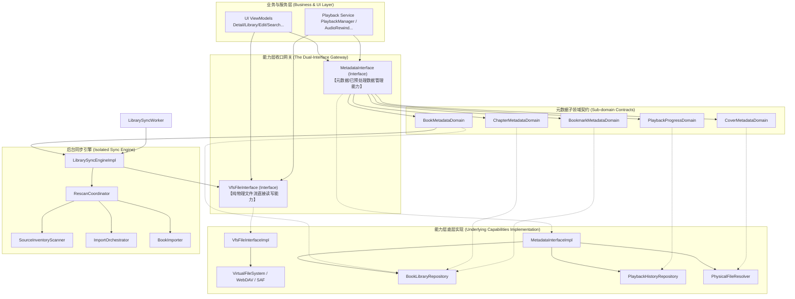

# 媒体库能力层收口重构与架构演进方案

在本项目（APlayer）的现有架构中，`LibraryRepository` 扮演着数据及物理操作的“大门面（Facade）”角色。然而，从代码的第一依据出发，这个门面类不仅掺杂了元数据 CRUD、进度映射、书签、章节等数据库事务，还深度耦合了物理文件系统可用性检测、外置字幕流解析、封面物理缓存管理，甚至托管了复杂的扫描与批量认领导入等后台核心逻辑。

为了向业务层提供更简洁、自治且低耦合的物理与数据操作网关，本方案提出**对项目能力层进行收口重构**。我们将只向业务层暴露 `VfsFileInterface` 和 `MetadataInterface` 两个主要能力。本方案详细阐述项目的实际代码分析、完整目标架构设计、防上帝类解耦策略、导入扫描引擎定位、详细改动范围、工作量评估及实施里程碑。

---

## 1. 项目实际代码依赖与痛点分析

基于对项目当前代码的深度检索与分析，当前的架构依赖与职责边界存在以下亟待优化的痛点：

### 1.1 核心痛点一：`LibraryRepository` 网关臃肿且职责交叉
虽然原先的上帝类 `LibraryRepository` 经过了一次初步拆分，将逻辑分流给了 `BookLibraryRepository`（数据库 CRUD）、`PlaybackHistoryRepository`（播放历史）和 `PhysicalFileResolver`（物理文件解析），但在暴露出的大门面中，这三者的职责仍然紧密绞合：
- **物理与元数据边界模糊**：如 `checkPrimaryAudioFileExists` 和 `checkDetailAvailability` 等本属于虚拟文件系统（VFS）范畴的逻辑，依然塞在 `LibraryRepository` 内向业务层暴露，导致业务层在需要访问物理状态时，不知道该信任 Vfs 还是该信任 Repository。
- **高频更新与重型任务同宿**：高频的播放进度更新（`updateProgress`）与重型的全局书库同步扫描（`syncLibrary`）存在于同一个大类中，增加了接口维护的心智负担。

### 1.2 核心痛点二：虚拟文件系统（VFS）的实例化不统一
在 `VfsPlaybackDataSource.kt` 中，文件读取器是通过直接 `new` 实例化的：
```kotlin
private val fileReader = VfsFileInterface(context.applicationContext, database.libraryRootDao())
```
这导致 Vfs 实例散落在播放组件及核心仓储中，破坏了全局 Vfs 状态（如根目录缓存 `rootCache`）的一致性，也不利于未来的模块化替换。

### 1.3 核心痛点三：扫描/导入流程对业务层过度暴露
目前，诸如 `syncLibrary`、`scheduleLibrarySync`、`observeLatestScanSession` 以及根目录管理的具体逻辑均平摊在 `BookLibraryRepository` 中。实际上，扫描和导入链路涉及 `RescanCoordinator`、`ImportOrchestrator`、`BookImporter`、`SourceInventoryScanner` 等多个重型底层组件的复杂配合，将其完全向普通业务 ViewModel 暴露，增加了业务层发生误调用的风险，也使得导入同步逻辑无法实现内聚的闭环自愈。

---

## 2. 完整目标架构设计 (Target Architecture)

重构后的目标架构将严格遵循**依赖倒置原则（DIP）**与**接口隔离原则（ISP）**，把能力层彻底收口为 **VFS 物理存取接口** 与 **元数据服务接口**，对业务层仅提供这两个能力网关。



---

## 3. 防上帝类解耦策略与导入扫描流程定位

### 3.1 杜绝 `MetadataInterface` 沦为新上帝类的设计
为了防止 `MetadataInterface` 沦为汇聚了成百上千个方法的巨无霸类，重构方案采用**“子领域契约独立自治”**的设计。

1. **组合门面契约 (Composite Gateway Contract)**：
   `MetadataInterface` 仅作为各大高内聚子领域的装配网关，其内部不平铺任何具体的元数据业务方法，仅暴露只读的子领域契约接口：
   ```kotlin
   package com.viel.aplayer.data

   import com.viel.aplayer.data.domain.*

   /**
    * 统一元数据与预处理数据能力收口网关。
    * 通过子领域隔离避免上帝类陷阱，实现高度解耦的微服务化设计。
    */
   interface MetadataInterface {
       val books: BookMetadataDomain
       val chapters: ChapterMetadataDomain
       val bookmarks: BookmarkMetadataDomain
       val progress: PlaybackProgressDomain
       val covers: CoverMetadataDomain
   }
   ```

2. **五大自治子领域接口划分**：
   - **`BookMetadataDomain`**：负责有声书实体查询（如 `getBookById`、`observeBookById`）、书架检索（`searchAudiobooks`）、作者/讲述人/年份过滤、搜索历史 CRUD，以及书库根节点管理。
   - **`ChapterMetadataDomain`**：负责章节物理轨映射、强制覆写并保存章节（`saveChapters`）。
   - **`BookmarkMetadataDomain`**：负责书签的响应式订阅、指纹书签落库及 CRUD（`addBookmark`、`deleteBookmark` 等）。
   - **`PlaybackProgressDomain`**：负责播放进度的高频更新（`updateProgress`）、恢复时的就绪可用性判定（`checkCurrentPlaybackFileAvailability`）及丢失时的自愈查找。
   - **`CoverMetadataDomain`**：负责强刷封面元数据重建、自定义封面保存与大图色彩解析落库（`saveCustomCover`、`updateBackgroundColor`）。

3. **按子领域分而治之的装配器**：
   in 实现层，`MetadataInterfaceImpl` 只是一个无状态的“接线板”，将调用智能分流给底层已拆解完备的三个子仓库（`BookLibraryRepository`、`PlaybackHistoryRepository`、`PhysicalFileResolver`），保证各领域业务逻辑在物理类中保持极高的内聚性。

### 3.2 导入与扫描流程的归纳与闭环位置
同步扫描不仅是一个重型的、包含多并发 I/O 认领的流程，还涉及到底层 VFS 深度读写。它本质上不属于普通业务层需要获取的“元数据”，不应暴露在核心业务网关中。

1. **归口到独立后台引擎 `LibrarySyncEngine`**：
   新建独立的同步扫描引擎接口及实现：
   ```kotlin
   package com.viel.aplayer.library.sync

   import com.viel.aplayer.data.entity.ScanSessionEntity
   import kotlinx.coroutines.flow.Flow

   /**
    * 媒体库后台扫描与增量认领导入同步引擎。
    */
   interface LibrarySyncEngine {
       // 观察当前的重扫历史会话
       fun observeLatestScanSession(): Flow<ScanSessionEntity?>
       // 异步调度派发后台书库扫描
       fun scheduleLibrarySync(trigger: String = "USER")
       // 在前台直接执行同步挂载（协程挂起）
       suspend fun syncLibrary(trigger: String = "USER"): ScanSessionEntity
   }
   ```

2. **引擎内部闭环**：
   `LibrarySyncEngineImpl` 直接封装并驱动 `RescanCoordinator`。所有与扫描有关的复杂认领账本、并发控制信号量完全在其内部闭环。
   - **VFS 的协同**：由于重扫引擎在扫描物理目录时需要读取真实的物理流（提取自带章节与基本标签），同步引擎内部通过注入 `VfsFileInterface` 的形式，完成对物理文件的遍历与区间流式解析（通过 `MetadataResolver` 等）。

3. **对业务层的极简代理**：
   为了让业务层（例如书架下拉刷新、或者系统冷启动）能够触发同步和查看状态，我们将 `LibrarySyncEngine` 的极简触发入口，代理在 `BookMetadataDomain` 中（或专门引入 `LibraryAdminDomain` ）。上游 UI 只能通过该极简代理进行触发或观察，而根本感知不到 `ImportOrchestrator` 等扫描内部类的存在。

---

## 4. 详细改动范围评估 (Scope of Modifications)

我们将对项目中所有涉及的模块及类进行逐一梳理：

### 4.1 能力接口定义与底层实现 (新模块与新建文件)
- **`[NEW] VfsFileInterface.kt` (接口)**：定义纯粹的 VFS 物理文件存取规范（`open`、`readRange`、`listChildren`），将原有的类转换为 `VfsFileInterfaceImpl.kt` 并实现此接口。
- **`[NEW] MetadataInterface.kt` (聚合接口)**：定义 5 大只读子领域属性契约。
- **`[NEW] domains` 目录**：
  - `[NEW] BookMetadataDomain.kt`：定义书籍列表及根节点管理接口。
  - `[NEW] ChapterMetadataDomain.kt`：定义章节契约接口。
  - `[NEW] BookmarkMetadataDomain.kt`：定义书签契约接口。
  - `[NEW] PlaybackProgressDomain.kt`：定义播放历史与进度契约接口。
  - `[NEW] CoverMetadataDomain.kt`：定义封面强刷与缓存管理接口。
- **`[NEW] impl` 目录**：
  - `[NEW] MetadataInterfaceImpl.kt`：实现 `MetadataInterface` 接口，完成对底层子仓库（如 `BookLibraryRepository`） of 装配与方法委派。
- **`[NEW] LibrarySyncEngine.kt`** 与 **`LibrarySyncEngineImpl.kt`**：承载 `RescanCoordinator` 后台执行核心，统一托管 `LibrarySyncWorker` 的执行入口。

### 4.2 依赖注入容器 (AppContainer) 的切换
- **`[MODIFY] AppContainer.kt`**：
  - 彻底注销全局的 `val libraryRepository: LibraryRepository`。
  - 注册并公开 `val vfsFileInterface: VfsFileInterface` 和 `val metadataInterface: MetadataInterface` 全局单例。
  - 保证业务层与播放服务只能通过这两个接口进行属性及数据访问。

### 4.3 底层服务与数据提供层重构 (向下兼容性自愈)
- **`[MODIFY] BookLibraryRepository.kt`、`PlaybackHistoryRepository.kt`、`PhysicalFileResolver.kt`**：
  - 让这三个已拆解的子 Repository 分别声明实现对应的领域接口（例如 `BookLibraryRepository : BookMetadataDomain, ChapterMetadataDomain, BookmarkMetadataDomain`）。
  - 将原先包含的扫描驱动（如 `syncLibrary`、`scheduleLibrarySync`）迁移到同步引擎中，在 Repository 中仅保留简单的数据库操作以及对引擎的代理转发。
- **`[MODIFY] VfsPlaybackDataSource.kt`**：
  - 移除 `private val fileReader = VfsFileInterface(...)` 这一在内部直接 `new` 实例的行为。
  - 改为在 `Factory` 中由 `AppContainer` 注入全局唯一的 `VfsFileInterface` 接口单例，保障虚拟文件系统根缓存及认证状态的全局统一。

### 4.4 业务与媒体控制层依赖全面切换 (向上解耦)
- **ViewModels 的全局重构**：
  - **`DetailViewModel.kt`**、**`LibraryViewModel.kt`**、**`EditBookViewModel.kt`**、**`BookListViewModel.kt`**、**`SearchViewModel.kt`**、**`SettingsViewModel.kt`**：
    - 统一将声明持有的 `LibraryRepository` 替换为 `MetadataInterface`。
    - 所有的数据流观察及 CRUD 操作，重构成通过 `metadataInterface.books`、`metadataInterface.progress` 等子领域属性代理进行，大幅度简化 ViewModel 的数据依赖，增强了测试时的打桩（Mock）便利性。
- **播放器与媒体服务核心组件的重构**：
  - **`PlaybackService.kt`**、**`PlaybackManager.kt`**、**`AutoRewindManager.kt`**、**`ProgressSyncTracker.kt`**、**`PlaybackFailureHandler.kt`**：
    - 全面清除对 `LibraryRepository` 的硬编码依赖，重构为面向 `MetadataInterface` 与 `VfsFileInterface` 双能力接口进行驱动。

---

## 5. 工作量与里程碑规划 (Effort & Milestones)

由于此次重构触及项目核心架构与所有业务 ViewModel，为降低重构期间的系统性风险，我们将重构划分为三个阶段：

### 5.1 里程碑一：核心能力接口与子领域契约定义 (奠定基石)
* **核心内容**：
  - 编写 `VfsFileInterface` 接口并改造旧的具体类。
  - 定义 `MetadataInterface` 及其 5 大高内聚子领域契约接口。
  - 定义独立的后台同步引擎 `LibrarySyncEngine`。
  - 更新 `AppContainer.kt` 以支持双接口的延迟装配声明。
* **预估工作量**：2.0 人日（包含架构评审与接口契约走读）。
* **交付件**：新定义的完整能力接口包及依赖注入容器框架。

### 5.2 里程碑二：底层逻辑重构与扫描引擎独立 (打通血脉)
* **核心内容**：
  - 改造 `BookLibraryRepository`、`PlaybackHistoryRepository` 和 `PhysicalFileResolver`，使其实现各领域接口，剔除相互间的网关交叉。
  - 编写 `MetadataInterfaceImpl` 将这三大子仓库装配为统一的微网关。
  - 彻底抽离并重构 `RescanCoordinator` 到 `LibrarySyncEngineImpl` 中，完成同步引擎对 VFS 读写与多并发导入闭环的完美支持。
  - 重构 `LibrarySyncWorker` 和 `VfsPlaybackDataSource` 以支持依赖注入。
* **预估工作量**：3.0 人日（包含 Room 增量适配与扫描并发压力测试）。
* **交付件**：高自治的重型数据同步引擎与符合契约的底层能力层实现。

### 5.3 里程碑三：上游业务全局切换与系统级真机验证 (完美收口)
* **核心内容**：
  - 批量重构所有业务 ViewModel（如 `DetailViewModel`、`LibraryViewModel` 等）中的方法调用，将其全面倒置为通过 `metadataInterface.xxx` 子领域进行访问。
  - 批量重构 `PlaybackService` 及其子组件，完成物理与元数据能力的解耦切换。
  - 实施全面编译、Room DB 迁移测试（若涉及）、音频播放及 VFS（WebDAV/SAF）边界可用性异常测试，完成端到端的架构演进校验。
* **预估工作量**：3.0 人日（包含多分辨率适配场景验证与弱网网络 VFS 降级验证）。
* **交付件**：全线业务平滑切换的 APlayer 架构收口完整版本。

---

## 6. 重构验证方案 (Verification Plan)

为确保在进行大刀阔斧的能力层收口重构时，业务功能不发生任何非预期的退化，重构完成后将执行双重验证流程：

### 6.1 自动化编译与打桩测试 (Automated Verification)
- **编译级无损验证**：
  在每个里程碑结束后，运行 Gradle 编译命令确保架构演进过程中没有任何签名级的编译破坏。
  ```powershell
  ./gradlew assembleDebug
  ```
- **接口防退化打桩验证**：
  通过编写针对 `MetadataInterface` 及其子域接口的 Mock 单元测试，重点验证在播放进度高频更新、网络 VFS 异常降级和章节强写时，数据流向与状态映射是否与重构前完全一致。

### 6.2 关键业务场景手工冒烟验证 (Manual Verification)
1. **书架响应式极速刷新验证**：
   添加或删除书库根目录（本地 SAF 或远端 WebDAV），验证 `LibrarySyncEngine` 触发的后台重扫能否在完成时，通过 `metadataInterface.books` 触发上游 UI 的流式渲染，且页面无抖动。
2. **物理文件可用性与播放降级自愈验证**：
   模拟断网或手动删除底层的 SAF/WebDAV 物理文件，在详情页触发状态刷新。校验 `AvailabilityChecker` 的 `checkBookFile` 和 `checkVfsBookFiles` 中对 `vfs.resolve` 的调用是否显式开启了 `forceRefresh = true`；验证其是否能 100% 绕过本地 SQLite 元数据缓存，强制发起远程/系统级物理检测；最终校验 `bookDao` 能否在检测失败时准确将文件与书籍分别翻转为 `MISSING` 与 `UNAVAILABLE`，确保物理自愈探活在各种缓存策略下均保持极高的可信度与时效性。
3. **封面物理自愈与色彩异步重建验证**：
   重构完成后彻底清理测试设备的图片物理缓存，冷启动 APP 触发扫描。手工验证书籍封面能否通过 `CoverMetadataDomain` 的物理自愈管道自动重建，且提取主色后书架及详情页的主调色彩响应式刷新，无文件丢失（ENOENT）等异常。

---
