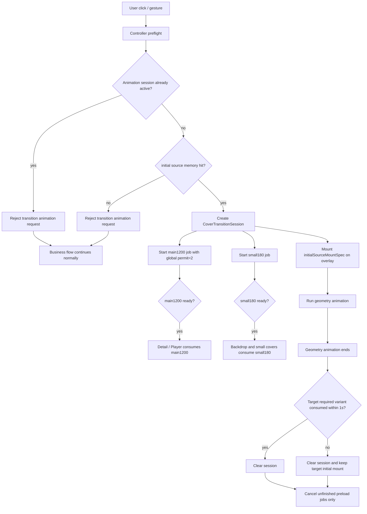

# 封面动画联动设计

本文只基于当前源码重新整理封面动画联动方案，不依赖历史重构记忆。

当前版本收敛为轻量方案：`CoverTransitionSession` 只代表一次正在运行的封面转场动画，不做排队、不做多 session slot、不处理复杂并发链路。复杂并发从 controller preflight 阶段阻断，业务导航或打开继续走普通路径。

## 当前源码事实

1. 顶层渲染顺序在 `APlayerApp.kt` 中固定为：
   `APlayerNavHost -> DetailOverlay -> MiniPlayerOverlay -> EditBookOverlay -> PlayerOverlay -> SearchOverlay`。
2. 封面转场层应挂在 `PlayerOverlay` 之后、`SearchOverlay` 之前，作为根级 sibling overlay，而不是放进 Home、Detail、Mini 或 Player 任意一个页面内部。
3. 当前封面变体由 `CoverImageVariant` 定义：
   - `ThumbnailSmall`：180 x 180。
   - `ThumbnailMedium`：360 x 360。
   - `Backdrop`：180 x 180，直接复用 `small180` key。
   - `Main1200`：1200 x 1200。
4. `Backdrop` 与小封面共用 `small180` cache key，这是刻意保留的 cache coalescing。
5. `small180` 服务 backdrop / blurred ambience，也服务 Home list、recent、mini 等小封面 UI。
6. 封面转场中的主封面目标只消费 `main1200`。
7. 动画过程中的 cover 视觉来自 `initialSourceMountSpec` 的同源内存挂载，而不是用 `small180` 替代封面。

## 保留与移除的动画流

保留：

1. `home <-> detail`
   - 双向。
   - 必须区分 `HomeList` 和 `HomeRecent`。
   - 返回时只允许回到原来源 anchor。

2. `detail -> player`
   - 单向。
   - 只有 mini 真正可见，并且当前播放书籍等于详情页书籍时，才复用 `mini -> player`。
   - 否则走 `detail -> player`，或在目标 anchor 不存在时降级为普通打开。

3. `mini <-> player`
   - 双向。
   - 优先级最高。
   - 展开 player 前必须先创建 session 并记录 mini anchor，否则 `setFullPlayerVisible(true)` 会导致 mini 立刻不可见。

移除：

1. `home -> player`
   - 当前 recent 没有直接到 player 的真实入口。
   - Home list 右侧播放按钮可以继续执行 `loadBook(id)` 和 `setFullPlayerVisible(true)`，但不参与封面转场。

## 新增包与类边界

新增包建议：

```text
app/src/main/java/com/viel/aplayer/ui/motion/covertransition/
```

`motion` 包只收 UI 动画协调、锚点测量、转场会话和预加载联动，不接管播放、详情、书库等业务状态。

### CoverTransitionContext

描述一次业务转场的上下文，不持有运行时动画状态。

字段建议：

```text
sessionId
bookId
source
target
direction
priority
coverPath
thumbnailPath
coverLastUpdated
startedAtElapsedMs
```

职责：

1. 表示这次为什么转场。
2. 作为 controller、preloader、target UI 的统一输入。
3. 不访问 ViewModel、不执行 Coil、不保存 bounds。

### CoverTransitionController

独立控制器，负责转场决策和动画请求 preflight。

入口建议：

```text
requestHomeToDetail(book, origin)
requestDetailToHome(bookId)
requestDetailToPlayer(book, miniVisibilitySnapshot)
requestMiniToPlayer(book)
requestPlayerToMini(book)
cancel(reason)
```

职责：

1. 判断当前请求是否允许创建动画 session。
2. 应用优先级：`mini <-> player` 高于 `detail -> player`，`home <-> detail` 最低。
3. 判定 `detail -> player` 是否复用 mini。
4. 拒绝已移除的 `home -> player` 动画流。
5. 如果已有 active session，直接拒绝新的转场动画请求；业务导航或打开继续走普通路径。
6. 在打开 player 前先冻结 source anchor snapshot。

### CoverTransitionSession

一次正在运行的动画 session。它和动画生命周期强绑定，不做排队，不做多 target slot。

字段建议：

```text
context
sourceAnchorSnapshot
targetAnchorSnapshot
initialSourceMountSpec
mainReady
smallReady
failedReason
animationPhase
targetConsumedReady
targetReadyDeadlineMs
```

职责：

1. 保存 source/target bounds 与圆角。
2. 保存发起者当前封面的同源挂载描述。
3. 保存 `main1200` 和 `small180` 预加载 ready 状态。
4. 几何动画结束后最多等待目标所需 variant 1s。
5. session 退出时取消未完成的 preload job；已完成结果不回滚。

### CoverTransitionCoordinator

Composable 层状态协调器，通过 `rememberCoverTransitionCoordinator()` 创建。

职责：

1. 持有 controller、anchor registry、preloader 和唯一 active session。
2. 对接 `APlayerApp` 中的全局状态。
3. 暴露给 Home、Detail、Mini、Player 注册 anchor 的接口。
4. 暴露给目标封面组件查询 session ready 的接口。

### CoverTransitionAnchorRegistry

负责 anchor 注册。

Anchor 类型：

```text
HomeList(bookId)
HomeRecent(bookId)
Detail(bookId)
Mini(bookId)
Player(bookId)
```

每个 anchor 保存：

```text
bookId
type
boundsInRoot
cornerRadius
isVisible
registeredAtElapsedMs
```

注册位置：

1. `ListItem` 的 leading cover。
2. `RecentlyItem` 的 cover box。
3. `Detail*` layout 中的 `PlayerCover`。
4. `CompactMediaPlayer` / `PillCompactMediaPlayer` 的 cover box。
5. `Player*` layout 中的 `PlayerCover`。

### CoverTransitionPreloader

负责动画期间需要的后台预加载。

预加载目标：

```text
main1200:
  - Detail / Player 主封面。

small180:
  - Backdrop / blurred ambience。
  - Home list / recent / mini 等小封面 UI。
  - 与 Backdrop 和小封面使用的 180px cache key 对齐。

backdrop:
  - Backdrop / blurred ambience。
  - 使用 CoverImageVariant.Backdrop。
  - Backdrop 的 keySegment 是 small180，与小封面共用 cache key。
```

策略：

1. 动画 session 创建后，`main1200` 和 `small180` 分别启动独立后台 coroutine/job。
2. 两个 job 都先查 Coil memory cache，命中则同步标记 ready。
3. 未命中时后台执行 `ImageLoader.execute(request)`。
4. `main1200` 使用全局限流，任意时刻最多只有 2 个未完成的 main1200 session/job。
5. `small180` 不占用 main1200 的全局限流 permit。
6. `main1200` ready 后只通知主封面目标。
7. `small180` ready 后通知 backdrop 和小封面 UI。
8. session 退出时只取消仍未完成的 job。

不负责：

1. 不生成本地 `coverPath` / `thumbnailPath` 文件。
2. 不替代 `CoverImageRequestFactory`。
3. 不绕过 Coil cache key。

### CoverTransitionLayer

根级 overlay，负责绘制动画中的封面副本。

职责：

1. 使用 session 的 source/target bounds 做位置、大小插值。
2. 使用 session 的 source/target cornerRadius 做圆角插值。
3. 动画开始时使用 `initialSourceMountSpec` 挂载同源封面内容，不做 bitmap 或 drawable 快照。
4. 全程裁剪圆角，避免动画过程中露出直角。
5. 几何动画结束后通知 coordinator 进入目标 ready 等待或清理流程。

## Target Anchor 等待策略

target anchor 指动画终点的封面位置、尺寸和圆角。目标 UI 刚被状态打开时，Compose 可能还没完成 composition/layout，所以 target anchor 可能暂时不存在或 bounds 无效。

规则：

1. source anchor 必须在触发前立即冻结，不等待。
2. target UI 打开后，coordinator 最多等待 3 个 frame 注册 target anchor。
3. 3 帧内 target anchor 注册且 bounds 非空，继续创建/启动动画。
4. 3 帧后仍无 target anchor，或 bounds 仍无效，拒绝动画 session，业务继续普通路径。
5. 3 帧只是 layout 等待上限，不等待图片 ready。

## Initial Source Mount Spec

动画启动不等待目标所需 variant ready。controller 创建 session 前必须记录 `initialSourceMountSpec`：

```text
source cover sourcePath
source cover lastUpdated
source cover variant
source cover scene
source request memoryCacheKey
source anchor bounds
source anchor cornerRadius
```

规则：

1. `initialSourceMountSpec.memoryCacheKey` 必须命中 Coil memory cache。
2. miss 时不补发同源请求，直接拒绝动画 session，业务继续普通路径。
3. hit 后才创建可见 session，并立即启动几何动画。
4. `initialSourceMountSpec` 只作为过渡挂载描述，不截取 bitmap，不保存 drawable。

## Ready 消费规则

Variant 的挂载目标不能混用：

```text
main1200:
  - Detail / Player 主封面。

small180:
  - Home list / recent / mini 等小封面 UI。
  - Backdrop / blurred ambience。
  - 与 Backdrop 共用 180px cache key。

initialSourceMountSpec:
  - CoverTransitionLayer 动画 cover。
  - 目标 UI 在目标 variant ready 前的过渡占位。
```

规则：

1. 小封面 UI 可以消费 `small180`。
2. 主封面目标只消费 `main1200`。
3. Backdrop 消费 `small180`。
4. CoverTransitionLayer 的飞行动画 cover 不用 `small180` 替代封面，而是使用 `initialSourceMountSpec`。
5. 目标所需 variant 未 ready 时，目标 UI 继续挂 `initialSourceMountSpec`。
6. 几何动画结束后，session 最多等待目标所需 variant 1s。
7. 1s 内 ready：目标 UI 替换挂载内容，session 清理。
8. 1s 内失败或仍未 ready：session 清理，目标 UI 可继续保留 `initialSourceMountSpec`，直到下一次成功创建的封面转场 session 更新它。

## 简化流程



## 圆角策略

不要直接使用目标元素的圆角接管动画。

每个 anchor 注册自己的圆角：

```text
HomeList: 8dp
HomeRecent: 16dp
CompactMini: 8dp
PillMini: 100dp
DetailMain: 24dp
PlayerMain: 24dp
```

动画层独立插值圆角，并全程裁剪。source 和 target 原组件只做占位或临时透明处理，避免动画过程中露出直角。

## 场景流程

### HomeList/HomeRecent -> Detail

```text
用户点击 Home 封面或条目
-> controller.requestHomeToDetail(book, origin)
-> active session 存在则拒绝动画请求
-> initial source memory miss 时普通打开 Detail
-> initial source memory hit 后创建 session
-> preloader 并行启动 main1200/small180
-> DetailOverlay 打开
-> Detail anchor 注册
-> CoverTransitionLayer 执行动画
-> Detail 主封面消费 main1200 ready
-> Detail backdrop 消费 small180 ready
```

### Detail -> HomeList/HomeRecent

```text
用户关闭 Detail
-> controller.requestDetailToHome(bookId)
-> active session 存在则拒绝动画请求
-> 查找原 origin anchor
-> initial source memory hit 后创建 session
-> CoverTransitionLayer 执行动画到 origin
-> 找不到 origin 则普通关闭 Detail
```

### Detail -> Player

```text
用户在 Detail 点击播放
-> controller.requestDetailToPlayer(book, miniVisibilitySnapshot)
-> 若 mini 可复用，转换为 Mini -> Player session
-> 否则冻结 Detail anchor
-> active session 存在则拒绝动画请求
-> initial source memory hit 后创建 session
-> preloader 并行启动 main1200/small180
-> setSelectedContentTab(-1)
-> setFullPlayerVisible(true)
-> Player anchor 注册
-> Player 主封面消费 main1200 ready
-> Player backdrop 消费 small180 ready
-> CoverTransitionLayer 执行动画
```

### Mini -> Player

```text
用户点击 mini
-> controller.requestMiniToPlayer(book)
-> 在 setFullPlayerVisible(true) 前冻结 mini anchor
-> active session 存在则拒绝动画请求
-> initial source memory hit 后创建 session
-> preloader 并行启动 main1200/small180
-> setFullPlayerVisible(true)
-> Player anchor 注册
-> Player 主封面消费 main1200 ready
-> Player backdrop 消费 small180 ready
-> CoverTransitionLayer 执行动画
```

### Player -> Mini

```text
用户最小化 player
-> controller.requestPlayerToMini(book)
-> 冻结 player anchor
-> active session 存在则拒绝动画请求
-> initial source memory hit 后创建 session
-> setFullPlayerVisible(false)
-> mini 重新可见并注册 anchor
-> CoverTransitionLayer 执行动画到 mini
```

## 分阶段实施计划

### 阶段 1：Anchor 与 Context

目标：

1. 新增 `CoverTransitionContext`。
2. 新增 `CoverTransitionAnchorRegistry`。
3. 在 Home list、recent、detail、mini、player 注册 anchor。
4. 不显示动画。

回归：

1. `compileDebugKotlin` 通过。
2. 各页面封面显示不变。
3. 滚动列表不会因为 anchor 注册触发明显抖动。

### 阶段 2：Controller 与 Session

目标：

1. 新增 `CoverTransitionController`。
2. 新增单 active 的 `CoverTransitionSession`。
3. active session 存在时拒绝新的转场动画请求。
4. session 创建前校验 `initialSourceMountSpec` memory hit。
5. 显式拒绝 `home -> player` 动画流。

回归：

1. Home 到 Detail 可创建 session。
2. active session 存在时不会创建第二个 session。
3. `initialSourceMountSpec` 未命中 memory cache 时不创建 session。

### 阶段 3：Preloader 与 Ready 消费

目标：

1. 新增 `CoverTransitionPreloader`。
2. 为 `main1200` 和 `small180` 分别启动独立后台 coroutine/job。
3. `main1200` 全局限流 2 个未完成 job。
4. `main1200` 只给主封面。
5. `small180` 给 backdrop 和小封面 UI。
6. session 退出时只取消未完成 job。

回归：

1. main1200 ready 后 Detail / Player 主封面显示高清封面。
2. small180 ready 后背景模糊层和小封面 UI 可消费。
3. small180 可被小封面 UI 和 backdrop 复用，但不替代飞行动画 cover。
4. 同时最多只有 2 个 main1200 job 处于未完成状态。

### 阶段 4：Mini <-> Player

目标：

1. 先实现最高优先级链路。
2. 处理 compact mini 和 pill mini 两种圆角。
3. 处理 player 收起后 mini anchor 重新注册的等待。

回归：

1. mini 展开 player 无闪烁。
2. player 收起 mini 无直角泄露。
3. search active、mini hidden、不同 book 时拒绝动画请求或降级。

### 阶段 5：Home <-> Detail

目标：

1. 实现 `HomeList <-> Detail`。
2. 实现 `HomeRecent <-> Detail`。
3. 返回时严格使用原 origin。

回归：

1. list 进 detail 回 list。
2. recent 进 detail 回 recent。
3. 原 anchor 滚出屏幕时正常降级。

### 阶段 6：Detail -> Player

目标：

1. 实现 detail 到 player。
2. 同书且 mini 真正可见时复用 mini。
3. 非 player 主 tab 时先切回主封面页或降级。

回归：

1. 同书 mini 可见时走 mini -> player。
2. 不同书时走 detail -> player。
3. player 目标封面不存在时不崩溃、不闪烁。

## 风险与处理

1. active session 期间用户快速连续点击。
   - 处理：controller 拒绝新的转场动画请求，业务导航或打开继续走普通路径。

2. mini 在 full player 打开时立即消失。
   - 处理：controller 必须先冻结 mini anchor，再打开 player。

3. target anchor 可能尚未测量。
   - 处理：最多等待 3 帧；仍未注册或 bounds 无效时拒绝动画 session，业务继续普通路径。

4. source anchor 因滚动消失。
   - 处理：request 时立即 snapshot，不依赖后续组合树存在。

5. overlay 与目标 UI 同时绘制高清封面导致闪烁。
   - 处理：目标 UI 消费 session ready，session active 期间按规则延迟自绘。

6. 1200 解码造成内存压力。
   - 处理：main1200 全局限流为 2，并在 session 退出时只取消未完成 job。

## 可执行任务计划

本节作为实现执行计划使用，覆盖上文“分阶段实施计划”的粗粒度描述。每个阶段都必须独立完成、独立编译、独立回归。阶段内没有完成验收项时，不进入下一阶段。

### 全局执行约束

1. 所有新增动画类放在 `app/src/main/java/com/viel/aplayer/ui/motion/covertransition/`。
2. `CoverTransitionSession` 保持单 active 设计，不新增 queue、slot、foreground/background session。
3. active session 存在时，controller 拒绝新的转场动画请求；业务导航、打开、关闭继续走当前普通路径。
4. `initialSourceMountSpec.memoryCacheKey` 未命中 Coil memory cache 时，不创建 session，不启动 preloader，不显示转场层。
5. target anchor 最多等待 3 个 frame；3 帧后仍未注册或 bounds 无效时，不创建可见动画。
6. `small180` 同时服务 Home list、recent、mini 等小封面 UI 和 Backdrop；`small180` 不替代 CoverTransitionLayer 的飞行动画 cover。
7. CoverTransitionLayer 的飞行动画 cover 使用 `initialSourceMountSpec`。
8. `main1200` 只服务 Detail / Player 主封面。
9. `main1200` 全局限流为 2 个未完成 job；`small180` 不占用该限流。
10. session 退出时只取消未完成 preload job；已 ready 且已被消费的结果不回滚。
11. 每个阶段的编译验证命令为：

```powershell
$env:JAVA_HOME='C:\Program Files\Microsoft\jdk-21.0.11.10-hotspot'; .\gradlew.bat compileDebugKotlin
```

### 阶段 0：当前缓存规则固定

改动范围：

1. `app/src/main/java/com/viel/aplayer/ui/common/CoverImageRequestFactory.kt`

执行任务：

1. 保持 `CoverImageVariant.Backdrop` 的尺寸为 `180 x 180`。
2. 保持 `CoverImageVariant.Backdrop.keySegment == "small180"`。
3. 保持 `CoverImageVariant.ThumbnailSmall.keySegment == "small180"`。
4. 保持 `allowHardware` 由调用方显式传入，不在 `CoverImageRequestFactory` 内按 variant 覆盖。

验收：

1. `ThumbnailSmall` 和 `Backdrop` 对同一 source / lastUpdated 生成相同 180px cache key。
2. `Main1200` 仍生成独立 cache key。
3. `CoverBackground` 继续传入 `allowHardware = false`。
4. `compileDebugKotlin` 通过。

### 阶段 1：类型与 Anchor Registry

新增文件：

1. `app/src/main/java/com/viel/aplayer/ui/motion/covertransition/CoverTransitionContext.kt`
2. `app/src/main/java/com/viel/aplayer/ui/motion/covertransition/CoverTransitionAnchor.kt`
3. `app/src/main/java/com/viel/aplayer/ui/motion/covertransition/CoverTransitionAnchorRegistry.kt`

执行任务：

1. 定义 `CoverTransitionAnchorType`：`HomeList`、`HomeRecent`、`Detail`、`Mini`、`Player`。
2. 定义 `CoverTransitionAnchorSnapshot`，字段固定包含 `bookId`、`type`、`boundsInRoot`、`cornerRadiusPx`、`isVisible`、`registeredAtElapsedMs`。
3. 定义 `CoverTransitionContext`，字段固定包含 `sessionId`、`bookId`、`source`、`target`、`direction`、`priority`、`coverPath`、`thumbnailPath`、`coverLastUpdated`、`startedAtElapsedMs`。
4. 实现 `CoverTransitionAnchorRegistry.register(anchor)`。
5. 实现 `CoverTransitionAnchorRegistry.snapshot(type, bookId)`。
6. `snapshot(...)` 只返回 `isVisible == true` 且 `boundsInRoot.width > 0` 且 `boundsInRoot.height > 0` 的 anchor。

接入位置：

1. `app/src/main/java/com/viel/aplayer/ui/home/components/ListItem.kt` 注册 `HomeList(bookId)`。
2. `app/src/main/java/com/viel/aplayer/ui/home/components/ListCardItem.kt` 的 `RecentlyItem` 注册 `HomeRecent(bookId)`。
3. `app/src/main/java/com/viel/aplayer/ui/detail/layouts/DetailPortrait.kt` 注册 `Detail(bookId)`。
4. `app/src/main/java/com/viel/aplayer/ui/detail/layouts/DetailLandscapePhone.kt` 注册 `Detail(bookId)`。
5. `app/src/main/java/com/viel/aplayer/ui/detail/layouts/DetailLandscapeTablet.kt` 注册 `Detail(bookId)`。
6. `app/src/main/java/com/viel/aplayer/ui/miniplayer/CompactMediaPlayer.kt` 注册 `Mini(bookId)`。
7. `app/src/main/java/com/viel/aplayer/ui/miniplayer/PillCompactMediaPlayer.kt` 注册 `Mini(bookId)`。
8. `app/src/main/java/com/viel/aplayer/ui/player/layouts/PlayerPortrait.kt` 注册 `Player(bookId)`。
9. `app/src/main/java/com/viel/aplayer/ui/player/layouts/PlayerLandscapePhone.kt` 注册 `Player(bookId)`。
10. `app/src/main/java/com/viel/aplayer/ui/player/layouts/PlayerLandscapeTablet.kt` 注册 `Player(bookId)`。

验收：

1. 所有注册接入点不改变现有封面请求 variant。
2. 页面正常滚动时不触发可见布局跳动。
3. active session 逻辑尚未接入，所有交互行为保持原样。
4. `compileDebugKotlin` 通过。

### 阶段 2：单 Active Controller 与 Session

新增文件：

1. `app/src/main/java/com/viel/aplayer/ui/motion/covertransition/CoverTransitionSession.kt`
2. `app/src/main/java/com/viel/aplayer/ui/motion/covertransition/CoverTransitionController.kt`
3. `app/src/main/java/com/viel/aplayer/ui/motion/covertransition/CoverTransitionInitialSourceMountSpec.kt`

执行任务：

1. `CoverTransitionController` 持有唯一 active session 引用。
2. active session 非空时，所有 request API 返回 `RejectedActiveSession`。
3. `requestHomeToDetail` 只接受 `HomeList` 或 `HomeRecent` source。
4. `requestDetailToHome` 只返回原 origin target。
5. `requestDetailToPlayer` 在 mini 真正可见且 `currentBookId == targetBookId` 时返回 `Mini -> Player` context。
6. `requestDetailToPlayer` 在 mini 不可复用时返回 `Detail -> Player` context。
7. `requestMiniToPlayer` 必须在调用 `setFullPlayerVisible(true)` 前冻结 `Mini` source snapshot。
8. `requestPlayerToMini` 必须在调用 `setFullPlayerVisible(false)` 前冻结 `Player` source snapshot。
9. `home -> player` request 不创建 context，返回 `RejectedRemovedFlow`。
10. `initialSourceMountSpec` 只记录 source request metadata 和 `memoryCacheKey`，不保存 bitmap，不保存 drawable。

目标 anchor 规则：

1. source snapshot 在触发前同步冻结。
2. target anchor 最多等待 3 个 frame。
3. target anchor 在 3 帧内有效时创建可见 session。
4. target anchor 在 3 帧内无效时返回 `RejectedTargetAnchorUnavailable`。

验收：

1. active session 存在时不会创建第二个 session。
2. source anchor 无效时不创建 session。
3. target anchor 3 帧内无效时不创建 session。
4. `home -> player` 不创建 session。
5. `compileDebugKotlin` 通过。

### 阶段 3：Preloader 与 Ready 状态

新增文件：

1. `app/src/main/java/com/viel/aplayer/ui/motion/covertransition/CoverTransitionPreloader.kt`
2. `app/src/main/java/com/viel/aplayer/ui/motion/covertransition/CoverTransitionReadyState.kt`

执行任务：

1. `CoverTransitionPreloader` 为每个 session 启动 `main1200` job。
2. `CoverTransitionPreloader` 为每个 session 启动 `small180` job。
3. `main1200` job 使用全局 `Semaphore(2)`。
4. `small180` job 不使用 `main1200` semaphore。
5. 两个 job 均先查询 Coil memory cache。
6. memory miss 后调用 `ImageLoader.execute(request)`。
7. `main1200` ready 只写入主封面 ready 状态。
8. `small180` ready 写入小封面和 backdrop ready 状态。
9. session 退出时取消未完成 job。
10. 已完成 job 不回滚 ready 状态。

验收：

1. 同时未完成的 `main1200` job 数量不超过 2。
2. `small180` job 不阻塞在 `main1200` semaphore 上。
3. session 退出后未完成 job 不再写 ready。
4. `compileDebugKotlin` 通过。

### 阶段 4：Coordinator 与 Root Layer

新增文件：

1. `app/src/main/java/com/viel/aplayer/ui/motion/covertransition/CoverTransitionCoordinator.kt`
2. `app/src/main/java/com/viel/aplayer/ui/motion/covertransition/CoverTransitionLayer.kt`

修改文件：

1. `app/src/main/java/com/viel/aplayer/ui/navigation/APlayerApp.kt`

执行任务：

1. 在 `APlayerApp` 根级 `Box` 中创建 `rememberCoverTransitionCoordinator()`。
2. 将 coordinator 传给 Home、Detail、Mini、Player 需要注册 anchor 的组件。
3. 在 `PlayerOverlay` 之后、`SearchOverlay` 之前挂载 `CoverTransitionLayer`。
4. `CoverTransitionLayer` 只绘制 active session。
5. `CoverTransitionLayer` 使用 `initialSourceMountSpec` 绘制飞行动画 cover。
6. `CoverTransitionLayer` 不使用 `small180` 作为飞行动画 cover。
7. 几何动画结束后，coordinator 最多等待目标所需 variant 1s。
8. 1s 内目标消费 ready 时清理 session。
9. 1s 后仍未消费 ready 时清理 session，目标 UI 保留 `initialSourceMountSpec`。

验收：

1. `CoverTransitionLayer` 物理层级在 `PlayerOverlay` 之后、`SearchOverlay` 之前。
2. active session 为空时 `CoverTransitionLayer` 不绘制任何内容。
3. active session 存在时再次触发转场不会创建第二个 session。
4. `compileDebugKotlin` 通过。

### 阶段 5：Mini <-> Player

修改文件：

1. `app/src/main/java/com/viel/aplayer/ui/miniplayer/MiniPlayerOverlay.kt`
2. `app/src/main/java/com/viel/aplayer/ui/miniplayer/CompactMediaPlayer.kt`
3. `app/src/main/java/com/viel/aplayer/ui/miniplayer/PillCompactMediaPlayer.kt`
4. `app/src/main/java/com/viel/aplayer/ui/player/components/PlayerOverlay.kt`
5. `app/src/main/java/com/viel/aplayer/ui/player/layouts/PlayerPortrait.kt`
6. `app/src/main/java/com/viel/aplayer/ui/player/layouts/PlayerLandscapePhone.kt`
7. `app/src/main/java/com/viel/aplayer/ui/player/layouts/PlayerLandscapeTablet.kt`

执行任务：

1. mini 点击展开 player 时先调用 `requestMiniToPlayer(book)`。
2. `requestMiniToPlayer` 成功后再调用 `setFullPlayerVisible(true)`。
3. `requestMiniToPlayer` 被拒绝时直接调用 `setFullPlayerVisible(true)`。
4. player 最小化时先调用 `requestPlayerToMini(book)`。
5. `requestPlayerToMini` 成功后再调用 `setFullPlayerVisible(false)`。
6. `requestPlayerToMini` 被拒绝时直接调用 `setFullPlayerVisible(false)`。
7. compact mini 圆角注册为 8dp。
8. pill mini 圆角注册为 100dp。
9. player 主封面圆角注册为 24dp。

验收：

1. mini 展开 player 时，source anchor 在 `setFullPlayerVisible(true)` 前冻结。
2. active session 存在时，mini 点击仍能普通打开 player。
3. target anchor 超过 3 帧无效时普通打开 player。
4. `compileDebugKotlin` 通过。

### 阶段 6：Home <-> Detail

修改文件：

1. `app/src/main/java/com/viel/aplayer/ui/home/HomeScreenState.kt`
2. `app/src/main/java/com/viel/aplayer/ui/home/components/ListItem.kt`
3. `app/src/main/java/com/viel/aplayer/ui/home/components/ListCardItem.kt`
4. `app/src/main/java/com/viel/aplayer/ui/detail/DetailOverlay.kt`
5. `app/src/main/java/com/viel/aplayer/ui/detail/DetailContent.kt`
6. `app/src/main/java/com/viel/aplayer/ui/detail/layouts/DetailPortrait.kt`
7. `app/src/main/java/com/viel/aplayer/ui/detail/layouts/DetailLandscapePhone.kt`
8. `app/src/main/java/com/viel/aplayer/ui/detail/layouts/DetailLandscapeTablet.kt`

执行任务：

1. list item 打开详情前调用 `requestHomeToDetail(book, HomeList)`.
2. recent item 打开详情前调用 `requestHomeToDetail(book, HomeRecent)`.
3. request 被拒绝时普通打开详情。
4. 关闭详情时调用 `requestDetailToHome(bookId)`。
5. `requestDetailToHome` 只使用进入详情时记录的 origin。
6. origin anchor 不存在时普通关闭详情。
7. list origin 圆角注册为 8dp。
8. recent origin 圆角注册为 16dp。
9. detail 主封面圆角注册为 24dp。

验收：

1. list 进入详情后返回 list origin。
2. recent 进入详情后返回 recent origin。
3. origin 滚出屏幕时普通关闭详情。
4. active session 存在时打开详情不创建新 session。
5. `compileDebugKotlin` 通过。

### 阶段 7：Detail -> Player

修改文件：

1. `app/src/main/java/com/viel/aplayer/ui/detail/DetailContent.kt`
2. `app/src/main/java/com/viel/aplayer/ui/detail/components/DetailControlPanel.kt`
3. `app/src/main/java/com/viel/aplayer/ui/navigation/APlayerApp.kt`
4. `app/src/main/java/com/viel/aplayer/ui/player/PlayerViewModel.kt`

执行任务：

1. Detail 播放按钮触发时读取 mini visibility snapshot。
2. mini snapshot 满足真实可见条件且 `currentBookId == detailBookId` 时，调用 `requestDetailToPlayer` 并创建 `Mini -> Player` context。
3. mini 不可复用时，调用 `requestDetailToPlayer` 并创建 `Detail -> Player` context。
4. request 成功后执行当前播放逻辑和 `setFullPlayerVisible(true)`。
5. request 被拒绝时执行当前播放逻辑和普通打开 player。
6. 非 player 主 tab 时先执行 `setSelectedContentTab(-1)`，再等待 Player target anchor。

验收：

1. 同书 mini 真正可见时走 `Mini -> Player` source。
2. 不同书时走 `Detail -> Player` source。
3. mini hidden、search active、full player visible 时不复用 mini。
4. Player target anchor 3 帧内无效时普通打开 player。
5. `compileDebugKotlin` 通过。

### 阶段 8：Ready 消费接入

修改文件：

1. `app/src/main/java/com/viel/aplayer/ui/common/PlayerCover.kt`
2. `app/src/main/java/com/viel/aplayer/ui/common/CoverBackground.kt`
3. `app/src/main/java/com/viel/aplayer/ui/home/components/ListItem.kt`
4. `app/src/main/java/com/viel/aplayer/ui/home/components/ListCardItem.kt`
5. `app/src/main/java/com/viel/aplayer/ui/miniplayer/CompactMediaPlayer.kt`
6. `app/src/main/java/com/viel/aplayer/ui/miniplayer/PillCompactMediaPlayer.kt`

执行任务：

1. `PlayerCover` 查询匹配 session 的 `main1200` ready。
2. `PlayerCover` 在 session active 且 `main1200` 未 ready 时显示 `initialSourceMountSpec`，不抢发自己的 main1200 请求。
3. `CoverBackground` 查询匹配 session 的 `small180` ready。
4. 小封面 UI 查询匹配 session 的 `small180` ready。
5. session 不匹配时，所有组件使用现有 `CoverImageRequestFactory.build(...)` 路径。

验收：

1. session active 期间主封面不与 overlay 同时抢画 main1200。
2. session active 期间 backdrop 可消费 small180。
3. session active 期间小封面 UI 可消费 small180。
4. session 不匹配时所有封面显示行为与现状一致。
5. `compileDebugKotlin` 通过。

### 阶段 9：最终回归

执行任务：

1. 运行 `compileDebugKotlin`。
2. 手动验证 `Mini -> Player`。
3. 手动验证 `Player -> Mini`。
4. 手动验证 `HomeList -> Detail -> HomeList`。
5. 手动验证 `HomeRecent -> Detail -> HomeRecent`。
6. 手动验证 `Detail -> Player`。
7. 手动验证 active session 期间再次点击时业务路径继续工作。
8. 手动验证 target anchor 超过 3 帧不可用时业务路径继续工作。

验收：

1. 编译通过。
2. 所有保留动画流均无直角泄露。
3. 所有保留动画流均无 source 丢失导致的空白闪烁。
4. `home -> player` 不出现封面转场动画。
5. main1200 同时未完成 job 数量不超过 2。
6. small180 被 backdrop 和小封面 UI 复用。
