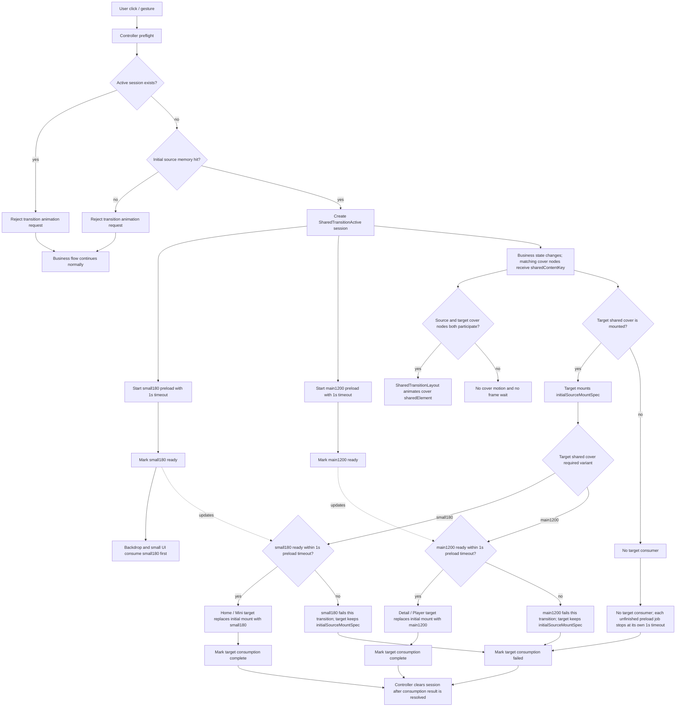

# 封面动画联动设计

本文只基于当前源码重新整理封面动画联动方案，不依赖历史重构记忆。

当前版本改为基于 Jetpack Compose `SharedTransitionLayout`：封面位移、尺寸和 overlay 绘制交给 Compose shared element 系统处理；项目只保留转场决策、preload 等待窗口、ready 消费和业务流降级。

## 当前源码事实

1. 项目 Compose BOM 为 `2026.05.01`，具备 `androidx.compose.animation` 的 shared transition API 使用条件。
2. 顶层渲染顺序在 `APlayerApp.kt` 中固定为：
   `APlayerNavHost -> DetailOverlay -> MiniPlayerOverlay -> EditBookOverlay -> PlayerOverlay -> SearchOverlay`。
3. 不新增自定义根级封面绘制层，不实现 `CoverTransitionLayer`。
4. `SharedTransitionLayout` 只作为 Compose shared element 的 scope provider；它不是业务 controller，也不接管播放、详情、书库等状态。
5. 当前封面变体由 `CoverImageVariant` 定义：
   - `ThumbnailSmall`：180 x 180。
   - `ThumbnailMedium`：360 x 360。
   - `Backdrop`：180 x 180，直接复用 `small180` key。
   - `Main1200`：1200 x 1200。
6. `Backdrop` 与小封面共用 `small180` cache key，这是刻意保留的 cache coalescing。
7. `small180` 服务 backdrop / blurred ambience，也服务 Home list、mini 等小封面 UI。`medium360` 服务 HomeRecent 封面。
8. 封面转场中的主封面目标只消费 `main1200`。
9. shared element 转场过程中的 cover 视觉来自 `initialSourceMountSpec` 的同源内存挂载，而不是用 `small180` 替代转场封面。
10. `CoverImageVariant.ThumbnailMedium`（360x360）参与封面转场设计。`HomeRecent`（`RecentlyItem`，`ListCardItem.kt`）使用 `ThumbnailMedium` 渲染封面。`HomeRecent` 是保留动画流 `home <-> detail` 的明确参与者，其就绪门控和消费规则必须基于 `medium360` 而非 `small180`。
11. `NavHost` 只有单一路由 `"home"`（`APlayerNavHost.kt`）。Detail、Player、Mini 都是 `AnimatedVisibility` 控制的 overlay，不是导航目的地。Home 封面的 `AnimatedVisibilityScope` 来自一个永不发生路由切换的 scope，转场实际只能由 target（overlay）侧的 `AnimatedVisibility` 驱动。

## 保留与移除的动画流

保留：

1. `home <-> detail`
   - 双向。
   - 必须区分 `HomeList` 和 `HomeRecent`。
   - 返回时只允许回到原来源。

2. `detail -> player`
   - 单向。
   - 只有 mini 真正可见，并且当前播放书籍等于详情页书籍时，才复用 `mini -> player`。
   - 否则走 `detail -> player`，或在 source / target shared node 未参与当前打开流程时普通打开。

3. `mini <-> player`
   - 双向。
   - 优先级最高。
   - 展开 player 前必须先创建 session 并记录 mini source，否则 `setFullPlayerVisible(true)` 会导致 mini 立刻不可见。

移除：

1. `home -> player`
   - 当前 recent 没有直接到 player 的真实入口。
   - Home list 右侧播放按钮可以继续执行 `loadBook(id)` 和 `setFullPlayerVisible(true)`，但不参与封面转场。

## SharedTransitionLayout 方案

根部结构：

```text
SharedTransitionLayout {
    APlayerNavHost(...)
    DetailOverlay(...)
    MiniPlayerOverlay(...)
    EditBookOverlay(...)
    PlayerOverlay(...)
    SearchOverlay(...)
}
```

规则：

1. `SharedTransitionLayout` 放在 `APlayerApp` 根级 `Box` 外层或同级包裹处，使 Home、Detail、Mini、Player 的封面节点处于同一个 `SharedTransitionScope`。
2. 每个参与转场的封面节点必须同时拿到：
   - `SharedTransitionScope`。
   - 自己所在可见性容器的 `AnimatedVisibilityScope`，或 NavHost / AnimatedContent 提供的等价 scope。
3. 参与节点使用同一个 `sharedContentKey` 进行匹配。
4. `sharedContentKey` 由 active session 生成，格式固定为：

```text
cover:<sessionId>
```

5. source 和 target 只有在匹配同一个 active session 时才启用 shared element。
6. session 不匹配时，所有封面组件走现有普通封面渲染路径。
7. shared element 系统负责 bounds、位置和 overlay 绘制；项目不再手写 bounds morph。

## AnimatedVisibilityScope 来源映射

每个参与 shared element 或 sharedBounds 的节点必须持有一个明确的 `AnimatedVisibilityScope`。来源固定如下：

| 参与者 | AnimatedVisibilityScope 来源 | 位置 |
|---|---|---|
| HomeList cover | `APlayerNavHost` 内 `composable("home")` block 的隐式 `this` | APlayerNavHost.kt |
| HomeRecent cover | 同 HomeList | APlayerNavHost.kt |
| Detail cover | `DetailOverlay` 的 `AnimatedVisibility` block 的隐式 `this` | DetailOverlay.kt |
| Mini cover (Compact) | `MiniPlayerOverlay` 的 `AnimatedVisibility` block 的隐式 `this` | MiniPlayerOverlay.kt |
| Mini cover (Pill) | 同 Mini cover (Compact) | MiniPlayerOverlay.kt |
| Player cover | `PlayerOverlay` 的 `AnimatedVisibility` block 的隐式 `this` | PlayerOverlay.kt |

规则：

1. `SharedTransitionScope` 统一来自 `APlayerApp` 根级 `SharedTransitionLayout`。
2. `AnimatedVisibilityScope` 各参与者按上表从自己所在的 `AnimatedVisibility` 或 NavHost `composable` block 获取。
3. 两个 scope 必须通过 `CoverTransitionSharedScopes` holder 组合传递给 `CoverTransitionSharedCover`。
4. Home 封面的 `AnimatedVisibilityScope` 来自 NavHost 的 `composable` block，而非独立的 `AnimatedVisibility`。由于 NavHost 只有 `"home"` 一个路由，Home 页面永不发生路由退出，Home 封面的 scope 是**常驻/静止**的。Home cover 作为 source 不会有 outgoing transition，转场完全由 target 侧的 `AnimatedVisibilityScope` 驱动。**这是待验证的设计前提**——source 侧 scope 永久 settled 时，shared element 能否正常触发 bounds 动画、以及静止的 Home 封面会不会在原位“留底”造成重影，需要在阶段 2 之前用最小原型验证。

## Shared 节点

新增 composable 建议：

```text
CoverTransitionSharedCover
```

职责：

1. 接收 `bookId`、`role`、`cornerRadius`、普通封面 request、可选 `CoverTransitionCoordinator`。
2. 判断当前 active session 是否与自身 role + bookId 匹配。
3. 匹配时只应用 `Modifier.sharedElement(...)`。
4. 匹配时优先显示 `initialSourceMountSpec`。
5. 目标 variant ready 后，在同一个 shared cover 内容内替换为 ready 内容。
6. 不发起业务导航。
7. 不启动 preload。
8. 不保存 bitmap 或 drawable。

Modifier 顺序：

```text
size / aspectRatio / layout constraints
-> sharedElement
-> clip(shape)
-> draw image content
```

规则：

1. 封面这一层只使用 `sharedElement`。
2. 容器尺寸、占位或外层布局共享不属于封面层职责；需要时单独定义容器层方案。
3. 圆角裁剪必须放在 shared modifier 之后，避免 shared overlay 过程中露出直角。
4. 所有参与 shared element 的封面节点必须通过 `clipInOverlayDuringTransition` 在 overlay 层应用圆角裁剪。直接在组合树中的 `clip(shape)` 只影响非 overlay 渲染；overlay 期间由 `clipInOverlayDuringTransition` 负责。
5. 不使用 `small180` 作为 shared element 的转场内容。

## 容器级 sharedBounds

Mini ↔ Player 转场在封面 `sharedElement` 之外，增加容器级 `sharedBounds`，使 mini 播放器外边界平滑变形到 player 全屏边界。

参与节点：

| source / target | sharedBounds 挂载点 | shape |
|---|---|---|
| CompactMediaPlayer | 最外层 Surface | RoundedCornerShape(0.dp) |
| PillCompactMediaPlayer | 最外层 Surface | RoundedCornerShape(100.dp) |
| PlayerOverlay | AnimatedVisibility 内的最外层 Box | RoundedCornerShape(0.dp) |

sharedBoundsKey 格式固定为：

```text
container:<sessionId>
```

规则：

1. `sharedBounds` 和 `sharedElement` 使用不同的 key。封面用 `cover:<sessionId>`，容器用 `container:<sessionId>`。
2. `sharedBounds` 挂载在容器最外层，`sharedElement` 挂载在容器内部的封面节点上。**设计意图是两者独立运行，但需要验证**：容器使用 `ScaleToBounds` 会缩放内容，封面作为子节点又有自己的 `sharedElement`，是否产生双重变换（一次被容器缩放、一次被 overlay 提升）需实测确认。
3. mini → player 方向：mini 容器 bounds 变形为 player 全屏 bounds；mini 内容 fade out，player 内容 fade in。fade 效果由 `sharedBounds` 的 `enter`/`exit` 参数提供（因为 `AnimatedVisibility` 的 enter/exit 在 session 匹配时为 `None`，不提供 fade）。
4. player → mini 方向：player 全屏 bounds 变形为 mini 容器 bounds；player 内容 fade out，mini 内容 fade in。fade 来源同上。
5. `sharedBounds` 的 resizeMode 使用 `ScaleToBounds`，避免 content remeasure 导致内容布局抖动。
6. sharedBounds 转场期间的 overlay clip 必须使用动画圆角（source shape → target shape 插值），不允许出现直角帧。
7. 只有 mini ↔ player 方向使用容器 sharedBounds。Home ↔ Detail、Detail → Player 不使用容器 sharedBounds。
8. session context 中的 `sourceRole` 为 `Mini` 且 `targetRole` 为 `Player`（或反向）时，controller 才生成 `container:<sessionId>` key。
9. `sharedBounds` 替代 MiniPlayerOverlay 和 PlayerOverlay 中现有的 `slideInVertically` / `slideOutVertically` enter/exit 动画。session active 且 bookId 匹配时，`AnimatedVisibility` 的 enter/exit spec 改为 `EnterTransition.None` / `ExitTransition.None`，由 sharedBounds 接管视觉过渡。**待验证**：enter/exit 为 `None` 时，可见性切换可能在一帧内完成，`isTransitionActive` 瞬间 true→false，bounds 动画能否撑住整个 `boundsTransform` 时长需要原型确认。
10. session 不匹配或不存在时，保留原有的 `slideInVertically` / `slideOutVertically`。
11. Compact 和 Pill 两种 mini 变体共用同一个 `container:<sessionId>` key，因为同一时刻只有一种变体在组合树中。
12. `sharedBounds` 的 `AnimatedVisibilityScope` 来源与各自的封面 sharedElement 相同（见 AnimatedVisibilityScope 来源映射表）。

## 圆角策略

不要直接把目标元素圆角挂到转场中的封面上。

每个参与 role 固定注册自己的圆角：

```text
HomeList: 8dp
HomeRecent: 16dp
CompactMini: 8dp
PillMini: 100dp
DetailMain: 24dp
PlayerMain: 24dp
```

规则：

1. source 和 target 都按自身 role 提供 corner radius。
2. shared overlay 中必须始终裁剪为圆角，不允许出现直角帧。
3. 圆角过渡作为 shared cover 内部的 clip 动画处理，只负责 shape，不负责 bounds。
4. bounds、位置、overlay 提升由 `SharedTransitionLayout` 处理。

## Session

`CoverTransitionSession` 只代表一次正在运行的封面转场意图。它不排队，不做多 slot，不负责绘制。

字段建议：

```text
sessionId
sharedContentKey
containerSharedBoundsKey
context
sourceRole
targetRole
bookId
initialSourceMountSpec
mainReady
smallReady
failedReason
phase
targetConsumedReady
```

phase 固定为：

```text
SharedTransitionActive
Finished
Failed
```

Session 与 preload 等待规则：

1. `initialSourceMountSpec.memoryCacheKey` 命中后立即创建 session。
2. session 创建后立即启动 `small180` 和 `main1200` preload job。
3. 每个 preload job 自己记录 `timeoutAtElapsedMs = jobStartedAtElapsedMs + 1000ms`。
4. session 创建后立即进入 `SharedTransitionActive`，不设置 shared match 帧等待。
5. `SharedTransitionLayout` 只在 source / target shared node 同时参与当前业务可见性变化时执行共享元素转场。
6. source / target shared node 未同时参与时不补等、不补救，业务 UI 保持普通路径。
7. 1s 只限制 `small180` 和 `main1200` preload job 的等待时间，不限制 sharedElement 封面动画时长。
8. `small180` ready 后先于 `main1200` 消费；这是 180px 请求 IO / decode 成本更低导致的默认消费顺序。
9. 任一 preload job 超过 1s 仍未 ready 时，该 job 退出等待并视为本轮失败；目标 shared cover 继续保留 `initialSourceMountSpec`，直到下一次成功转场或普通封面渲染覆盖。
10. session 由 controller 清理。清理前提条件为以下两项同时满足：
    a. 目标消费结果已确定（消费完成、消费失败或 controller 主动取消）。
    b. `SharedTransitionScope.isTransitionActive` 为 false（shared element / sharedBounds 动画已结束）。
    若条件 a 先满足但条件 b 未满足，session 保持 `SharedTransitionActive` phase 并等待动画结束后再清理。
11. controller 清理 session 时只取消未完成 preload job；已 ready 且已被消费的结果不回滚。
12. controller 监听 `SharedTransitionScope.isTransitionActive` 状态。当 `isTransitionActive` 从 true 变为 false 且消费结果已确定时，执行 session 清理。若 shared element / sharedBounds 未实际发生转场（source / target 未同时参与），`isTransitionActive` 不会变为 true，此时消费结果确定后直接清理。
13. `isTransitionActive` 是 `SharedTransitionScope` 的全局信号，不按 key 区分。清理逻辑的正确性依赖“全局唯一 active session”这个不变量——因此 `isTransitionActive == false` 等价于“本 session 的转场已结束”。若未来放宽并发 session，必须改用按 key 追踪的机制。
14. `isTransitionActive` 桥接规则：controller 本身不持有 `SharedTransitionScope`，因此需要在持有 scope 的 Composable 中建立桥接。具体做法：在 `APlayerApp` 的 `SharedTransitionLayout` 内部，使用 `LaunchedEffect { snapshotFlow { isTransitionActive }.collect(CoverTransitionController::onTransitionStateChanged) }` 将 scope 信号桥接到 controller。此桥接属于阶段 2（Shared Scope 注入）的执行范围。

## 组件归属与生命周期

1. `CoverTransitionController` 为 process 级 `object` 单例，内部持有永生的 `controllerScope`（`Dispatchers.Main.immediate + SupervisorJob`）。
2. `activeSession` 为 Compose `mutableStateOf`，配置变更（屏幕旋转）时 Activity 重建但 process 不死，单例保持。残留 session 在新 Activity 重建后仍可被新的 `SharedTransitionLayout` scope 读取，但转场动画本身会被中断。旋转后应主动清理悬挂 session。
3. Coil `ImageLoader` 来自 Application 级单例（Coil 默认行为），controller 不自建 ImageLoader。
4. `sessionId` 生成策略：使用 `UUID.randomUUID().toString()` 或递增计数器，保证全局唯一即可。
5. 配置变更时 `controllerScope` 不重建、不取消。旋转导致的 Activity 重建不影响单例存活，但活跃 preload job 可能在新 scope 下变得无意义。

## Initial Source Mount Spec

创建 session 前必须记录 `initialSourceMountSpec`：

```text
source cover sourcePath
source cover lastUpdated
source cover variant
source cover scene
source request memoryCacheKey
source role
source cornerRadius
```

规则：

1. `initialSourceMountSpec.memoryCacheKey` 必须命中 Coil memory cache。
2. miss 时不补发同源请求，直接拒绝动画 session，业务继续普通路径。
3. hit 后立即创建 session，并立即启动 preload。
4. `initialSourceMountSpec` 只作为 shared cover 的挂载描述，不截取 bitmap，不保存 drawable。

## Ready 消费规则

Variant 的挂载目标不能混用：

```text
main1200:
  - Detail / Player 主封面。

medium360:
  - HomeRecent 封面 UI。

small180:
  - Home list / mini 等小封面 UI。
  - Backdrop / blurred ambience。
  - 与 Backdrop 共用 180px cache key。

initialSourceMountSpec:
  - shared element 转场内容。
  - 目标 variant ready 前的过渡占位。
```

规则：

1. Home list / mini 等小封面 UI 消费 `small180`。
2. HomeRecent 封面 UI 消费 `medium360`。
3. 主封面目标只消费 `main1200`。
4. Backdrop 消费 `small180`。
5. shared element 转场内容不用 `small180` 替代封面，而是使用 `initialSourceMountSpec`。
6. `small180` ready 后优先通知 Home list / Mini 小封面目标和 Backdrop。
7. `medium360` ready 后通知 HomeRecent 封面目标。
8. `main1200` ready 后通知 Detail / Player 主封面目标。
9. HomeRecent 目标的就绪门控必须基于 `medium360`，不能用 `small180` 门控替代。
10. 任一 variant 在自己的 1s preload 等待窗口内未 ready 时，该 variant 本轮降级失败。
11. 目标所需 variant 未 ready 时，目标 shared cover 继续挂 `initialSourceMountSpec`。
12. 目标所需 variant ready 时，目标 shared cover 在同一个 shared element 内容内替换为 ready 内容，并触发本目标消费完成。

## Preloader

`CoverTransitionPreloader` 负责动画期间需要的后台预加载。

预加载目标：

```text
main1200:
  - Detail / Player 主封面。

medium360:
  - HomeRecent 封面 UI。

small180:
  - Backdrop / blurred ambience。
  - Home list / mini 等小封面 UI。
```

策略：

1. 动画 session 创建后，`small180` 和 `main1200` 分别启动独立后台 coroutine/job。
2. 两个 job 都先查 Coil memory cache，命中则同步标记 ready。
3. 未命中时后台执行 `ImageLoader.execute(request)`。
4. `main1200` 使用全局限流，任意时刻最多只有 2 个未完成的 main1200 job。
5. `small180` 不占用 main1200 的全局限流 permit。
6. `small180` ready 后先通知 backdrop 和小封面 UI。
7. `main1200` ready 后再通知主封面目标。
8. 每个 preload job 最多等待 1s；超时 job 本轮失败，不继续挂住目标消费。
9. controller 清理 session 时只取消仍未完成的 job；未清理前，job 自己按 1s timeout 退出。

## 简化流程



## 场景流程

### HomeList/HomeRecent -> Detail

```text
用户点击 Home 封面或条目
-> controller.requestHomeToDetail(book, origin)
-> active session 存在则拒绝动画请求
-> initial source memory miss 时普通打开 Detail
-> initial source memory hit 后创建 session
-> preloader 并行启动 small180/main1200，两个 job 各自最多等待 1s
-> source Home cover 与 target Detail cover 使用同一个 sharedContentKey
-> DetailOverlay 打开
-> SharedTransitionLayout 匹配 shared element
-> Detail backdrop 消费 small180 ready
-> Detail 主封面 shared cover 消费 main1200 ready
```

### Detail -> HomeList/HomeRecent

```text
用户关闭 Detail
-> controller.requestDetailToHome(bookId)
-> active session 存在则拒绝动画请求
-> 只允许返回进入详情时记录的 origin
-> initial source memory hit 后创建 session
-> Detail cover 与 Home origin cover 使用同一个 sharedContentKey
-> origin shared node 未参与当前业务可见性变化时，session 正常创建但 shared element 不会实际发生转场；消费结果确定后直接清理 session，Detail 走普通关闭动画
```

### Detail -> Player

```text
用户在 Detail 点击播放
-> controller.requestDetailToPlayer(book, miniVisibilitySnapshot)
-> 若 mini 可复用，转换为 Mini -> Player session
-> 否则使用 Detail -> Player session
-> initial source memory hit 后创建 session
-> preloader 并行启动 small180/main1200，两个 job 各自最多等待 1s
-> setSelectedContentTab(-1)
-> setFullPlayerVisible(true)
-> source cover 与 Player cover 使用同一个 sharedContentKey
-> Player backdrop 消费 small180 ready
-> Player 主封面 shared cover 消费 main1200 ready
```

### Mini -> Player

```text
用户点击 mini
-> controller.requestMiniToPlayer(book)
-> 在 setFullPlayerVisible(true) 前冻结 mini source
-> initial source memory hit 后创建 session
-> preloader 并行启动 small180/main1200，两个 job 各自最多等待 1s
-> setFullPlayerVisible(true)
-> Mini cover 与 Player cover 使用同一个 sharedContentKey
-> Player backdrop 消费 small180 ready
-> Player 主封面 shared cover 消费 main1200 ready
```

### Player -> Mini

```text
用户最小化 player
-> controller.requestPlayerToMini(book)
-> 冻结 player source
-> initial source memory hit 后创建 session
-> preloader 检查 small180 memory cache：命中时同步标记 ready，miss 时启动 small180 preload job（1s timeout）
-> 不启动 main1200 preload job（target 为 Mini，只消费 small180）
-> setFullPlayerVisible(false)
-> Player cover 与 Mini cover 使用同一个 sharedContentKey
-> Player 容器与 Mini 容器使用同一个 containerSharedBoundsKey
-> shared node 未参与时普通收起 player
```

## 风险与处理

1. active session 期间用户快速连续点击。
   - 处理：controller 拒绝新的转场动画请求，业务导航或打开继续走普通路径。

2. mini 在 full player 打开时立即消失。
   - 处理：controller 必须先创建 session 并冻结 mini source，再打开 player；mini cover 必须处于 `AnimatedVisibilityScope` 内，让 shared element / sharedBounds 系统可以保留 outgoing 内容。
   - 结构性约束：`MiniPlayerOverlay` 中的 `if (isPopupNeeded)` 条件守卫必须消解到 `AnimatedVisibility.visible` 中。即改为 `AnimatedVisibility(visible = isPopupNeeded && !isFullPlayerVisible && !isMiniPlayerHidden)`，去掉外层 `if`，确保 `AnimatedVisibility` 始终处于组合树中并拥有退场动画控制权。外层 Box 保留无条件挂载。

3. source / target shared node 未同时参与当前业务可见性变化。
   - 处理：不做帧等待；业务界面保持普通路径，未完成 preload job 按各自 1s timeout 退出。

4. source 因滚动消失。
   - 处理：request 时立即记录 source role 和 `initialSourceMountSpec`；source shared node 未参与当前业务可见性变化时普通降级。

5. target shared cover 与普通封面同时请求高清封面导致闪烁。
   - 处理：匹配 session active 期间，目标 shared cover 使用 `initialSourceMountSpec` 或 ready 状态；普通封面请求延迟到 session 不匹配或 session 清理后恢复。

6. 1200 解码造成内存压力。
   - 处理：main1200 全局限流为 2，并为单个 preload job 设置 1s timeout。
7. 被完全遮挡的 overlay 参与转场计算。
   - 当前 overlay 层级：`APlayerNavHost → DetailOverlay → MiniPlayerOverlay → EditBookOverlay → PlayerOverlay → SearchOverlay`。PlayerOverlay 全屏展开时完全遮住下方 Detail/Mini/Home，但这些被遮住的 overlay 仍参与 composition/layout。
   - 处理：被完全遮挡且不参与当前动画的 overlay 应跳过转场相关计算（shared cover 匹配、ready 消费等）。具体策略：session context 中记录 source/target role，不匹配的 overlay 中的 shared cover 不应启用 sharedElement。

## 与 layerBackdrop 毛玻璃系统的交互

`APlayerApp` 大量使用 `Modifier.layerBackdrop(...)` 做视口级毛玻璃采样，层级关系围绕“谁采样谁、避免 Vulkan feedback loop”精心摆放。`SharedTransitionLayout` 包在根部罩住整棵树时，会引入以下交互风险：

1. **overlay 层采样问题**：转场中“飞行”的封面渲染在 shared overlay 层，可能被 `appBackdrop`/`detailBackdrop` 采样到。采到可能造成毛玻璃重影，采不到可能造成毛玻璃闪烁。
2. **lookahead pass 干扰**：在 `layerBackdrop` 节点外再套一层 lookahead 的 `SharedTransitionLayout`，可能改变采样源捕获的布局。
3. **验证要求**：阶段 2 的最小原型必须在开启毛玻璃的状态下测试，确认转场动画不会破坏现有毛玻璃效果。

## 待验证的 Compose 行为

以下三个设计假设基于未验证的 Compose 行为，必须在阶段 2 之前用最小原型确认。任一不成立，后续阶段的验收口径都要变。

1. **Home source scope 永久 settled 时 shared element 能否动起来**：NavHost 只有 `"home"` 一个路由，source 侧 scope 永不退场。shared element 的典型用法是一侧 enter、另一侧 exit。source 侧永久 settled 时，bounds 动画能否触发、静止的 Home 封面会不会在原位“留底”造成重影，需实测确认。
2. **`EnterTransition.None` / `ExitTransition.None` + sharedBounds 能否撑住动画时长**：enter/exit 为 None 时，可见性切换可能在一帧内完成，`isTransitionActive` 瞬间 true→false。需确认 sharedBounds 的 `boundsTransform` 能否独立维持动画时长。
3. **sharedElement 嵌套在 sharedBounds(ScaleToBounds) 内部时是否双重变换**：容器 ScaleToBounds 缩放内容，封面子节点又有自己的 sharedElement overlay 提升。二者是否会对封面产生双重变换（一次被容器缩放、一次被 overlay 提升）需实测。

原型验证建议在 `motion/covertransition/` 下建立最小可运行的 demo，只验证上述三个机制，不接入业务逻辑。

## 分阶段实施计划

执行阶段以本文末尾的“可执行任务计划”为准。本节只保留为导航标题，不再维护第二份阶段列表，避免与可执行计划产生顺序或验收口径冲突。

## 可执行任务计划

本节作为实现执行计划使用。每个阶段都必须独立完成、独立编译、独立回归。阶段内没有完成验收项时，不进入下一阶段。

### 全局执行约束

1. 所有新增动画类放在 `app/src/main/java/com/viel/aplayer/ui/motion/covertransition/`。
2. 使用 `SharedTransitionLayout` 和 `Modifier.sharedElement(...)` 完成封面共享元素转场。
3. 不新增 `CoverTransitionLayer`，不手写 bounds morph，不实现自定义根级封面绘制层。
4. active session 存在时，controller 拒绝新的转场动画请求；业务导航、打开、关闭继续走当前普通路径。
5. `initialSourceMountSpec.memoryCacheKey` 未命中 Coil memory cache 时，不创建 session，不启动 preloader，不启用 sharedContentKey。
6. `initialSourceMountSpec.memoryCacheKey` 命中后立即创建 session，并立即启动 `small180` / `main1200` preload job。
7. 每个 preload job 自己记录 `timeoutAtElapsedMs = jobStartedAtElapsedMs + 1000ms`；该 timeout 只限制本 job，不限制 cover 动画。
8. 不设置 shared match 帧等待；source / target shared node 未同时参与时，业务路径照常完成，preload job 按各自 1s timeout 退出。
9. `small180` 同时服务 Home list、mini 等小封面 UI 和 Backdrop；`medium360` 服务 HomeRecent 封面；`small180` 不替代 shared element 转场内容。
10. `small180` ready 后先于 `main1200` 被消费。
11. shared element 转场内容使用 `initialSourceMountSpec`。
12. `main1200` 只服务 Detail / Player 主封面。
13. `main1200` 全局限流为 2 个未完成 job；`small180` 不占用该限流。
14. controller 清理 session 时只取消未完成 preload job；已 ready 且已被消费的结果不回滚。
15. 每个阶段的编译验证命令为：

```powershell
$env:JAVA_HOME='C:\Program Files\Microsoft\jdk-21.0.11.10-hotspot'; .\gradlew.bat compileDebugKotlin
```

16. Player → Mini 方向只 preload `small180`，不 preload `main1200`。Target 为 Mini 时不需要 `main1200`。

### 阶段 0：当前缓存规则固定 【done】

改动范围：

1. `app/src/main/java/com/viel/aplayer/ui/common/CoverImageRequestFactory.kt`

执行任务：

1. 保持 `CoverImageVariant.Backdrop` 的尺寸为 `180 x 180`。
2. 保持 `CoverImageVariant.Backdrop.keySegment == "small180"`。
3. 保持 `CoverImageVariant.ThumbnailSmall.keySegment == "small180"`。
4. 保持 `allowHardware` 由调用方显式传入，不在 `CoverImageRequestFactory` 内按 variant 覆盖。

验收：

1. `ThumbnailSmall` 和 `Backdrop` 对同一 source / lastUpdated 生成相同 180px cache key。
2. `Main1200` 仍生成独立 cache key。
3. `CoverBackground` 继续传入 `allowHardware = false`。
4. `compileDebugKotlin` 通过。

### 阶段 1：类型与 Session 模型 【todo】

新增文件：

1. `app/src/main/java/com/viel/aplayer/ui/motion/covertransition/CoverTransitionContext.kt`
2. `app/src/main/java/com/viel/aplayer/ui/motion/covertransition/CoverTransitionParticipant.kt`
3. `app/src/main/java/com/viel/aplayer/ui/motion/covertransition/CoverTransitionInitialSourceMountSpec.kt`
4. `app/src/main/java/com/viel/aplayer/ui/motion/covertransition/CoverTransitionSession.kt`

执行任务：

1. 定义 `CoverTransitionParticipantRole`：`HomeList`、`HomeRecent`、`CompactMini`、`PillMini`、`DetailMain`、`PlayerMain`。Mini 拆分为 Compact/Pill 两个角色，与圆角策略一一对应。
2. 定义 `CoverTransitionContext`，字段固定包含 `sessionId`、`sharedContentKey`、`bookId`、`sourceRole`、`targetRole`、`direction`、`priority`、`startedAtElapsedMs`。
   - `bookId` 指本次转场涉及的有声书 ID。
   - 不包含 `coverPath`、`thumbnailPath`、`coverLastUpdated`。这些属于 book 实体自身的属性，由使用方通过 `bookId` 查询获取，不冗余存储在 context 中。
   - source 侧的封面物理路径和时间戳已记录在 `CoverTransitionInitialSourceMountSpec` 中。
3. 定义 `CoverTransitionInitialSourceMountSpec`，字段固定包含 source request metadata、`memoryCacheKey`、source role 和 source corner radius。
4. 定义 `CoverTransitionSession`，字段固定包含 `sessionId`、`sharedContentKey`、`containerSharedBoundsKey`、`context`、`initialSourceMountSpec`、`mainReady`、`smallReady`、`phase`、`targetConsumedReady`。
5. 定义 session phase：`SharedTransitionActive`、`Finished`、`Failed`。
6. `CoverTransitionSession` 创建时必须写入 `sharedContentKey = "cover:<sessionId>"`。
7. `CoverTransitionSession` 创建时，若 sourceRole 为 Mini 且 targetRole 为 Player（或反向），写入 `containerSharedBoundsKey = "container:<sessionId>"`；否则 `containerSharedBoundsKey = null`。

验收：

1. 本阶段不修改任何现有 UI 调用点。
2. 本阶段不创建 preloader、不创建 coordinator、不接入业务场景。
3. session phase 与 sharedContentKey 可由纯 Kotlin 调用构造出来。
4. `compileDebugKotlin` 通过。

### 阶段 2：Shared Scope 注入 【todo】

新增文件：

1. `app/src/main/java/com/viel/aplayer/ui/motion/covertransition/CoverTransitionSharedScopes.kt`

修改文件：

1. `app/src/main/java/com/viel/aplayer/ui/navigation/APlayerApp.kt`
2. `app/src/main/java/com/viel/aplayer/ui/navigation/APlayerNavHost.kt`
3. 需要向 Home、Detail、Mini、Player 传递 shared scopes 的中间组件文件

执行任务：

1. 在 `APlayerApp` 根级包裹 `SharedTransitionLayout`。
2. 将 `SharedTransitionScope` 传给 Home、Detail、Mini、Player 的封面节点。
3. 按 AnimatedVisibilityScope 来源映射表，将各封面节点所在容器的 `AnimatedVisibilityScope` 传给封面节点。Home 封面使用 NavHost `composable` block 的 scope；Detail、Mini、Player 封面使用各自 Overlay 的 `AnimatedVisibility` block 的 scope。
4. 本阶段不改任何点击逻辑，不触发任何业务转场请求。
5. 不在 `APlayerApp` 增加根级封面绘制层。

验收：

1. `APlayerApp` 中存在 `SharedTransitionLayout`。
2. `APlayerApp` 中没有新增 `CoverTransitionLayer`。
3. 所有页面打开、关闭、滚动、播放行为保持原样。
4. `compileDebugKotlin` 通过。

### 阶段 3：Preloader 与 Ready 状态 【todo】

新增文件：

1. `app/src/main/java/com/viel/aplayer/ui/motion/covertransition/CoverTransitionPreloader.kt`
2. `app/src/main/java/com/viel/aplayer/ui/motion/covertransition/CoverTransitionReadyState.kt`

执行任务：

1. `CoverTransitionPreloader` 为每个 session 启动 `small180` job。
2. `CoverTransitionPreloader` 为每个 session 启动 `main1200` job。
3. `main1200` job 使用全局 `Semaphore(2)`。
4. `small180` job 不使用 `main1200` semaphore。
5. 每个 job 创建时写入自己的 `timeoutAtElapsedMs = jobStartedAtElapsedMs + 1000ms`。
6. 两个 job 均先查询 Coil memory cache，命中时同步写 ready。
7. memory miss 后调用 `ImageLoader.execute(request)`。
8. `small180` ready 只写入小封面和 backdrop ready 状态，并先于 `main1200` 被消费。
9. `main1200` ready 只写入主封面 ready 状态。
10. 每个 preload job 最多等待 1s，超时后本轮失败。
11. controller 清理 session 时取消未完成 job。
12. 已完成 job 不回滚 ready 状态。

验收：

1. 同时未完成的 `main1200` job 数量不超过 2。
2. `small180` job 不阻塞在 `main1200` semaphore 上。
3. `small180` ready 可先于 `main1200` 被目标或 backdrop 消费。
4. preload job 超过 1s 后不再写 ready。
5. controller 清理 session 后未完成 job 不再写 ready。
6. `compileDebugKotlin` 通过。

### 阶段 4：Controller 与 Coordinator 生命周期 【todo】

新增文件：

1. `app/src/main/java/com/viel/aplayer/ui/motion/covertransition/CoverTransitionController.kt`
2. `app/src/main/java/com/viel/aplayer/ui/motion/covertransition/CoverTransitionCoordinator.kt`

执行任务：

1. `CoverTransitionController` 持有唯一 active session 引用。
2. active session 非空时，所有 request API 返回 `RejectedActiveSession`。
3. source participant 无效时不创建 session。
4. `initialSourceMountSpec.memoryCacheKey` 未命中 Coil memory cache 时不创建 session。
5. `initialSourceMountSpec.memoryCacheKey` 命中后立即创建 `SharedTransitionActive` session。
6. session 创建后立即调用 preloader 启动 `small180` 和 `main1200` job。
7. preloader 为两个 preload job 分别启动 1s timeout 计时。
8. 不设置 shared match 等待窗口。
9. source / target shared node 同时参与当前业务可见性变化时，`SharedTransitionLayout` 执行共享元素转场。
10. source / target shared node 未同时参与时，业务路径照常完成，preload job 按各自 1s timeout 退出。
11. preload timeout 到达时目标仍未消费 ready，对应 variant 本轮失败，并取消对应未完成 preload job。
12. controller 清理 session 的前提为：消费结果已确定且 `SharedTransitionScope.isTransitionActive == false`。
13. shared element / sharedBounds 未实际发生转场时，消费结果确定后直接清理 session。

请求入口：

1. `requestHomeToDetail(book, origin)` 只接受 `HomeList` 或 `HomeRecent` source。
2. `requestDetailToHome(bookId)` 只返回原 origin target。
3. `requestDetailToPlayer(book, miniVisibilitySnapshot)` 接收调用方传入的 `miniVisibilitySnapshot` 布尔值。调用方负责计算 mini 是否真正可见且 `currentBookId == targetBookId`；controller 信任该布尔值，不重复判定。若为 true 则返回 `Mini -> Player` context。
4. `requestDetailToPlayer(book, miniVisibilitySnapshot)` 在 mini 不可复用时返回 `Detail -> Player` context。
5. `requestMiniToPlayer(book)` 必须在调用 `setFullPlayerVisible(true)` 前冻结 `Mini` source。
6. `requestPlayerToMini(book)` 必须在调用 `setFullPlayerVisible(false)` 前冻结 `Player` source。
7. `home -> player` request 不创建 context，返回 `RejectedRemovedFlow`。

验收：

1. active session 存在时不会创建第二个 session。
2. initial source memory hit 后立即创建 session 并启动 preload。
3. 不存在 shared match 帧等待逻辑。
4. 单个 preload job 从创建开始最多等待 1s。
5. `home -> player` 不创建 session。
6. `compileDebugKotlin` 通过。

### 阶段 5：Shared Cover 接入 【todo】

新增文件：

1. `app/src/main/java/com/viel/aplayer/ui/motion/covertransition/CoverTransitionSharedCover.kt`
2. `app/src/main/java/com/viel/aplayer/ui/motion/covertransition/CoverTransitionMountState.kt`

修改文件：

1. `app/src/main/java/com/viel/aplayer/ui/common/PlayerCover.kt`
2. `app/src/main/java/com/viel/aplayer/ui/home/components/ListItem.kt`
3. `app/src/main/java/com/viel/aplayer/ui/home/components/ListCardItem.kt`
4. `app/src/main/java/com/viel/aplayer/ui/miniplayer/CompactMediaPlayer.kt`
5. `app/src/main/java/com/viel/aplayer/ui/miniplayer/PillCompactMediaPlayer.kt`

执行任务：

1. 在每个封面组件内部接入 `CoverTransitionSharedCover`。
2. active session 的 source 或 target 与自身 role + bookId 匹配时，只应用 `Modifier.sharedElement(...)`。
3. shared modifier 使用 `sharedContentKey = "cover:<sessionId>"`。
4. 匹配时优先显示 `initialSourceMountSpec`。
5. 不匹配时走普通封面渲染。
6. 圆角 clip 放在 shared modifier 之后。
7. 所有参与 shared element 的封面节点必须设置 `clipInOverlayDuringTransition`，使用该节点注册的圆角 shape 进行裁剪。不存在"不需要 overlay 裁剪"的封面节点。

验收：

1. active session 为空时，所有 shared cover 只走普通封面渲染。
2. active session 存在但 role + bookId 不匹配时，shared cover 只走普通封面渲染。
3. active session 匹配时，source 与 target 使用相同 sharedContentKey。
4. shared transition 不改变页面、backdrop、控制区动画。
5. `compileDebugKotlin` 通过。

### 阶段 6：Ready 消费接入 【todo】

修改文件：

1. `app/src/main/java/com/viel/aplayer/ui/common/PlayerCover.kt`
2. `app/src/main/java/com/viel/aplayer/ui/common/CoverBackground.kt`
3. `app/src/main/java/com/viel/aplayer/ui/home/components/ListItem.kt`
4. `app/src/main/java/com/viel/aplayer/ui/home/components/ListCardItem.kt`
5. `app/src/main/java/com/viel/aplayer/ui/miniplayer/CompactMediaPlayer.kt`
6. `app/src/main/java/com/viel/aplayer/ui/miniplayer/PillCompactMediaPlayer.kt`

执行任务：

1. `PlayerCover` 查询匹配 session 的 `main1200` ready。
2. `PlayerCover` 在 session active 且 target 匹配时由 `CoverTransitionSharedCover` 显示 `initialSourceMountSpec`，不抢发自己的 main1200 请求。
3. `CoverBackground` 查询匹配 session 的 `small180` ready。
4. 小封面 UI 查询匹配 session 的 `small180` ready。
5. session 不匹配时，所有组件使用现有 `CoverImageRequestFactory.build(...)` 路径。
6. 系统内先分发并消费 `small180` ready，再分发并消费 `main1200` ready。
7. 每个目标 shared cover 只消费自己的 required variant。
8. 目标所需 variant 在 1s preload timeout 前未 ready 时，目标 shared cover 保持 `initialSourceMountSpec`。
9. 目标所需 variant 在 1s preload timeout 前 ready 时，目标 shared cover 在同一个 shared element 内容内替换为 ready 内容。
10. 目标所需 variant 超过 1s 仍未 ready 或未被消费，该 variant 本轮失败，目标 shared cover 继续保留 `initialSourceMountSpec`，直到下一次匹配的成功转场或普通封面渲染覆盖。

验收：

1. session active 期间主封面只由匹配的 shared cover 接管，不从其他通道同时请求 main1200。
2. session active 期间 backdrop 可优先消费 small180。
3. session active 期间小封面 UI 可优先消费 small180。
4. session 不匹配时所有封面显示行为与现状一致。
5. ready 替换发生在同一个 shared element 内容内。
6. `compileDebugKotlin` 通过。

### 阶段 7：Mini <-> Player 【todo】

修改文件：

1. `app/src/main/java/com/viel/aplayer/ui/miniplayer/MiniPlayerOverlay.kt`
2. `app/src/main/java/com/viel/aplayer/ui/miniplayer/CompactMediaPlayer.kt`
3. `app/src/main/java/com/viel/aplayer/ui/miniplayer/PillCompactMediaPlayer.kt`
4. `app/src/main/java/com/viel/aplayer/ui/player/components/PlayerOverlay.kt`
5. `app/src/main/java/com/viel/aplayer/ui/player/layouts/PlayerPortrait.kt`
6. `app/src/main/java/com/viel/aplayer/ui/player/layouts/PlayerLandscapePhone.kt`
7. `app/src/main/java/com/viel/aplayer/ui/player/layouts/PlayerLandscapeTablet.kt`

执行任务：

1. mini 点击展开 player 时先调用 `requestMiniToPlayer(book)`。
2. `requestMiniToPlayer` 成功后再调用 `setFullPlayerVisible(true)`。
3. `requestMiniToPlayer` 被拒绝时直接调用 `setFullPlayerVisible(true)`。
4. player 最小化时先调用 `requestPlayerToMini(book)`。
5. `requestPlayerToMini` 成功后再调用 `setFullPlayerVisible(false)`。
6. `requestPlayerToMini` 被拒绝时直接调用 `setFullPlayerVisible(false)`。
7. compact mini 圆角注册为 8dp。
8. pill mini 圆角注册为 100dp。
9. player 主封面圆角注册为 24dp。
10. 重构 `MiniPlayerOverlay`：移除外层 `if (isPopupNeeded)` 条件守卫，将 `isPopupNeeded` 合并到 `AnimatedVisibility.visible` 条件中，确保 mini cover 始终可由 `AnimatedVisibility` 退场动画保护。
11. 在 CompactMediaPlayer 最外层 Surface 上应用 `Modifier.sharedBounds(...)`，key 为 `container:<sessionId>`。
12. 在 PillCompactMediaPlayer 最外层 Surface 上应用 `Modifier.sharedBounds(...)`，key 为 `container:<sessionId>`。
13. 在 PlayerOverlay 的 AnimatedVisibility 内最外层 Box 上应用 `Modifier.sharedBounds(...)`，key 为 `container:<sessionId>`。
14. session active 且 mini ↔ player 方向匹配时，MiniPlayerOverlay 和 PlayerOverlay 的 AnimatedVisibility enter/exit 改为 `EnterTransition.None` / `ExitTransition.None`。
15. session 不匹配或为空时，保留原有 slideInVertically / slideOutVertically。
16. sharedBounds 的 resizeMode 设为 ScaleToBounds。
17. sharedBounds overlay clip 使用动画圆角插值（source shape 到 target shape）。

验收：

1. mini 展开 player 时，session 在 `setFullPlayerVisible(true)` 前创建。
2. active session 存在时，mini 点击仍能普通打开 player。
3. shared node 未参与时不等待，player 保持普通打开结果，preload job 按各自 1s timeout 退出。
4. `compileDebugKotlin` 通过。
5. `MiniPlayerOverlay` 中不存在跳过 `AnimatedVisibility` 直接移除 mini 子树的条件分支。
6. mini → player 时，mini 容器 bounds 平滑变形到全屏，无 slide 动画。
7. player → mini 时，全屏 bounds 平滑收缩到 mini 容器，无 slide 动画。
8. session 不匹配时，保留原有 slide 动画效果不变。
9. sharedBounds 转场过程中不出现直角帧。
10. 封面 sharedElement 和容器 sharedBounds 同时运行，验证不产生双重变换（见"待验证的 Compose 行为"第 3 项）。

### 阶段 8：Home <-> Detail 【todo】

修改文件：

1. `app/src/main/java/com/viel/aplayer/ui/home/HomeScreenState.kt`
2. `app/src/main/java/com/viel/aplayer/ui/home/components/ListItem.kt`
3. `app/src/main/java/com/viel/aplayer/ui/home/components/ListCardItem.kt`
4. `app/src/main/java/com/viel/aplayer/ui/detail/DetailOverlay.kt`
5. `app/src/main/java/com/viel/aplayer/ui/detail/DetailContent.kt`
6. `app/src/main/java/com/viel/aplayer/ui/detail/layouts/DetailPortrait.kt`
7. `app/src/main/java/com/viel/aplayer/ui/detail/layouts/DetailLandscapePhone.kt`
8. `app/src/main/java/com/viel/aplayer/ui/detail/layouts/DetailLandscapeTablet.kt`

执行任务：

1. list item 打开详情前调用 `requestHomeToDetail(book, HomeList)`。
2. recent item 打开详情前调用 `requestHomeToDetail(book, HomeRecent)`。
3. request 被拒绝时普通打开详情。
4. 关闭详情时调用 `requestDetailToHome(bookId)`。
5. `requestDetailToHome` 只使用进入详情时记录的 origin。
6. origin 不存在或 origin shared node 未参与时普通关闭详情。
7. list origin 圆角注册为 8dp。
8. recent origin 圆角注册为 16dp。
9. detail 主封面圆角注册为 24dp。

验收：

1. list 进入详情后返回 list origin。
2. recent 进入详情后返回 recent origin。
3. origin 滚出屏幕时普通关闭详情。
4. active session 存在时打开详情不创建新 session。
5. `compileDebugKotlin` 通过。

### 阶段 9：Detail -> Player 【todo】

修改文件：

1. `app/src/main/java/com/viel/aplayer/ui/detail/DetailContent.kt`
2. `app/src/main/java/com/viel/aplayer/ui/detail/components/DetailControlPanel.kt`
3. `app/src/main/java/com/viel/aplayer/ui/navigation/APlayerApp.kt`
4. `app/src/main/java/com/viel/aplayer/ui/player/PlayerViewModel.kt`

执行任务：

1. Detail 播放按钮触发时读取 mini visibility snapshot。
2. mini snapshot 满足真实可见条件且 `currentBookId == detailBookId` 时，调用 `requestDetailToPlayer` 并创建 `Mini -> Player` context。
3. mini 不可复用时，调用 `requestDetailToPlayer` 并创建 `Detail -> Player` context。
4. request 成功后执行当前播放逻辑和 `setFullPlayerVisible(true)`。
5. request 被拒绝时执行当前播放逻辑和普通打开 player。
6. 非 player 主 tab 时先执行 `setSelectedContentTab(-1)`，不等待 Player shared node 参与。

验收：

1. 同书 mini 真正可见时走 `Mini -> Player` source。
2. 不同书时走 `Detail -> Player` source。
3. mini hidden、search active、full player visible 时不复用 mini。
4. Player shared node 未参与时不等待，player 保持普通打开结果，preload job 按各自 1s timeout 退出。
5. `compileDebugKotlin` 通过。

### 阶段 10：最终回归 【todo】

执行任务：

1. 运行 `compileDebugKotlin`。
2. 手动验证 `Mini -> Player`。
3. 手动验证 `Player -> Mini`。
4. 手动验证 `HomeList -> Detail -> HomeList`。
5. 手动验证 `HomeRecent -> Detail -> HomeRecent`。
6. 手动验证 `Detail -> Player`。
7. 手动验证 active session 期间再次点击时业务路径继续工作。
8. 手动验证 shared node 未参与时业务路径继续工作。

验收：

1. 编译通过。
2. 所有保留动画流均无直角泄露。
3. 所有保留动画流均无 source 丢失导致的空白闪烁。
4. `home -> player` 不出现封面转场动画。
5. main1200 同时未完成 job 数量不超过 2。
6. small180 被 backdrop 和小封面 UI 复用。

## 参考

1. Android Developers：Shared element transitions in Compose
   https://developer.android.com/develop/ui/compose/animation/shared-elements
2. Android Developers：Customize shared element transition
   https://developer.android.com/develop/ui/compose/animation/shared-elements/customize
3. Android Developers：`SharedTransitionLayout` API reference
   https://developer.android.com/reference/kotlin/androidx/compose/animation/SharedTransitionLayout.composable
