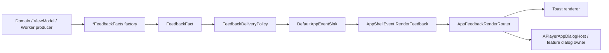

# Feedback Message Factory Architecture

Status: active

## 目标

APlayer 的应用内反馈使用同一个消息源：`FeedbackMessage`。Toast 和 Dialog 不是两类 producer，也不是两条消息通道；它们只是同一条 feedback message 在 app shell 里的两种互斥消费方式。

消息生产方只描述“发生了什么”和“应该呈现什么消息”。投递策略负责决定这条反馈是否应该被投递、合并、延迟或丢弃。Render 层只负责把幸存下来的 fact 消费成 Toast 或 Dialog。

## 总体链路



## 核心对象

### `FeedbackMessage`

`FeedbackMessage` 是唯一的 renderable message source，负责承载资源 key、plural、组合消息和少量渲染参数。它不承载聚合身份，也不决定投递策略。

当前消息形态：

- `Resource`: 一个字符串资源和格式化参数。
- `Quantity`: 一个 plural 资源、数量和格式化参数。
- `Composite`: 多个资源化消息片段组合成一条 feedback。
- `PlaybackTrackUnavailable`: 带有 `bookId`、`queueIndex`、`bookTitle` 的语义消息；Toast 可渲染短文案，Dialog 可路由到“跳到下一可用音轨”的强交互确认。

`FeedbackMessage.defaultRenderMode` 默认是 `TOAST`。只有明确需要强交互的消息由 fact factory 覆盖为 `DIALOG`。

### `FeedbackOutcome`

`FeedbackOutcome` 描述用户理解到的反馈结果，供投递策略读取。它和文案分离，避免策略按本地化文本、路径、URL 或 display name 聚合。

核心字段：

- `FeedbackCategory`: 顶层反馈类别，例如 `LIBRARY_ACCESS`、`PLAYBACK_CONTROL`、`BOOK_MANAGEMENT`、`DOWNLOAD_CACHE`、`RECOVERY`、`DATA_TRANSFER`。
- `FeedbackTopic`: 同一 category 下的用户任务主题，例如 `PlaybackSourcePreflight`、`PlaybackContentAvailability`、`DataExport`。
- `FeedbackContext`: 用户可理解的对象上下文，例如 `Book(bookId)`、`LibraryRoot(rootId, accessForm)`、`PlaybackContent(bookId, queueIndex)`、`Global`。
- `FeedbackSeverity`: 同 identity 内的替换优先级。
- `FeedbackLifecycle`: `FINAL` 或 `PROVISIONAL`。
- `FeedbackTaskInstance`: 区分同一 identity 的不同任务实例。

### `FeedbackFact`

`FeedbackFact` 是消息投递的完整输入：

```kotlin
data class FeedbackFact(
    val message: FeedbackMessage,
    val outcome: FeedbackOutcome,
    val renderMode: FeedbackRenderMode = message.defaultRenderMode
)
```

它把 `FeedbackMessage`、`FeedbackOutcome` 和互斥的 `FeedbackRenderMode` 绑定在一起。策略读取 `outcome`，render 层读取 `message` 和 `renderMode`。

### `*FeedbackFacts`

具体领域通过 fact factory 发布反馈，例如：

- `RecoveryFeedbackFacts`
- `PlaybackControlFeedbackFacts`
- `BookManagementFeedbackFacts`
- `DownloadCacheFeedbackFacts`
- `LibraryAccessFeedbackFacts`
- `DataTransferFeedbackFacts`

这些 factory 是 producer 到通用 feedback 模型的转换层。它们负责选择消息资源、category、topic、context、severity、lifecycle 和必要的 render mode。不要让 UI leaf、media service 或 worker 直接拼 `FeedbackOutcome`。

## 投递策略

`FeedbackDeliveryPolicy` 是消息通用投递策略，和 Toast/Dialog 无关。所有 `FeedbackFact` 都必须先经过它。

策略职责：

- 同一 `FeedbackAggregationIdentity` 才能互相合并或替换。
- 不同 category、topic、context 的反馈互不吸收。
- 同 identity 内，高 severity final 可以替换低 severity final。
- `PROVISIONAL` 会先 hold；如果同 identity final 很快到达，只投递 final。
- 新 provisional 会替换同 slot 的旧 pending provisional。
- burst limit 是 app-wide 保护，但不会改变 identity 规则。
- 没有 app shell collector 时返回 `Dropped(NO_COLLECTOR)`。

策略不关心最终消费方式。Dialog feedback 也会被合并、hold 或 drop；它不绕过策略。

## Render 方式

`FeedbackRenderMode` 只有两个值：

- `TOAST`: 渲染为短生命周期 Toast。
- `DIALOG`: 渲染为应用内强交互 Dialog。

两者互斥。一个 `FeedbackFact` 只能以一种 render mode 被消费。

`DefaultAppEventSink` 在策略允许投递后发出：

```kotlin
AppShellEvent.RenderFeedback(fact, fact.renderMode)
```

`AppFeedbackRenderRouter` 再把 shell event 转换为：

- `AppFeedbackRenderRequest.Toast(message)`
- `AppFeedbackRenderRequest.Dialog(message)`

Toast 使用 `FeedbackMessage.render(context)` 做本地化并显示。Dialog 先按语义消息路由；例如 `PlaybackTrackUnavailable` 路由到已有的恢复确认对话框，其余 Dialog message 暂时进入通用反馈 dialog。

## 媒体恢复 Dialog

媒体恢复类强交互反馈当前由 `RecoveryFeedbackFacts` 统一建模为 Dialog：

- 媒体库根目录缺失或不可用，无法加载媒体源。
- 明文 HTTP 播放被安全策略阻止。
- 当前音轨不可用，需要确认是否跳到其他可用音轨。
- 初始媒体载入失败。
- 跳转恢复失败后没有后续可播放音轨。

这类消息仍然共用 `FeedbackMessage` 和 `FeedbackDeliveryPolicy`。Dialog 只表示它们需要更强的应用内处理，不表示它们拥有独立消息源。

阻断播放的 Dialog 文案应包含影响范围，例如“已停止播放：book.title”。通用资源消息可以通过 `FeedbackMessage.Composite` 追加影响范围；`PlaybackTrackUnavailable` 这种需要保留语义类型以便路由的消息，在 render 时追加同一范围文案，不应包成 `Composite`。

## 边界规则

1. Producer 发布 `FeedbackFact`，不要直接发布 Toast 或 Dialog 命令。
2. `FeedbackMessage` 只表达可渲染消息，不表达聚合身份。
3. `FeedbackOutcome` 只表达用户可理解的任务结果，不包含本地化文案、display name、路径、URL、token 或 credential。
4. `FeedbackDeliveryPolicy` 是 render-independent policy；Dialog 不绕过它。
5. `APlayerApp` 只收集 shell event、调用 render router、挂载 Dialog host，不承载 category/topic/severity 规则。
6. 新反馈优先落在现有领域 fact factory；只有出现新的用户反馈类别时才扩展 `FeedbackCategory`。
7. 新 Dialog message 应先确认是否需要语义路由。需要路由的消息应建成独立 `FeedbackMessage` 类型；普通告知型 Dialog 可使用资源消息。

## 添加新反馈的流程

1. 选择最接近的领域 factory，例如 `RecoveryFeedbackFacts` 或 `LibraryAccessFeedbackFacts`。
2. 在 `FeedbackMessages` 中增加或复用 resource-backed message。
3. 在 factory 中构造 `FeedbackOutcome`，明确 category、topic、context、severity 和 lifecycle。
4. 仅在需要强交互时设置 `renderMode = FeedbackRenderMode.DIALOG`。
5. Producer 调用 `appEventSink.emitFeedback(factoryResult)`。
6. 补充 factory 测试，断言 message、identity、severity、lifecycle 和 render mode。
7. 如果新增 Dialog 语义类型，补充 `AppFeedbackRenderRouter` 或 dispatch 测试。

## 当前限制

通用 Dialog 当前只有单个 `feedbackDialogMessage` slot。它已经挂载在 `APlayerAppDialogHost`，不受 full-player gate 限制。后续增加更多 Dialog feedback 前，需要把这个单 slot 升级为 identity-aware queue 或合并策略，避免多个强交互消息互相覆盖。

这项限制只影响 Dialog render 队列，不改变消息源、投递策略或 fact factory 的职责。
