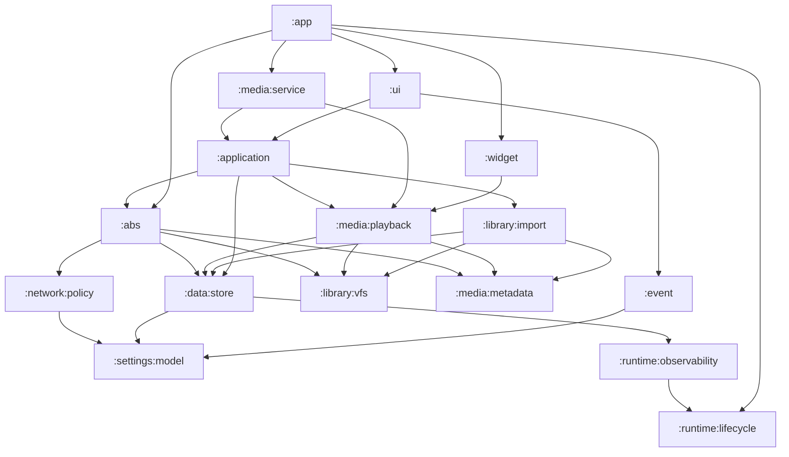

# Oto Gradle 多模块领域迁移计划

## 当前事实

- `settings.gradle.kts` 当前只包含 `:app`。
- `app/src/main/java/com/viel/oto/` 已经按领域包组织，主要包包括 `abs`、`application`、`data`、`library`、`media`、`ui`、`widget`、`work`。
- 本次静态扫描的 Kotlin 文件数量：`ui` 128、`application` 72、`data` 67、`media` 57、`library` 49、`abs` 41、`logger` 25、`di` 19。
- Koin 入口集中在 `OtoKoinApplication`，关闭顺序由 `GraphClosePolicy` 固定为 `media -> download -> abs -> library -> uiEvents -> data`。
- 现有导入图存在阻碍直接拆模块的循环：
  - `data` 直接引用 `abs`、`library`、`media`、`work`。
  - `library` 直接引用 `abs`、`data`、`media`。
  - `media` 直接引用 `application`、`data`、`library`、`widget`、`MainActivity`、`R`。
  - `logger` 与 `data` 互相引用。
  - `event` 直接引用 `application`、`data`、`media`、`R`。

本计划先清理这些反向依赖，再把现有包提升为 Gradle Module。迁移目标不是增加一个总控 Module，而是让每个领域 Module 持有自己的 Interface、Implementation、测试和 Koin Adapter。

## 目标模块图

## 目标模块职责

| Gradle Module | 领域职责 | Interface | Implementation | 禁止事项 |
| --- | --- | --- | --- | --- |
| `:app` | Android application、manifest、`MainActivity`、`OtoApplication`、版本、签名、AboutLibraries、Koin 聚合 | 应用启动和组件注册 | Activity/Application/manifest 合并 | 不放业务规则，不放特性 Koin 定义 |
| `:settings:model` | 用户设置值对象和枚举 | `AppSettings`、设置枚举 | 纯 Kotlin 值模型 | 不依赖 Android、Room、Compose |
| `:network:policy` | cleartext HTTP、unsafe TLS 全局策略 | `UnsafeNetworkPolicy` | 纯策略和结构化异常 | 不持有 OkHttp client，不读取 DataStore |
| `:runtime:lifecycle` | 关闭顺序和生命周期注册 | `GraphClosePolicy` | Closeable 注册与阶段关闭 | 不解析领域业务 |
| `:runtime:observability` | 领域日志和安全日志 | 日志 Interface、领域中立事件 | Android Log Adapter 和专用 logger | 不依赖 Room Entity 作为公共 Interface |
| `:data:store` | Room、DataStore、DAO、Gateway、Service、schema export | 现有 `XxxGateway` | Room/DataStore Implementation | 不调度扫描，不解析媒体，不直接依赖 ABS Implementation |
| `:library:vfs` | SAF/WebDAV/VFS 文件访问 | `VirtualFileSystem`、`VfsFileInterface`、source provider Interface | SAF/WebDAV Adapter、range/cache Adapter | 不直接引用 ABS Adapter |
| `:library:import` | 扫描、导入、root lifecycle、availability | 扫描命令、导入结果、root lifecycle Interface | Import pipeline、scan runner、availability checker | 不持有播放器 runtime |
| `:media:metadata` | CUE/M3U8/音频 metadata、cover、subtitle 解析 | parser/router、manifest model | parser Implementation | 不访问 Room、PlaybackService、Widget |
| `:media:playback` | playback plan、preflight、VFS playback data source、progress sync coordination | playback plan/player controller Interface | Media3-adjacent playback Implementation | 不引用 `MainActivity`、Widget、Compose |
| `:media:service` | MediaSession service、foreground notification、manual download service | Android service entrypoints | Service、notification Adapter | 不直接更新 Widget 状态 |
| `:abs` | AudiobookShelf anti-corruption layer | ABS auth/catalog/progress/source Adapter Interface | DTO、Moshi、API client、sync、ABS VFS Adapter | 不泄漏原始 ABS DTO 到 UI 或通用 library |
| `:application` | read model、command、use case、download orchestration | 场景级命令和读模型 | use case/read model Implementation | 不依赖 Compose、Android service、raw network DTO |
| `:event` | one-shot feedback 和领域反馈事实 | `AppEventSink`、feedback facts | feedback delivery Adapter | 不直接引用 Android `R` 作为领域事实 |
| `:ui` | Compose route/screen/overlay/ViewModel/theme/i18n | screen state、actions、route | Compose Implementation | 不绕过 application/data gateway |
| `:widget` | Glance widget 和 widget action receiver | widget render state、action entrypoints | Glance UI、receiver Adapter | 不直接操纵播放器 Implementation |

不建立 `:core`、`:common-all`、`:di` 这类宽 Module。Koin 定义跟随所属领域 Module，`:app` 只收集模块列表。

## 阶段 0 - 基线冻结和依赖图守卫

目标：把当前单模块行为固定下来，给后续移动文件提供回归基线。

改动范围：

- 保留 `:app` 单模块。
- 增加或更新架构测试，输出并校验顶层包导入方向。
- 记录当前 `OtoKoinApplication` 模块列表和 `GraphClosePolicy` 顺序。
- 确认 Room schema 版本 `41` 基线仍由 `docs/release-policy.md` 描述。

验收：

- `.\gradlew.bat compileDebugKotlin`
- `.\gradlew.bat testDebugUnitTest --tests "com.viel.oto.architecture.*"`
- `.\gradlew.bat testDebugUnitTest --tests "com.viel.oto.architecture.ReleasePolicyTest"`

回滚点：只回退新增测试和文档，业务代码保持不变。

## 阶段 1A - 抽出纯 Kotlin 设置、网络策略和生命周期

目标：先拆不依赖 Android runtime 的低耦合 Module，给后续领域 Module 提供稳定 Interface。

改动范围：

- 新增 `:settings:model`，移动 `shared/settings/AppSettings.kt`。
- 新增 `:network:policy`，移动 `network/UnsafeNetworkPolicy.kt`，依赖 `:settings:model`。
- 新增 `:runtime:lifecycle`，移动 `GraphClosePolicy`。
- `:runtime:observability` 单独进入阶段 1B，因为当前 logger Implementation 依赖 Android `Log`，不和纯 Kotlin 基础模块糅在一起。
- `work/WorkSchedulingPolicy.kt` 暂不进入基础 Module，因为它仍依赖 `AudiobookSchema.ScanTrigger` 和 AndroidX WorkManager 类型。

验收：

- `.\gradlew.bat :settings:model:test`
- `.\gradlew.bat :network:policy:test`
- `.\gradlew.bat :runtime:lifecycle:test`
- `.\gradlew.bat compileDebugKotlin`
- `.\gradlew.bat testDebugUnitTest --tests "com.viel.oto.architecture.GraphLifecycleTest"`

回滚点：回退新增 Module include、build 文件和移动的三类基础文件，不影响领域代码。

## 阶段 1B - 抽出运行时观测 Module

目标：把 release 保留日志、专用 workflow logger 和安全日志清洗器从 `:app` 中分离出来。

改动范围：

- 新增 `:runtime:observability` Android library Module。
- 移动 `logger/` 下的 `SecureLog`、ABS logger、playback logger、scan logger、cache logger 和 UI performance logger。
- 保持日志包名稳定，让现有调用点先通过 Gradle dependency 解析。
- 后续领域 Module 拆分时，各领域只依赖观测 Module，不反向依赖 `:app`。

验收：

- `.\gradlew.bat :runtime:observability:testDebugUnitTest`
- `.\gradlew.bat compileDebugKotlin`
- `.\gradlew.bat testDebugUnitTest --tests "com.viel.oto.logger.*"`
- `.\gradlew.bat testDebugUnitTest --tests "com.viel.oto.architecture.*"`

回滚点：只回退 logger 文件移动和 `:runtime:observability` build/include，不影响已抽出的纯 Kotlin 基础模块。

## 阶段 2 - 清理 data 的外向领域依赖

目标：让 `data` 变成可提升为 Gradle Module 的深 Module。它的 Interface 是 gateway，Implementation 是 Room/DataStore service。

改动范围：

- 把 ABS Room Entity/DAO 从 `abs` 移到 `data` 的 ABS 持久化包，`AppDatabase` 不再依赖 `abs` 包。
- 把 `data/scan/ScanSchedulerImpl.kt` 移到 `library:import` 所属包；`data` 只保留扫描状态持久化 gateway。
- 把 `data/subtitle` 对 `media.subtitle.SubtitleLine` 的依赖改为 metadata 模型或 catalog 模型。
- 把 `data/cover` 对 `media.parser` 和 `library.vfs` 的直接依赖收拢到 cover recovery gateway 的 Adapter，不让 Room store 了解解析 Implementation。
- 移除 `data <-> logger` 循环，`data` 只依赖 `:runtime:observability` 的日志 Interface。

验收：

- `.\gradlew.bat compileDebugKotlin`
- `.\gradlew.bat testDebugUnitTest --tests "com.viel.oto.architecture.BookGatewaySplitArchitectureTest"`
- `.\gradlew.bat testDebugUnitTest --tests "com.viel.oto.data.*"`
- `.\gradlew.bat testDebugUnitTest --tests "com.viel.oto.data.db.*MigrationTest"`

回滚点：每个包移动单独提交；Room schema 文件和迁移测试在同一阶段提交。

## 阶段 3 - 提升 `:data:store`

目标：把 Room、DataStore、gateway/service 提升为独立 Gradle Module。

改动范围：

- 新增 `:data:store` Android library Module。
- 移动 `data/` 源码、对应 JVM tests、Room KSP 配置。
- schema export 仍写入现有 `app/schemas` 路径，避免迁移期间改写 release policy。
- `CoreDataModule` 移入 `:data:store`，只暴露该 Module 的 Koin Module。
- `:app` 和其他领域 Module 通过 Gradle dependency 使用 `:data:store`。

验收：

- `.\gradlew.bat :data:store:compileDebugKotlin`
- `.\gradlew.bat :data:store:testDebugUnitTest`
- `.\gradlew.bat testDebugUnitTest --tests "com.viel.oto.architecture.ReleasePolicyTest"`
- `.\gradlew.bat assembleDebug`

回滚点：回退 `settings.gradle.kts` include、`:data:store` build 文件和源码移动；`app/schemas` 保持原样。

## 阶段 4 - 拆分 library VFS 和导入领域

目标：把 source lifecycle、VFS、scan/import 从 app 内提升出来，同时移除 `library -> abs` 直接引用。

改动范围：

- 新增 `:library:vfs`，移动 `VirtualFileSystem`、`VfsFileInterface`、VFS cache、SAF/WebDAV source provider、remote range strategy。
- 新增 `:library:import`，移动 scan/import/root lifecycle/availability。
- `LibrarySourceProvider` 改为接收 source Adapter 列表；ABS Adapter 由 `:abs` 的 Koin Module 注册，`library` 不再 import `AbsSourceProvider`。
- WebDAV 继续留在 `:library:vfs`，因为它是 library source Adapter，不与 ABS protocol 合并。
- `LibraryScanModule`、`LibraryCoverModule`、`LibraryUseCaseModule` 分别移动到所属 Module。

验收：

- `.\gradlew.bat :library:vfs:compileDebugKotlin`
- `.\gradlew.bat :library:import:testDebugUnitTest`
- `.\gradlew.bat testDebugUnitTest --tests "com.viel.oto.library.*"`
- `.\gradlew.bat testDebugUnitTest --tests "com.viel.oto.media.VfsPlaybackDataSourceTest"`
- `.\gradlew.bat assembleDebug`

回滚点：先回退 `:library:import`，再回退 `:library:vfs`，因为 import 依赖 VFS。

## 阶段 5 - 拆分 media metadata、playback、service

目标：让 metadata 解析、播放器核心和 Android Service 分别维护。

改动范围：

- 新增 `:media:metadata`，移动 `media/parser`、`media/manifest`、subtitle parser、cover extractor。
- 新增 `:media:playback`，移动 `BookPlaybackPlan`、`VfsPlaybackUri`、`VfsPlaybackDataSource`、`PlaybackManager`、preflight、progress sync tracking。
- 新增 `:media:service`，移动 `media/service` 下的 MediaSession service、download service、notification Adapter。
- 清理 `media -> MainActivity`：由 `:app` 提供 launch intent Adapter，`media:service` 只依赖一个窄 Interface。
- 清理 `media -> widget`：播放状态通过 `event` 或 application command 通知，Widget 自己读取 render state。
- `SeekStepPresentation` 等使用 `R` 的代码移动到 UI/event presentation，播放器核心只保留值模型。

验收：

- `.\gradlew.bat :media:metadata:testDebugUnitTest`
- `.\gradlew.bat :media:playback:testDebugUnitTest`
- `.\gradlew.bat :media:service:compileDebugKotlin`
- `.\gradlew.bat testDebugUnitTest --tests "com.viel.oto.media.*"`
- `.\gradlew.bat assembleDebug`
- 设备回归：播放、暂停、seek、后台通知、手动下载通知。

回滚点：`metadata -> playback -> service` 顺序提交，service 是最后可回退层。

## 阶段 6 - 提升 ABS anti-corruption Module

目标：把 ABS 作为独立远程源领域维护，同时保持对本地 library/data/media 的 Adapter 关系。

改动范围：

- 新增 `:abs` Android library Module。
- 移动 ABS auth、DTO、Moshi client、sync、mapping、cover cache、progress sync、ABS VFS Adapter。
- ABS Room Entity/DAO 已在阶段 2 归入 `:data:store`，`:abs` 通过 gateway/DAO Interface 访问持久化。
- `AbsSourceProvider` 实现 `:library:vfs` 的 source provider Interface，由 ABS Koin Module 注册。
- `AbsCatalogMapper` 继续做 DTO 到本地 catalog 的 anti-corruption 转换，原始 DTO 不穿透到 `application` 或 `ui`。

验收：

- `.\gradlew.bat :abs:testDebugUnitTest`
- `.\gradlew.bat testDebugUnitTest --tests "com.viel.oto.abs.*"`
- `.\gradlew.bat testDebugUnitTest --tests "com.viel.oto.abs.net.AbsApiContractTest"`
- `.\gradlew.bat testDebugUnitTest --tests "com.viel.oto.abs.sync.AbsSyncTaskCoordinatorTest"`
- `.\gradlew.bat assembleDebug`

回滚点：ABS Module 回退不影响 SAF/WebDAV/local library Module。

## 阶段 7 - 提升 application、event、ui、widget

目标：把用户意图、反馈、Compose UI 和 Glance Widget 分开维护。

改动范围：

- 新增 `:application`，移动 read model、command、use case、download orchestration。
- 新增 `:event`，移动 `AppEventSink` 和 feedback facts；资源字符串映射放在 `:ui` 或 `:app` presentation Adapter。
- 新增 `:ui`，移动 Compose route/screen/overlay/ViewModel/theme/i18n。
- 新增 `:widget`，移动 Glance widget、widget receiver、widget render state。
- `ViewModelModule` 移到 `:ui`，Widget Koin 定义移到 `:widget`。
- UI 继续只通过 application command/read model、event sink 和 media playback Interface 交互。

验收：

- `.\gradlew.bat :application:testDebugUnitTest`
- `.\gradlew.bat :event:testDebugUnitTest`
- `.\gradlew.bat :ui:compileDebugKotlin`
- `.\gradlew.bat :widget:compileDebugKotlin`
- `.\gradlew.bat testDebugUnitTest --tests "com.viel.oto.architecture.UiLayerArchitectureTest"`
- `.\gradlew.bat testDebugUnitTest --tests "com.viel.oto.widget.*"`
- 设备回归：主屏、搜索、详情、设置、播放器浮层、Widget action。

回滚点：`application` 先提交，`ui` 和 `widget` 分开提交。

## 阶段 8 - 收口 app shell 和发布策略

目标：`:app` 只剩应用壳和 composition root。

改动范围：

- `OtoKoinApplication` 只聚合各领域 Module 暴露的 Koin Module。
- Manifest 中的 service/receiver/activity 引用来自依赖 Module 的真实类。
- AboutLibraries 插件、签名、BuildConfig、locale filter、backup/network security 继续由 `:app` 维护。
- 保留 release shrinking 和 resource shrinking，不新增宽 R8 keep rule。
- 更新架构测试，禁止领域 Module 反向依赖 `:app`。

验收：

- `.\gradlew.bat compileDebugKotlin`
- `.\gradlew.bat testDebugUnitTest`
- `.\gradlew.bat lintDebug`
- `.\gradlew.bat assembleDebug`
- `.\gradlew.bat connectedDebugAndroidTest`

回滚点：该阶段只改 composition root、manifest 合并和架构测试，业务领域 Module 已经独立通过验证。

## 维护规则

- 每个 Gradle Module 持有自己的 `build.gradle.kts`、测试目录、Koin Module 和短 README。
- README 只记录 Module 的 Interface、允许依赖、禁止依赖、常用验证命令。
- 引入新 Module 时同步更新包导入架构测试。
- 一个 Module 只有一个 Adapter 时不急着抽新的 Seam；第二个真实 Adapter 出现后再提升 Interface。
- 不使用 Kotlin `typealias` 和 import alias 解决命名冲突。
- 不在迁移阶段改变 Room 版本基线、backup allowlist、unsafe network 默认值、release shrinking 策略。

## 首批建议提交顺序

1. 基线架构测试和导入图守卫。
2. `:settings:model`、`:network:policy`、`:runtime:lifecycle`。
3. `:runtime:observability`。
4. `data` 外向依赖清理。
5. `:data:store` 提升。
6. `:library:vfs` 和 `:library:import` 提升。

这五步完成后，项目已经从单 `:app` 进入可持续多模块状态，后续 ABS、media、UI、widget 可以按领域独立推进。
