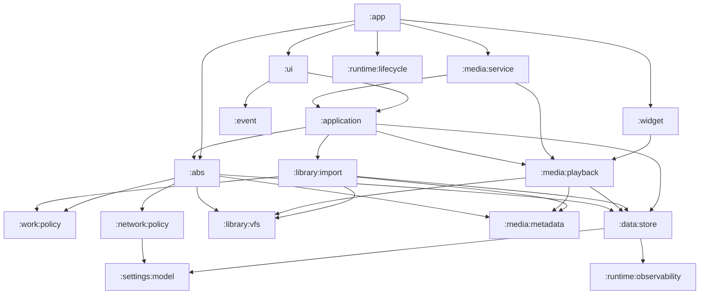

# Oto Gradle 多模块领域迁移计划

## 当前事实

- `settings.gradle.kts` 当前包含 `:app`、`:settings:model`、`:network:policy`、`:runtime:lifecycle`、`:runtime:observability`、`:data:store`、`:library:vfs`、`:library:import`、`:media:metadata`、`:media:playback`、`:media:service`、`:abs`、`:work:policy`、`:application`、`:event`、`:widget`、`:shared`、`:ui`。
- `app/src/main/java/com/viel/oto/` 已经按领域包组织，主要包包括 app-owned event adapter、app-owned widget adapter（`app/widget`）、app-owned playback presentation adapter 和组合根；`application` 已提升到 `application/src/main/java/com/viel/oto/application`，`event` 核心已提升到 `event/src/main/kotlin/com/viel/oto/event`，`data` 已提升到 `data/store/src/main/java/com/viel/oto/data`，scan/import/root lifecycle/availability 已提升到 `library/import/src/main/java/com/viel/oto/library`，ABS 已提升到 `abs/src/main/java/com/viel/oto/abs`，Glance widget 已提升到 `widget/src/main/java/com/viel/oto/widget`，Compose UI、i18n、ViewModel Koin 定义和 UI feedback resource adapter 已提升到 `ui/src/main/java/com/viel/oto`。
- 本次迁移后，app 内 `library`、`abs`、`application`、`widget`、`media`、`i18n` 和 `ui` 生产 Kotlin 文件已清空（app 只保留 app-owned adapter 与组合根）；`:library:vfs` 维护 VFS/source provider，`:library:import` 维护 scan/import/root lifecycle/availability，`:media:metadata` 维护 parser/manifest/cover/subtitle parser，`:media:playback` 维护 playback plan/controller/data source/cache/session state 和 subtitle gateway implementation，`:media:service` 维护 Media3 service、download service、audio focus 和通知 adapter，`:application` 维护 read model、command、use case、download orchestration 和 startup warmup seam，`:event` 维护 feedback delivery 核心契约，`:ui` 维护 Compose route/screen/overlay/ViewModel/theme/i18n 和资源化 feedback presentation adapter，`:abs` 维护 ABS auth、DTO、client、sync、mapping、cover cache、progress sync 和 ABS VFS Adapter，`:data:store` 继续维护 Room、DataStore 和持久化 gateway，`:widget` 维护 Glance widget render/receiver/state。
- `settings/model`、`network/policy`、`runtime/lifecycle` 已是纯 Kotlin Module；`runtime/observability`、`library/vfs` 和 `media/metadata` 已是 Android library Module，继续保留 `com.viel.oto.logger`、`com.viel.oto.library.vfs`、`com.viel.oto.media.parser`、`com.viel.oto.media.manifest` 和 `com.viel.oto.media.subtitle` 包名供现有调用点使用。
- ABS Room 持久化文件当前位于 `data/store/src/main/java/com/viel/oto/data/abs/playback` 和 `data/store/src/main/java/com/viel/oto/data/abs/sync`，`AppDatabase` 已从 `data.abs.*` 导入这些 DAO/Entity。
- Koin 入口集中在 `OtoKoinApplication`，关闭顺序由 `GraphClosePolicy` 固定为 `media -> download -> abs -> library -> uiEvents -> data`。
- 现有导入图仍存在阻碍继续拆模块的循环：
  - `data` 已进入 `:data:store`，当前只保留对 `shared`、`timeline`、`logger` 的窄依赖。
  - `:abs` 已作为 anti-corruption Module 独立维护，直接依赖 `:data:store`、`:library:vfs`、`:library:import`、`:media:metadata`、`:media:playback`、`:network:policy`、`:work:policy` 和运行时模块；ABS 同步反馈通过 `AbsSyncFeedbackSink` 由 app event adapter 转换。
  - `library` 已移除对 `abs` 的生产源码直接引用，VFS 已进入 `:library:vfs`，metadata parser/manifest 已进入 `:media:metadata`，scan/import/root lifecycle/availability 已进入 `:library:import`。
  - `media` 已拆出 `:media:metadata`、`:media:playback` 和 `:media:service`；sidecar subtitle resolver implementation 已随 `:media:playback` 维护，app 不再持有生产 `media/` 包。
  - `logger` 已物理迁出 app，多数领域仍直接依赖具体 logger，后续需要继续收敛为窄 observability Interface。
  - app-owned event adapter 仍引用 ABS、library 和 data scan/sync 输入事实；资源化 feedback message factory 与 Compose rendering adapter 已随 `:ui` 维护，`:event` 只维护反馈消息载体、交付策略和 app shell event stream。

本计划先清理这些反向依赖，再把现有包提升为 Gradle Module。迁移目标不是增加一个总控 Module，而是让每个领域 Module 持有自己的 Interface、Implementation、测试和 Koin Adapter。

## 目标模块图

## 目标模块职责

| Gradle Module | 领域职责 | Interface | Implementation | 禁止事项 |
| --- | --- | --- | --- | --- |
| `:app` | Android application、manifest、`MainActivity`、`OtoApplication`、版本、签名、AboutLibraries、Koin 聚合 | 应用启动和组件注册 | Activity/Application/manifest 合并 | 不放业务规则，不放特性 Koin 定义 |
| `:settings:model` | 用户设置值对象和枚举 | `AppSettings`、设置枚举 | 纯 Kotlin 值模型 | 不依赖 Android、Room、Compose |
| `:network:policy` | cleartext HTTP、unsafe TLS 全局策略 | `UnsafeNetworkPolicy` | 纯策略和结构化异常 | 不持有 OkHttp client，不读取 DataStore |
| `:runtime:lifecycle` | 关闭顺序和生命周期注册 | `GraphClosePolicy` | Closeable 注册与阶段关闭 | 不解析领域业务 |
| `:runtime:observability` | 领域日志和安全日志 | 日志 Interface、领域中立事件 | Android Log Adapter 和专用 logger | 不依赖 Room Entity 作为公共 Interface |
| `:data:store` | Room、DataStore、DAO、Gateway、Service、schema export | 现有 `XxxGateway` | Room/DataStore Implementation | 不调度扫描，不解析媒体，不直接依赖 ABS Implementation |
| `:library:vfs` | SAF/WebDAV/VFS 文件访问 | `VirtualFileSystem`、`VfsFileInterface`、source provider Interface | SAF/WebDAV Adapter、range/cache Adapter | 不直接引用 ABS Adapter |
| `:library:import` | 扫描、导入、root lifecycle、availability | 扫描命令、导入结果、root lifecycle Interface | Import pipeline、scan runner、availability checker | 不持有播放器 runtime |
| `:media:metadata` | CUE/M3U8/音频 metadata、cover、subtitle 解析 | parser/router、manifest model | parser Implementation | 不访问 Room、PlaybackService、Widget |
| `:work:policy` | WorkManager 唯一队列、约束、退避和冷启动去重策略 | `WorkSchedulingPolicy`、`UniqueWorkSchedulingPolicy` | 可测试的 WorkManager policy 值模型 | 不持有 Worker、不执行 enqueue、不读取数据库 |
| `:media:playback` | playback plan、preflight、VFS playback data source、progress sync coordination | playback plan/player controller Interface | Media3-adjacent playback Implementation | 不引用 `MainActivity`、Widget、Compose |
| `:media:service` | MediaSession service、foreground notification、manual download service | Android service entrypoints | Service、notification Adapter | 不直接更新 Widget 状态 |
| `:abs` | AudiobookShelf anti-corruption layer | ABS auth/catalog/progress/source Adapter Interface | DTO、Moshi、API client、sync、ABS VFS Adapter | 不泄漏原始 ABS DTO 到 UI 或通用 library |
| `:application` | read model、command、use case、download orchestration | 场景级命令和读模型 | use case/read model Implementation | 不依赖 Compose、Android service、raw network DTO |
| `:event` | one-shot feedback 核心契约 | `AppEventSink`、`AppShellEvent`、`FeedbackMessage`、feedback outcome/identity | `DefaultAppEventSink`、`FeedbackDeliveryPolicy` | 不直接引用 Android `R`、media、ABS、library、data、application |
| `:ui` | Compose route/screen/overlay/ViewModel/theme/i18n | screen state、actions、route | Compose Implementation | 不绕过 application/data gateway |
| `:widget` | Glance widget 和 widget action receiver | widget render state、action entrypoints | Glance UI、receiver Adapter | 不直接操纵播放器 Implementation |

不建立 `:core`、`:common-all`、`:di` 这类宽 Module。Koin 定义跟随所属领域 Module，`:app` 只收集模块列表。

## 阶段 0 - 基线冻结和依赖图守卫（已落地，后续维护）

目标：把当前已拆出基础 Module 后的运行行为固定下来，给后续移动文件提供回归基线。

改动范围：

- 保留当前 `:app` 加 Stage 1 基础 Module 的组合，不在本阶段新增业务领域 Module。
- 维护架构测试，输出并校验顶层包导入方向。
- 记录当前 `OtoKoinApplication` 模块列表和 `GraphClosePolicy` 顺序。
- 确认 Room schema 版本 `41` 基线仍由 `docs/release-policy.md` 描述。

验收：

- `.\gradlew.bat --no-problems-report compileDebugKotlin`
- `.\gradlew.bat --no-problems-report :app:testDebugUnitTest --tests "com.viel.oto.architecture.*"`
- `.\gradlew.bat --no-problems-report :app:testDebugUnitTest --tests "com.viel.oto.architecture.ReleasePolicyTest"`

回滚点：只回退测试基线和文档，业务代码保持不变。

## 阶段 1A - 抽出纯 Kotlin 设置、网络策略和生命周期（已落地，后续维护）

目标：先拆不依赖 Android runtime 的低耦合 Module，给后续领域 Module 提供稳定 Interface。

改动范围：

- 保持 `:settings:model` 管理 `shared/settings/AppSettings.kt` 和设置枚举。
- 保持 `:network:policy` 管理 `UnsafeNetworkPolicy`，并只依赖 `:settings:model`。
- 保持 `:runtime:lifecycle` 管理 `GraphClosePolicy`。
- `:runtime:observability` 继续单独维护，因为 logger Implementation 依赖 Android `Log`，不和纯 Kotlin 基础模块糅在一起。
- `work/WorkSchedulingPolicy.kt` 已作为 `:work:policy` Android library Module 独立维护，因为 library import 和 ABS sync 都需要共享 WorkManager 队列语义。

验收：

- `.\gradlew.bat --no-problems-report :settings:model:test`
- `.\gradlew.bat --no-problems-report :network:policy:test`
- `.\gradlew.bat --no-problems-report :runtime:lifecycle:test`
- `.\gradlew.bat --no-problems-report compileDebugKotlin`
- `.\gradlew.bat --no-problems-report :app:testDebugUnitTest --tests "com.viel.oto.architecture.GraphLifecycleTest"`

回滚点：回退这些基础 Module 的 include、build 文件和移动文件，不影响领域代码。

## 阶段 1B - 抽出运行时观测 Module（已落地，后续维护）

目标：把 release 保留日志、专用 workflow logger 和安全日志清洗器从 `:app` 中分离出来。

改动范围：

- 保持 `:runtime:observability` Android library Module。
- `SecureLog`、ABS logger、playback logger、scan logger、cache logger 和 UI performance logger 继续位于 `runtime/observability/src/main/java/com/viel/oto/logger`。
- 保持日志包名稳定，让现有调用点先通过 Gradle dependency 解析。
- 后续领域 Module 拆分时，各领域只依赖观测 Module，不反向依赖 `:app`。

验收：

- `.\gradlew.bat --no-problems-report :runtime:observability:testDebugUnitTest`
- `.\gradlew.bat --no-problems-report compileDebugKotlin`
- `.\gradlew.bat --no-problems-report :runtime:observability:testDebugUnitTest --tests "com.viel.oto.logger.*"`
- `.\gradlew.bat --no-problems-report :app:testDebugUnitTest --tests "com.viel.oto.architecture.*"`

回滚点：只回退 logger 文件移动和 `:runtime:observability` build/include，不影响已抽出的纯 Kotlin 基础模块。

## 阶段 2 - 清理 data 的外向领域依赖

目标：让 `data` 变成可提升为 Gradle Module 的深 Module。它的 Interface 是 gateway，Implementation 是 Room/DataStore service。

改动范围：

- 收尾 ABS Room Entity/DAO 从 `abs` 到 `data` ABS 持久化包的移动，确保 `AppDatabase` 不再依赖 `abs` 包。
- 已落地：`data/scan/ScanSchedulerImpl.kt` 已移到 `library/scan` 所属包；`data` 只保留扫描状态持久化 gateway，后续随阶段 4 提升进 `:library:import`。
- 已落地：`data/subtitle` 已迁出为 `media/subtitle` gateway，sidecar 解析不再作为 data store 职责暴露。
- 已落地：`data/cover` 已通过 `CoverImageWriter` 和 `CoverRecoveryArtworkSource` 收拢 parser/VFS 访问，Room store 不再直接依赖解析 Implementation。
- 已落地：`data/metadata` 已通过 `MetadataRefreshSource` 接入 metadata 刷新，Room store 不再直接依赖 `MetadataResolver`。
- 已落地：`data/cover` 已通过 `RemoteCoverStore` 接入远程封面删除，Room store 不再直接依赖 ABS cover cache Implementation。
- 已落地：`data/cache` 已通过 `RootSourceCacheEvictor` 接入 source cache 清理，Room store 不再直接依赖 VFS range cache Implementation。
- 已落地：`data/availability` 已通过 `FileAvailabilityProbe` 接入文件可用性探测，Room store 不再直接依赖 library availability Implementation。
- 已落地：`data` 不再直接调用具体 logger object，只依赖 `:runtime:observability` 提供的 `DiagnosticLogSink` 和 `WorkflowLogSink`。
- 已落地：`data/root` 已迁入 `library/root`，source root lifecycle、扫描触发、SAF/WebDAV/ABS post-commit cleanup 不再作为 data store 职责维护。

验收：

- `.\gradlew.bat --no-problems-report compileDebugKotlin`
- `.\gradlew.bat --no-problems-report :app:testDebugUnitTest --tests "com.viel.oto.architecture.BookGatewaySplitArchitectureTest"`
- `.\gradlew.bat --no-problems-report :data:store:testDebugUnitTest --tests "com.viel.oto.data.*"`
- `.\gradlew.bat --no-problems-report :data:store:testDebugUnitTest --tests "com.viel.oto.data.db.*MigrationTest"`

回滚点：每个包移动单独提交；Room schema 文件和迁移测试在同一阶段提交。

## 阶段 3 - 提升 `:data:store`（已落地，后续维护）

目标：把 Room、DataStore、gateway/service 提升为独立 Gradle Module。

改动范围：

- 已新增 `:data:store` Android library Module。
- 已移动 `data/` 源码、对应 JVM tests、Room KSP 配置。
- schema export 仍写入现有 `app/schemas` 路径，避免迁移期间改写 release policy。
- `CoreDataModule` 已移入 `:data:store`，只暴露该 Module 的 Koin Module。
- `:app` 已通过 Gradle dependency 使用 `:data:store`。
- `AppSettingsRepository` 保持 data-owned DataStore repository，application 设置合约由 `RepositoryAppSettingsAdapter` 在 app 侧适配。
- app 侧暂时保留 `ksp(libs.androidx.room.compiler)` 作为 KSP processor classpath 兼容项，直到 Moshi DTO 随 ABS Module 拆出。

验收：

- `.\gradlew.bat --no-problems-report :data:store:compileDebugKotlin`
- `.\gradlew.bat --no-problems-report :data:store:testDebugUnitTest`
- `.\gradlew.bat --no-problems-report :app:testDebugUnitTest --tests "com.viel.oto.architecture.ReleasePolicyTest"`
- `.\gradlew.bat --no-problems-report assembleDebug`

回滚点：回退 `settings.gradle.kts` include、`:data:store` build 文件和源码移动；`app/schemas` 保持原样。

## 阶段 4 - 拆分 library VFS 和导入领域

目标：把 source lifecycle、VFS、scan/import 从 app 内提升出来，同时移除 `library -> abs` 直接引用。

改动范围：

- 已新增 `:library:vfs`，并移动 `VirtualFileSystem`、`VfsFileInterface`、VFS cache、SAF/WebDAV source provider、remote range strategy。
- 已移动 `FileRef`、`FileIdentity` 和 `RemoteAvailabilityMappingPolicy` 到 `:library:vfs`，让 WebDAV、ABS 和 metadata/import 调用点继续使用稳定坐标模型与远程错误映射。
- 已为 WebDAV provider/tester 增加 settings provider 注入点，模块测试不再依赖 app composition root 或 DataStore 缓存预热。
- `:media:metadata` 已先于 `:library:import` 抽出，作为 import pipeline 的 parser/manifest 前置依赖。
- 已新增 `:work:policy`，把 library cold-start scan 与 ABS root sync 共用的 WorkManager 唯一队列、约束和退避策略移出 app。
- 已落地：`ScanOutcome` 改为携带 library-owned `ScanNotice`，app 侧通过 mapper 转回 `FeedbackFact`，避免 `:library:import` 依赖 app `R` 或 event delivery。
- 已新增 `:library:import`，移动 scan/import/root lifecycle/availability，并保留对 `:data:store`、`:library:vfs`、`:media:metadata`、`:work:policy` 的显式依赖。
- 已落地：`LibrarySourceProvider` 改为接收 source Adapter 列表；ABS Adapter 由 app composition root 注册，`library` 不再 import `AbsSourceProvider`。
- WebDAV 继续留在 `:library:vfs`，因为它是 library source Adapter，不与 ABS protocol 合并。
- `LibraryScanModule` 已移动到 `:library:import`；`LibraryCoverModule`、`LibraryUseCaseModule` 仍留在 app，后续随 cover/application 领域拆分。

验收：

- `.\gradlew.bat --no-problems-report :library:vfs:compileDebugKotlin`
- `.\gradlew.bat --no-problems-report :library:vfs:testDebugUnitTest`
- `.\gradlew.bat --no-problems-report :library:import:testDebugUnitTest`
- `.\gradlew.bat --no-problems-report :library:import:testDebugUnitTest --tests "com.viel.oto.library.*"`
- `.\gradlew.bat --no-problems-report :media:playback:testDebugUnitTest --tests "com.viel.oto.media.VfsPlaybackDataSourceTest"`
- `.\gradlew.bat --no-problems-report assembleDebug`

回滚点：先回退 `:library:import`，再回退 `:library:vfs`，因为 import 依赖 VFS。

## 阶段 5 - 拆分 media metadata、playback、service

目标：让 metadata 解析、播放器核心和 Android Service 分别维护。

改动范围：

- 已新增 `:media:metadata`，移动 `media/parser`、`media/manifest`、subtitle parser、cover extractor。
- `ManifestModels.kt` 已从 `library` 包模型改为 `media.manifest` 包模型，避免 metadata module 继续暴露 import/root lifecycle 领域包。
- 已新增 `:media:playback`，移动 `BookPlaybackPlan`、`VfsPlaybackUri`、`VfsPlaybackDataSource`、`PlaybackManager`、preflight、progress sync tracking、manual cache playback、session state、sidecar subtitle resolver 和 playback domain event。
- 已落地：`PlaybackManager` 通过 `PlaybackSessionTokenFactory` 获取 Media3 session token，不再直接引用 `PlaybackService`；ABS playback session sync 通过 `RemotePlaybackSessionSyncGateway` 适配，不再由 playback core 直接 import ABS implementation。
- 已新增 `:media:service`，移动 `media/service` 下的 MediaSession service、download service、notification Adapter。
- 已清理 `media -> MainActivity`：由 `:app` 提供 launch intent Adapter，`media:service` 只依赖 `MediaServiceLaunchIntentFactory`。
- 已清理 `media -> widget`：播放状态通过 `PlaybackWidgetStateSink` 投递 snapshot，Widget 自己读取并更新 render state。
- `SeekStepPresentation` 已移动到 UI presentation，播放器核心只保留值模型。

验收：

- `.\gradlew.bat --no-problems-report :media:metadata:compileDebugKotlin`
- `.\gradlew.bat --no-problems-report :media:metadata:testDebugUnitTest`
- `.\gradlew.bat --no-problems-report :media:playback:testDebugUnitTest`
- `.\gradlew.bat --no-problems-report :media:service:compileDebugKotlin`
- `.\gradlew.bat --no-problems-report :media:playback:testDebugUnitTest --tests "com.viel.oto.media.*"`
- `.\gradlew.bat --no-problems-report assembleDebug`
- 设备回归：播放、暂停、seek、后台通知、手动下载通知。

回滚点：`metadata -> playback -> service` 顺序提交，service 是最后可回退层。

## 阶段 6 - 提升 ABS anti-corruption Module

目标：把 ABS 作为独立远程源领域维护，同时保持对本地 library/data/media 的 Adapter 关系。

改动范围：

- 已新增 `:abs` Android library Module。
- 已移动 ABS auth、DTO、Moshi client、sync、mapping、cover cache、progress sync、ABS VFS Adapter。
- ABS Room Entity/DAO 已在阶段 2 归入 `data` 持久化包，并随阶段 3 进入 `:data:store`；`:abs` 通过 gateway/DAO Interface 访问持久化。
- `AbsSourceProvider` 实现 `:library:vfs` 的 source provider Interface，由 ABS Koin Module 注册。
- `AbsCatalogMapper` 继续做 DTO 到本地 catalog 的 anti-corruption 转换，原始 DTO 不穿透到 `application` 或 `ui`。
- 已清理 `abs -> event`：ABS 输出 `AbsSyncFeedbackSink` 事实，app 侧 `AppEventAbsSyncFeedbackSink` 负责转成资源化 feedback。

验收：

- `.\gradlew.bat --no-problems-report :abs:testDebugUnitTest`
- `.\gradlew.bat --no-problems-report :abs:testDebugUnitTest --tests "com.viel.oto.abs.*"`
- `.\gradlew.bat --no-problems-report :abs:testDebugUnitTest --tests "com.viel.oto.abs.net.AbsApiContractTest"`
- `.\gradlew.bat --no-problems-report :abs:testDebugUnitTest --tests "com.viel.oto.abs.sync.AbsSyncTaskCoordinatorTest"`
- `.\gradlew.bat --no-problems-report assembleDebug`

回滚点：ABS Module 回退不影响 SAF/WebDAV/local library Module。

## 阶段 7 - 提升 application、event、ui、widget

目标：把用户意图、反馈、Compose UI 和 Glance Widget 分开维护。

改动范围：

- 已落地 7A：download notification resources、manual download notification/action adapter、playback resume adapter 和 manual-download orphan cleanup Worker 已移到 app-owned package，`application` 不再持有 Android service/WorkManager adapter。
- 已落地 7A：settings ABS sync preflight 不再返回 `FeedbackFact`；`application` 只返回结构化 blocked reason，UI/event 边缘负责资源化 feedback。
- 已落地 7A：settings root 文案和 connection failure 文案格式化已移到 UI-owned formatter，`application` 不再直接引用 app `R` 或 event feedback。
- 阶段 7A 后，`application` 剩余 Android `Context` 依赖集中在 user-data import/export 用例，下一切片先决定它们保留为 Android application Module 能力，还是拆出 app/runtime adapter。
- 已落地 7B：新增 `:application`，移动 read model、command、use case、download orchestration、startup warmup seam 和 application JVM tests。
- 已落地 7B：`StartupWarmupDependencies`、`OtoStartupWarmup`、`DefaultStartupWarmupDependencies` 和 `DefaultPlayerPlaybackController` 作为 app composition root 的跨模块构造边界公开；内部 warmup 调度细节保持 module-local。
- 已落地 7B：settings root formatter 不再 import data schema，UI 只消费 `LibraryRootSettingsSnapshot` 暴露的 settings source/status/availability 语义。
- 已落地 7C：新增纯 Kotlin `:event`，移动 `AppEventSink`、`AppShellEvent`、`FeedbackMessage`、`FeedbackFact`、feedback outcome/identity、交付结果和 `FeedbackDeliveryPolicy`。
- 已落地 7C：资源字符串工厂、`FeedbackMessage.render(Context)`、ABS sync feedback adapter、scan notice feedback adapter 和 playback domain event bridge 仍保留在 app-owned event adapter，避免 `:event` 直接依赖 Android `R`、ABS、library、media、data 或 application。
- 已落地 7G：新增 `:ui` Android library Module，移动 Compose route/screen/overlay/ViewModel/theme/i18n、UI JVM tests 和 Compose instrumentation tests。
- 已落地 7D：新增 `:widget` Android library Module，移动 `PlayerWidget`、`PlayerWidgetReceiver`、`PlayerWidgetActionReceiver`、`PlayerWidgetStateHelper`、`PlayerWidgetPlaybackPresentation`、`WidgetCoverArtRenderer`、`WidgetSeekStepPresentation` 和 widget drawable/layout/xml/string 资源，widget receiver 声明移入 `:widget` manifest 由 manifest merge 合入 app。
- 已落地 7D：`media:service` 通过 `PlaybackWidgetStateSink` 投递快照，app composition root 持有 `AppPlaybackWidgetStateSink`（位于 app-owned `app.widget` 包）把快照路由进 widget 模块的 Glance store，`:widget` 不反向依赖 `:app`、media service 或 ui。
- 已落地 7D：widget 模块自带各 locale 副本；app 内 `player_widget_*` string 和 widget 专用 drawable/layout/xml 死资源已清理。7D 暂留在 app 的共享 string 已在 7E 迁入 `:shared`。
- 已落地 7E：`:shared` 继续维护跨层小工具，并接管 app、UI、event adapter 和测试共同引用的 user-visible string、locale 资源和共享 playback/navigation drawable；app 只保留 launcher、AboutLibraries raw 等应用壳专属资源。
- 已落地 7E：UI、app-owned event adapter、download notification resource adapter 和相关测试改为引用 `com.viel.oto.shared.R`；架构 baseline 移除 `app/event/ui -> R` 资源边，保留明确的 `app/event/ui -> shared` 边。
- 已落地 7F 预备切片：`MainActivity` 作为 app shell 读取 `BuildConfig.VERSION_NAME` 和 AboutLibraries raw 资源，并把版本号和已解析 license 列表传入 `OtoApp`；`AboutLibrariesScreen` 不再 import app `BuildConfig` 或 app `R`。
- 已落地 7F 预备切片：架构 baseline 移除 `ui -> BuildConfig`，后续 `:ui` 抽取只需要继续处理 UI 对 app composition root、DI 和 app-owned adapter 的剩余引用。
- 已落地 7G：`ViewModelModule` 归 `:ui` 维护，app composition root 只导入 `com.viel.oto.ui.di.ViewModelModule`；widget receiver 由 manifest 声明，`:widget` 当前无 Koin 定义。
- 已落地 7G：UI feedback resource factory 和 `FeedbackMessage.render(Context)` 归 `:ui` 维护，并通过 application 层 `SettingsRootAvailabilityKind`、`SettingsRootSourceKind` 避免 `:ui` 直接 import data schema。
- UI 继续只通过 application command/read model、event sink 和 media playback Interface 交互。

验收：

- `.\gradlew.bat --no-problems-report :application:testDebugUnitTest`
- `.\gradlew.bat --no-problems-report :event:test`
- `.\gradlew.bat --no-problems-report :ui:compileDebugKotlin`
- `.\gradlew.bat --no-problems-report :widget:compileDebugKotlin`
- `.\gradlew.bat --no-problems-report :shared:compileDebugKotlin`
- `.\gradlew.bat --no-problems-report :app:testDebugUnitTest --tests "com.viel.oto.architecture.UiLayerArchitectureTest"`
- `.\gradlew.bat --no-problems-report :widget:testDebugUnitTest --tests "com.viel.oto.widget.*"`
- 设备回归：主屏、搜索、详情、设置、播放器浮层、Widget action。

回滚点：`application`、`event`、`ui` 和 `widget` 分开提交，按最近阶段单独回退。

## 阶段 8 - 收口 app shell 和发布策略

目标：`:app` 只剩应用壳和 composition root。

改动范围：

- `OtoKoinApplication` 只聚合各领域 Module 暴露的 Koin Module。
- Manifest 中的 service/receiver/activity 引用来自依赖 Module 的真实类。
- AboutLibraries 插件、签名、BuildConfig、locale filter、backup/network security 继续由 `:app` 维护。
- 保留 release shrinking 和 resource shrinking，不新增宽 R8 keep rule。
- 更新架构测试，禁止领域 Module 反向依赖 `:app`。
- 已落地 8A：`:widget` 打开应用改为通过 package launcher intent，不再硬编码 `com.viel.oto.MainActivity`；新增架构测试扫描非 app 生产 Module，禁止引用 app shell 类名和 app-owned adapter 包。
- 已落地 8B：`LibrarySceneModule` 随 home/detail/player/edit/search/recovery read model 与 command 绑定迁入 `:application`，app composition root 只聚合该领域 Module 暴露的 Koin Module。
- 已落地 8C：`DownloadReadModelModule` 随下载状态、下载管理和缓存维护读写模型迁入 `:application`，app 不再持有该下载场景 Koin 定义。

验收：

- `.\gradlew.bat --no-problems-report compileDebugKotlin`
- `.\gradlew.bat --no-problems-report testDebugUnitTest`
- `.\gradlew.bat --no-problems-report lintDebug`
- `.\gradlew.bat --no-problems-report assembleDebug`
- `.\gradlew.bat --no-problems-report connectedDebugAndroidTest`

回滚点：该阶段只改 composition root、manifest 合并和架构测试，业务领域 Module 已经独立通过验证。

## 维护规则

- 每个 Gradle Module 持有自己的 `build.gradle.kts`、测试目录、Koin Module 和短 README。
- README 只记录 Module 的 Interface、允许依赖、禁止依赖、常用验证命令。
- 引入新 Module 时同步更新包导入架构测试。
- 一个 Module 只有一个 Adapter 时不急着抽新的 Seam；第二个真实 Adapter 出现后再提升 Interface。
- 不使用 Kotlin `typealias` 和 import alias 解决命名冲突。
- 不在迁移阶段改变 Room 版本基线、backup allowlist、unsafe network 默认值、release shrinking 策略。

## 首批建议提交顺序

已落地的前置提交：基线架构测试和导入图守卫、`:settings:model`、`:network:policy`、`:runtime:lifecycle`、`:runtime:observability`。

后续建议提交顺序：

1. 完成 `data` 外向依赖清理，先收尾 ABS Room 持久化包移动，再处理 scan、subtitle、cover、logger 依赖。
2. 提升 `:data:store`，保持 Room schema export 和 release policy 不变。
3. 提升 `:library:vfs`，拆掉 `library -> abs` 的直接 Adapter 引用。
4. 提升 `:media:metadata`，作为 `:library:import` 的 parser/manifest 前置 Module。
5. 提升 `:library:import`，把 scan/import/root lifecycle/availability 从 app 中移出。
6. 拆 `:media:playback`、`:media:service`，先去除 `MainActivity`、`R`、Widget 反向依赖。
7. 提升 `:abs`，保持 ABS DTO 只停留在 anti-corruption Module 内。
8. 提升 `:application`、`:event`、`:ui`、`:widget`。
9. 收口 `:app` 为 manifest、application shell、Koin 聚合和发布策略所有者。

完成前五个后续提交后，项目会进入可持续多模块状态；后续 ABS、media、UI、widget 可以按领域独立推进。
