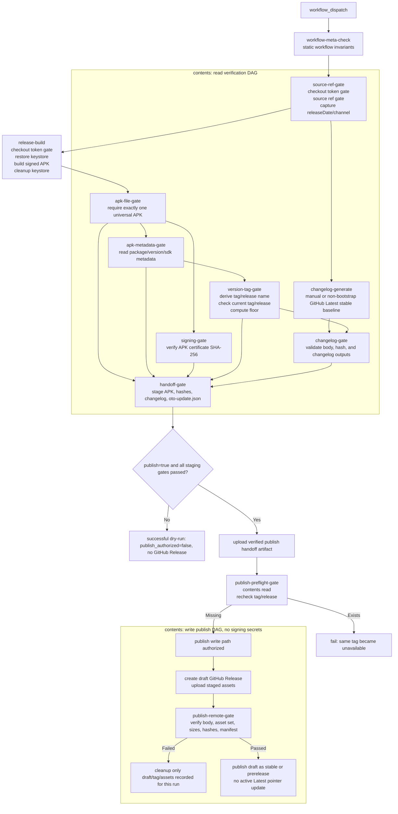

# Release Pipeline Hardening Plan

## Goal

改造 GitHub Actions 发布管线，让 GitHub Releases 成为应用内自更新的可信发布源。

硬条件：

- 继续通过 GitHub Actions `workflow_dispatch` 手动发布。
- 继续由 CI 构建 signed release APK。
- 继续使用 GitHub Releases 承载 release。
- `versionCode` 继续按提交数自动生成，并由 Gradle build script 统一派生。
- `versionCode` 发布门禁按 package-global 最大值判定，不按 channel 分别判定。
- `versionName` 由 Gradle build script 统一派生；tag 和 release name 由 CI 基于 APK metadata 自动生成，不由 maintainer 手动维护。
- `publish` 由 workflow 手动开关控制；开关未打开时绝不 publish。
- 任一校验门禁失败时绝不 publish，即使 `publish=true`。
- GitHub Latest release 指针按 GitHub Releases 默认规则正常维护；workflow 不创建 `latest` tag，也不把 Latest 用作 version floor、bootstrap 或客户端更新输入。
- 所有 release 都生成 `oto-update.json`。
- 首个新格式 stable release 是 manifest bootstrap；它必须通过手动发布流程提供完整 `manual_changelog`，并在 publish transaction 远端复验后建立 manifest baseline。
- `prerelease=true` 时 `oto-update.json.channel = "prerelease"`。
- `prerelease=false` 时 `oto-update.json.channel = "stable"`。
- tag 自动生成为 `<channel>-<versionName>-<versionCode>`，例如 `stable-26.01.01-123`。
- release asset 名称包含 channel、`versionName` 和 `versionCode`，例如 `oto-stable-26.01.01-123-universal.apk`。
- 同 tag 阻塞是刻意发布策略，不是 GitHub 技术限制；目标是禁止替换已发布资产，避免同一 tag 下 APK、manifest、changelog 或 signing metadata 发生语义漂移。
- stable manifest bootstrap 不解析旧 tag；bootstrap 只强制 stable channel 和完整 `manual_changelog`，manifest 存在性由 publish transaction 的 `oto-update.json` 生成和远端复验保证。
- 首版只构建和发布 universal APK，不构建 AAB。
- Gradle build/verify job 不能持有可写 `GITHUB_TOKEN`。
- publish job 不能持有 release keystore 或 signing secrets。

## Document Structure

本计划记录一次完整改造的目标合同、当前状态和剩余补强点，不拆 scope。为避免维护时混淆责任边界，后文按以下层次组织：

- Release contract：维护者前置条件、现状缺口、目标 workflow 拓扑和执行模型。
- Workflow inputs and derived metadata：唯一允许手填的输入，以及 CI/Gradle 必须自动派生的字段。
- Gate contracts：运行时 gate 与静态 workflow 约束分开描述；运行时 gate 由 workflow step 执行，静态约束由 PR lint、review checklist 或 workflow meta-check job 执行。
- Publish transaction model：publish job 的 draft release、资产上传、远端复验、发布和失败清理语义。
- Implementation phases：历史落地顺序和回归 checklist；当前 workflow 已进入 Phase 5 多 job publish 拓扑，Phase 0 到 Phase 4 的非发布边界只作为阶段化落地记录。
- Operational runbook and known risks：回滚、验证命令、已知 trade-off 和运维恢复点。

## Main Implementation Plan

本节是维护和补强当前发布管线的主阅读路径。后续 appendix 作为细节合同、当前状态和 checklist 使用，不再把旧阶段描述当作当前 workflow 状态。

### Release Contract

| Area | Contract |
| --- | --- |
| Trigger | 只保留 `workflow_dispatch` 手动发布。维护者只填写 `prerelease`、`publish`、可选 `manual_changelog`、可选 `highlights`。 |
| Source ref | Source Ref Gate 必须早于任何 signing secret 注入，只允许 `refs/heads/main` 或 `refs/heads/master`。这是 anti-footgun，不是权限安全边界。 |
| Version | `versionCode` 继续由 `git rev-list --count HEAD` 自动派生；`versionName` 使用一次捕获的 `releaseDate=yy.MM.dd` 派生。Gradle、APK metadata、tag、release name、manifest 必须一致。 |
| Channel | `prerelease=true` 生成 `channel=prerelease`；`prerelease=false` 生成 `channel=stable`。首个新格式 stable release 建立 manifest bootstrap，且必须提供完整 `manual_changelog`。 |
| Naming | tag 固定为 `<channel>-<versionName>-<versionCode>`；release asset 名称必须包含 channel、`versionName`、`versionCode`。新 release 不再接受手填 tag/release name。 |
| Immutability | 当前自动 Git tag/ref 或 GitHub Release（含 draft）任一存在即失败，不读取、不复用、不替换既有远端资产。 |
| Version floor | floor 按 package-global 最大 `versionCode` 判定，不按 channel 分别判定。stable manifest bootstrap 不从 legacy release tag 推导 floor；bootstrap 之后只解析非 draft GitHub Releases 的新格式 tag/title metadata。 |
| Secrets | build/verify job 可以持有 signing secrets 和 keystore，但只能有 `contents: read`。publish job 可以有 `contents: write`，但不能持有 signing secrets、keystore、Gradle 或 Android build。 |
| Publish switch | `publish=false` 永远不创建、不更新 GitHub Release。`publish=true` 也必须等所有 staging gate 通过后才授权 publish job。 |
| Release source | 所有 release 都生成 `oto-update.json`。GitHub Latest release 指针由 GitHub 默认规则维护；客户端更新模型读取 release assets，不读取 synthetic `latest` tag。 |

### Workflow Topology

实际 workflow 是多 job DAG，不是单个 build/verify job 串行执行。`build/verify` 在本文中表示所有 `contents: read` 验证 job 的集合；`publish` 表示只消费已验证 handoff artifact 的 `contents: write` 发布路径。

| Stage | Job(s) | Authority | Inputs | Outputs | Must not do |
| --- | --- | --- | --- | --- | --- |
| Static workflow check | `workflow-meta-check` | `contents: read` | workflow YAML and release scripts | static invariant pass/fail | read signing secrets or publish |
| Source setup | `source-ref-gate` | `contents: read` | workflow inputs, `github.ref` | channel, fixed `releaseDate` | read signing secrets before Source Ref Gate |
| Build | `release-build` | `contents: read`, signing secrets | release keystore, Gradle, Android SDK, fixed `releaseDate` | raw signed release APK | create/update/delete GitHub Release, tag, or asset; retain keystore after build |
| APK verification | `apk-file-gate`, `apk-metadata-gate`, `signing-gate` | `contents: read` | raw or normalized APK, Android SDK tooling, expected certificate variable | normalized APK, APK metadata, signing certificate metadata | publish or inspect current auto-tag remote assets |
| Version and changelog | `version-tag-gate`, `changelog-generate`, `changelog-gate` | `contents: read` | APK metadata, historical release list metadata, GitHub Latest stable baseline, changelog inputs | auto tag, release name, version metadata, `CHANGELOG.md`, release body | read/reuse current auto-tag assets or mutate releases |
| Staging and publish switch | `handoff-gate` | `contents: read` | APK, APK/signing/version/changelog metadata, `publish` input | verified handoff artifact only when publish is authorized | upload handoff artifact when `publish=false` or any gate failed |
| Publish preflight | `publish-preflight-gate` | `contents: read` without signing secrets | verified handoff artifact | current tag/release availability recheck | run Gradle, restore keystore, mutate releases, or accept unverified handoff contents |
| Publish transaction | draft create/upload, remote verify, finalize/cleanup jobs | `contents: write` without signing secrets | verified handoff artifact and recorded draft state | draft release, uploaded assets, published stable/prerelease release | run Gradle, access signing secrets, or read existing release assets as source of truth |

### Gate Ownership Matrix

| Gate | Phase | Runtime step or static invariant | Enforcement |
| --- | --- | --- | --- |
| Publish switch gate | Phase 0, finalized in Phase 5 | Runtime | `publish=false` successful dry-run; `publish=true` only authorizes publish after all staging gates pass. |
| Source Ref Gate | Phase 0 | Runtime | First release-safety step; fail before secrets when ref is not `main`/`master`. |
| Token and checkout boundary | Phase 0, finalized in Phase 5 | Static + runtime | actionlint/meta-check for permissions and checkout options; runtime checkout-token gate checks `.git/config` and `.git-credentials` have no persisted token. |
| Date/version derivation | Phase 1 | Runtime | Capture `releaseDate` once; Gradle release build must fail in CI if it lacks that value. |
| APK metadata readback | Phase 1 | Runtime | Use Android SDK tooling such as `aapt2 dump badging` or `apkanalyzer`; do not infer metadata from filenames or logs. |
| Current tag/ref/release availability | Phase 1, repeated in Phase 5 | Runtime | Query Git ref and GitHub Release including draft; any existing object blocks release. |
| Package-global version floor | Phase 1 | Runtime + runbook | Parse non draft new-format release metadata after current tag gate; use audited floor override only for recovery. |
| Stable manifest bootstrap | Phase 1 | Runtime | First new-format stable release establishes the manifest baseline through a successful publish transaction and must provide full `manual_changelog`; prerelease before that baseline fails. |
| Signing certificate | Phase 2 | Runtime | Compare APK certificate SHA-256 from `apksigner verify --print-certs` with repository variable. |
| Changelog source/body/hash | Phase 3 | Runtime | Manual changelog is full body; non-bootstrap auto changelog baseline is the GitHub Latest stable release. Body must equal `CHANGELOG.md`. |
| Artifact and manifest | Phase 4 | Runtime | Exactly one universal APK; fixed asset set; hashes, sizes, package name, SDKs, channel, and signing hash must match. |
| Staging handoff | Phase 5 | Runtime + static | Handoff artifact contains only verified non-secret files and metadata; no symlink/path traversal/checkout/secret material. |
| Draft publish transaction | Phase 5 | Runtime | Create draft, upload assets, remote-verify, then publish. Cleanup only objects recorded as created by this run. |
| Regression coverage | Phase 6 | Test | Add long-term dry-run coverage, including cross-midnight `releaseDate` reuse. |

### Implementation Audit Order

当前 workflow 已按 Phase 5 拓扑拆成验证 DAG 和 publish DAG。维护时按以下顺序审计，不要把它理解为尚未开始的实现计划：

1. Phase 0 safety baseline：publish switch、Source Ref Gate、`contents: read`、`persist-credentials: false`、`fetch-depth: 0`、temp keystore cleanup。
2. Manual version/tag input removal：Gradle/CI-derived version metadata and APK metadata readback。
3. Current auto tag/ref/release gate and package-global floor gate, including stable bootstrap behavior。
4. Signing certificate gate using repository variable `SIGNING_CERTIFICATE_SHA256` and APK certificate readback。
5. Changelog normalization, GitHub Latest stable baseline, release body generation, and changelog hash。
6. Fixed artifact naming, APK hash asset, `oto-update.json`, and local staging bundle verification。
7. Build/verify and publish job split; publish job consumes only the verified handoff artifact。
8. Draft transaction：create draft, upload assets, remote-verify, publish draft, cleanup only this run's recorded objects on failure。
9. Remaining regression coverage after the publish path is active。

### What Not To Re-read As Implementation Order

The detailed target pipeline, gate sections, and phase checklists below intentionally repeat some facts from different viewpoints. Treat them as reference contracts. If a detail appears both in this main plan and an appendix, the current workflow status in Appendix B and the contracts in this main plan take precedence.

## Appendix A: Maintainer Prerequisites

发布管线维护前需要固定以下预备条件：

- GitHub Secrets 必须配置 `KEYSTORE_BASE64`、`KEYSTORE_PASSWORD`、`KEY_ALIAS`、`KEY_PASSWORD`。
- GitHub Repository variables 必须配置 `SIGNING_CERTIFICATE_SHA256`。
- `SIGNING_CERTIFICATE_SHA256` 必须是 release APK 预期签名证书 SHA-256，格式为 64 位十六进制；可接受冒号分隔输入，但 CI 会规范化为 lowercase hex。
- GitHub Repository variable 可以配置 `RELEASE_DEBUG_SIGNING_CERT_SHA256_DENYLIST` 作为额外 debug certificate denylist；未配置时仍会按 Android debug certificate subject 和 debug key alias 拦截。
- GitHub Latest release 指针不参与 version floor、bootstrap version floor 或客户端更新模型；workflow 只读使用它作为非 bootstrap 自动 changelog 的 stable baseline，并让 GitHub 按默认规则维护该指针。
- workflow 只允许从 `refs/heads/main` 或 `refs/heads/master` 触发发布；source ref gate 必须早于任何 signing secret 注入。
- 发布分支必须使用完整 checkout，`actions/checkout` 必须设置 `fetch-depth: 0`，保证 `git rev-list --count HEAD` 和 changelog baseline tag 可用。
- 维护者负责保证发布分支和提交历史让 `versionCode` 单调递增；CI 只做门禁，不替维护者修复历史策略。
- package-global `versionCode` floor 由非 draft GitHub Releases 的新格式 tag/title metadata 解析；stable manifest bootstrap 不从 legacy stable release tag 推导 floor，legacy releases 不参与 floor。
- Phase 0 至 Phase 4 曾作为非发布准备阶段落地；当前 workflow 已进入 Phase 5 拓扑，`publish=true` 只在所有 staging gate 通过后授权 publish job。
- build/verify job 与 publish job 的最终隔离、staging gate 和真实 publish 路径已在 Phase 5 拓扑中固定。
- 最终 publish job 只能接收已验证 staging assets，不能接收 `KEYSTORE_BASE64`、`KEYSTORE_PASSWORD`、`KEY_ALIAS` 或 `KEY_PASSWORD`。
- CI workflow 必须从开始阶段固定 `TZ=Asia/Shanghai`。
- CI workflow 必须在开始阶段捕获一次 `releaseDate`，格式为 `yy.MM.dd`；Gradle、manifest、tag、release name 和 CI 校验都必须使用同一个 `releaseDate`。
- 首版 workflow 运行在 `ubuntu-latest` runner；JSON、hash、regex、Android SDK tooling、GitHub CLI 和 PowerShell Core 逻辑必须按同 runner 验证。若后续切换 runner OS，发布脚本路径、hash 工具和 shell 语义必须重新验证。

## Appendix B: Current Pipeline

当前发布入口是 `.github/workflows/release-publish.yml`。

当前流程：

1. 手动触发 `workflow_dispatch`。
2. 维护者只输入 `prerelease`、`publish`、可选 `manual_changelog`、可选 `highlights`。
3. `workflow-meta-check` 校验 workflow 静态约束，workflow-level 权限保持 `contents: read`。
4. `source-ref-gate` 使用完整 checkout，禁用 persisted credentials，校验发布 ref，并捕获一次 `releaseDate` 和 channel。
5. `release-build` 在 `contents: read` job 中注入 signing secrets，还原 runner temp keystore，传入 `OTO_RELEASE_DATE`，执行 `assembleRelease`，并在上传 raw APK artifact 前清理 materialized keystore。
6. `apk-file-gate` 归一化唯一 release APK。
7. `apk-metadata-gate` 使用 Android SDK tooling 回读 package、`versionCode`、`versionName`、minSdk、targetSdk。
8. `signing-gate` 用 `apksigner verify --print-certs` 回读 APK signing certificate SHA-256，并与 repository variable `SIGNING_CERTIFICATE_SHA256` 比对。
9. `version-tag-gate` 基于 APK metadata、captured release date 和 channel 自动生成 tag/release name，检查当前 tag/ref/release，计算 package-global floor，并处理 stable bootstrap 规则。
10. `changelog-generate` 和 `changelog-gate` 生成并校验 `CHANGELOG.md` 与 release body。
11. `handoff-gate` 生成固定 asset set：universal APK、APK `.sha256`、`CHANGELOG.md`、`oto-update.json`、release body 和 handoff metadata；`publish=false` 时 successful dry-run，不上传 publish handoff artifact。
12. `publish-preflight-gate` 在无 signing secrets 的 `contents: read` job 中复验 handoff，并重新检查当前自动 tag/ref/release。
13. `publish-draft` 在 `contents: write` job 中创建 draft GitHub Release，持久化 draft ownership artifact，并上传 staged assets；该 job 不 checkout、不运行 Gradle、不接收 signing secrets。
14. `publish-remote-gate` 下载并复验远端 release body、asset set、sizes、hashes 和 manifest。
15. `publish` 将通过远端复验的 draft 切换为 stable 或 prerelease；GitHub 按默认规则维护 Latest release 指针，workflow 不创建 `latest` tag。
16. `publish-cleanup-draft` 只在 publish path 失败后清理同时匹配当前 run handoff metadata 和 draft ownership artifact 的 draft release/tag。

当前剩余缺口：

- Phase 6 的长期回归覆盖仍需要补充，尤其是跨 `Asia/Shanghai` 0 点时 `releaseDate` 在 Gradle、manifest、tag 和 release name 中复用同一个值。

## Appendix C: Detailed Target Workflow Contract

### Target Pipeline

目标流程：

1. Maintainer 手动触发 `release-publish.yml`。
2. Maintainer 只填写 `prerelease`、`publish`、可选 `manual_changelog` 和可选 `highlights`。
3. CI 删除对 `tag_name`、`release_name`、`generate_changelog` 的手动依赖。
4. CI 从流程开始固定 `TZ=Asia/Shanghai`，并捕获一次 `releaseDate=yy.MM.dd`。
5. CI 根据 `prerelease` 生成 channel：`stable` 或 `prerelease`。
6. CI 执行 Source Ref Gate，只允许 `refs/heads/main` 或 `refs/heads/master`。
7. build/verify job 使用 `permissions: contents: read`、`persist-credentials: false` 和 `fetch-depth: 0` checkout。
8. build/verify job 校验 release signing secrets 完整。
9. build/verify job 从 GitHub Secrets 还原 release keystore。
10. build/verify job 从 GitHub Repository variable `SIGNING_CERTIFICATE_SHA256` 读取 expected signing certificate SHA-256。
11. build/verify job 构建 release APK，版本号由 Gradle build script 按本地/CI 共用规则派生。
12. build/verify job 使用 Android SDK `apksigner verify --print-certs` 解析 APK signing certificate SHA-256。
13. build/verify job 校验 APK signing certificate SHA-256 等于 `SIGNING_CERTIFICATE_SHA256`。
14. build/verify job 解析 APK metadata，回读 package name、`versionCode`、`versionName`、minSdk、targetSdk。
15. build/verify job 校验 APK package name、`versionCode` 和 `versionName` 等于发布规则期望值；minSdk 和 targetSdk 只作为 `oto-update.json` 字段来源，不作为 release gate 阈值。
16. CI 从 APK metadata 回读的 `versionCode` 和 `versionName` 生成 tag name：`<channel>-<versionName>-<versionCode>`。
17. CI 生成 release name：`Oto <versionName> (<versionCode>) [<channel>]`。
18. build/verify job 查询当前自动 tag 的 Git tag/ref 和 GitHub Release 状态，GitHub Release 查询必须包含 draft release。
19. Git tag/ref 或 GitHub Release（包含 draft）任一已存在时失败，不读取或复用任何既有远端 release 资产。
20. build/verify job 在同 tag/ref/release gate 通过后，基于非 draft GitHub Releases 的新格式 tag 解析 package-global 最大 `versionCode` floor，并校验新 `versionCode` 更大。
21. changelog generation 不依赖 `version-tag-gate`；stable bootstrap 必须使用 manual source，其他自动 changelog 以 GitHub Latest stable release tag 作为 baseline，并生成 `CHANGELOG.md`。
22. build/verify job 计算 APK hash、APK size、changelog hash。
23. build/verify job 生成 `oto-update.json`，其中 `channel` 等于当前 channel。
24. build/verify job 将已校验的 APK signing certificate SHA-256 写入 `oto-update.json.signingCertificateSha256`。
25. build/verify job 复验 staging asset bundle 满足 asset ownership、APK hash、changelog hash、manifest、release body 和 signing certificate gate。
26. build/verify job 在尾部执行 publish switch gate。
27. `publish=false` 时 build/verify job 以 successful dry-run 结束，输出 `publish_authorized=false`，不上传 publish handoff artifact，不创建 GitHub Release。
28. `publish=true` 时 build/verify job 输出 `publish_authorized=true` 和已验证 publish handoff artifact，不输出 keystore 或 signing secrets。
29. publish job 使用 `permissions: contents: write`，且不注入 keystore 或 signing secrets。
30. publish job 仅在 `needs.build_verify.outputs.publish_authorized == 'true'` 时运行。
31. publish job 下载 build/verify job 输出的 publish handoff artifact，并重新执行无 signing secrets 的 handoff artifact 复验。
32. publish job 在创建 release 前重新查询当前自动 tag 的 Git tag/ref 和 GitHub Release 状态，GitHub Release 查询必须包含 draft release。
33. publish job 复查 Git tag/ref 或 GitHub Release（包含 draft）任一已存在时失败，不读取或复用任何既有远端 release 资产。
34. publish job 复查 Git tag/ref 和 GitHub Release 都缺失时，使用 publish handoff artifact 创建 draft GitHub Release，并上传 APK、APK hash、`CHANGELOG.md`、`oto-update.json`。
35. publish job 上传完成后远端复验 release body、asset set、asset names、asset sizes、hashes 和 manifest 字段。
36. 远端复验通过后，publish job 才将 draft GitHub Release 切换为 published 或 prerelease 状态。
37. GitHub Release 创建、资产上传或远端复验失败时，只删除 publish job 已记录为本次 run 创建的 draft release、tag 和 partial assets。
38. `publish=true` 且所有发布操作成功时 release 保持 published 或 prerelease 状态。
39. `publish=true` 但任一门禁失败时不创建公开 GitHub Release。

执行模型：

- 上述目标流程描述 gate 依赖和失败语义，不要求 CI step 全部串行执行。
- tag name 和 release name 必须在 APK metadata 回读通过后生成；CI 不在 build 前查询当前自动 tag。
- release preparation 中签名/APK 构建、changelog 生成、GitHub Latest release 查询和历史 release list metadata 查询可以并行；`changelog-generate` 不等待 `version-tag-gate`。
- 当前自动 tag/ref/release gate 必须等待 APK metadata 生成自动 tag 后执行；Git tag/ref 或 GitHub Release 任一已存在时失败，不读取任何既有远端 release assets。
- 当前自动 tag/ref/release gate 中的 GitHub Release 查询必须包含 draft release；残留 draft 也会占用 tag name 并阻塞发布。
- package-global `versionCode` floor 只能在自动 tag 已生成且同 tag/ref/release gate 通过后计算；前置并行查询只能读取 release list metadata。
- 并行分支必须在 staging 前汇合；只有 APK metadata/signing gate、changelog gate、version/manifest input gate 全部通过，才允许生成 `oto-update.json`。
- `publish=false` 不创建、不更新 GitHub Release；build/verify job 仍可以 successful dry-run 形式只读查询 GitHub Latest release 和历史 release list metadata，用于 non-bootstrap changelog、bootstrap 判定和 version gate。
- `publish=false` 禁止读取、复用或修改当前自动 tag 对应的既有远端 release assets。
- publish switch gate 位于 build/verify job 尾部；`publish=false` 时 `publish_authorized=false`，build/verify job successful dry-run 结束，不上传 publish handoff artifact，不触发 publish job。
- `publish=true` 必须在所有 staging gate 完成后，才允许 build/verify job 输出 `publish_authorized=true` 和 publish handoff artifact，并触发 publish job 创建新的 draft GitHub Release。
- Gradle、Android build、release signing secrets 和 materialized keystore 只允许出现在 build/verify job。
- draft GitHub Release 创建、资产上传、远端复验、发布 draft 和失败清理只允许出现在 publish job。
- build/verify job 与 publish job 的唯一交接物是已验证 publish handoff artifact 和非敏感 metadata。

### CI Flow



## Appendix D: Workflow Inputs And Derived Metadata

### Required Workflow Inputs

`release-publish.yml` 应调整为尽量少的手动输入：

- `prerelease`：必填，默认 `true`。
- `publish`：必填，默认 `false`。
- `manual_changelog`：可选字符串；填写时作为完整 `CHANGELOG.md` 和 GitHub Release body 来源。
- `highlights`：可选字符串；只在 `manual_changelog` 为空时允许填写，不填写时自动 changelog 不包含 `Highlights` section。

输入规范化：

- 空白-only 输入视为空。
- `manual_changelog` 非空时，`highlights` 必须为空，否则失败。
- `manual_changelog` 非空时，它是完整 `CHANGELOG.md` 和 GitHub Release body 来源。
- `manual_changelog` 为空时，非 bootstrap 自动 changelog 始终以 GitHub Latest stable release tag 到当前 commit 为 baseline。
- `manual_changelog` 为空且 `highlights` 非空时，`highlights` 插入非 bootstrap 自动 changelog 的 `## Highlights` section。
- `manual_changelog` 为空且 `highlights` 为空时，非 bootstrap 自动 changelog 不生成 `Highlights` section。
- changelog 输入和输出统一规范化为 UTF-8 without BOM、LF 换行，并以单个 newline 结尾。
- workflow input 不设置额外业务长度上限，但 build/verify job 必须在 publish 前校验 GitHub Release body 的平台长度上限，避免超长 `manual_changelog` 拖到 publish job 才失败。

移除：

- `tag_name`
- `release_name`
- `generate_changelog`
- `changelog_limit`

### Automatically Derived Fields

Gradle build script 自动派生以下 APK 字段：

- APK `versionCode`
- APK `versionName`

CI 基于 workflow input、APK metadata、历史 release 和 staging assets 自动派生以下发布字段：

- channel
- tag name
- release name
- changelog
- APK SHA-256
- APK size
- expected signing certificate SHA-256 from GitHub Repository variable `SIGNING_CERTIFICATE_SHA256`
- APK signing certificate SHA-256
- APK package name
- APK minSdk（只回读并写入 manifest，不作为 release gate）
- APK targetSdk（只回读并写入 manifest，不作为 release gate）
- artifact names
- `oto-update.json`
- `fullChangelogUrl`

## Appendix E: Gate Contracts

### Token And Job Boundary Gate

固定规则：

- workflow 必须使用 job-level `permissions`，不能使用 workflow-level `contents: write` 覆盖所有 job。
- workflow 必须在任何 signing secret 注入前执行 Source Ref Gate。
- Source Ref Gate 只允许 `github.ref` 等于 `refs/heads/main` 或 `refs/heads/master`。
- Source Ref Gate 不要求 GitHub Environment；当前计划只使用 workflow 内 ref allowlist 防止从临时分支误触发发布。
- build/verify job 必须设置 `permissions: contents: read`。
- build/verify job 的 `actions/checkout` 必须设置 `persist-credentials: false`。
- build/verify job 的 `actions/checkout` 必须设置 `fetch-depth: 0`。
- build/verify job 可以持有 release signing secrets、Android SDK、Gradle 和 materialized keystore。
- build/verify job 禁止创建、更新、删除 GitHub Release、tag 或 release assets。
- build/verify job 可以只读查询 GitHub Latest release 和历史 release list metadata；changelog baseline 和 bootstrap/manual decision 可以并行解析，version floor 中的新格式 tag/title 解析必须等待自动 tag 已生成且同 tag/ref/release gate 通过。
- build/verify job 禁止读取、复用或修改当前自动 tag 对应的既有远端 release assets。
- Gradle release build、Android build 和任何会执行项目构建脚本的 step 禁止出现在 `contents: write` job。
- publish job 必须是独立 job，且必须显式设置 `permissions: contents: write`。
- publish job 不能注入 `KEYSTORE_BASE64`、`KEYSTORE_PASSWORD`、`KEY_ALIAS` 或 `KEY_PASSWORD`。
- build/verify job 在 publish switch gate 前复验 staging APK signing certificate。
- publish job 不运行 Android SDK `apksigner verify --print-certs`，只消费 build/verify job 输出的已验证 publish handoff artifact。
- publish job 不能运行 Gradle、Android build、APK signing 或任何需要 keystore 的 step。
- publish job 只能使用 build/verify job 输出的已验证 publish handoff artifact，不能读取既有远端 release assets。
- build/verify job 和 publish job 的交接 artifact 只能包含 APK、APK hash、`CHANGELOG.md`、`oto-update.json`、release body、tag/channel/version metadata 和校验摘要。
- 交接 artifact 禁止包含 keystore、password、GitHub token、`.git/config`、workspace checkout、Gradle user home、Android signing config 或任何 secret dump。

Runtime gates（workflow 内 step）：

- Source Ref Gate 缺失，或在 signing secret 注入之后才执行。
- workflow 从 `refs/heads/main`、`refs/heads/master` 之外的 ref 继续进入 signing 或 publish 流程。
- build/verify job 的 `.git/config` 中保留 GitHub token credential。
- build/verify 到 publish 的 artifact bundle 含 secret、keystore、checkout credential 或 workspace 全量目录。
- publish job 未重新复验 handoff artifact 即创建或修改 GitHub Release。
- handoff artifact 含额外文件、目录嵌套、symlink、绝对路径或路径穿越。
- draft release 上传完成后未远端复验 body、asset set、asset names、asset sizes、hashes 和 manifest 字段即发布。

Static invariants（PR lint / review checklist / workflow meta-check job）：

- 静态约束由 `actionlint`、仓库自定义 workflow meta-check 脚本和 PR review checklist 执行，不要求 release workflow 在运行时自省 job permissions。
- 任何 Gradle build/verify job 拥有 `contents: write`。
- build/verify job checkout 未设置 `persist-credentials: false`。
- build/verify job checkout 未设置 `fetch-depth: 0`。
- publish job 持有任一 signing secret。
- publish job 运行 Gradle、Android build、APK signing、APK signing verification 或 keystore restore。
- release 创建、资产上传或失败清理发生在 build/verify job。
- publish job 直接创建公开 GitHub Release，而不是先创建 draft release。

### Version And Tag Gate

固定规则：

- APK 实际 `versionCode` 是发布版本的唯一排序依据。
- `versionCode` 由 `git rev-list --count HEAD` 自动生成。
- release build 必须使用 Gradle build script 的统一版本规则派生 `versionCode`。
- 本地 release build 和 CI release build 必须使用同一套 `versionCode`、`versionName` 派生规则。
- `oto-update.json.versionCode` 必须等于 APK 实际 `versionCode`。
- `oto-update.json.channel` 必须等于当前 workflow channel。
- CI 以 package-global `versionCode` floor 作为发布门禁，不按 channel 分别判定。
- package-global floor 从非 draft GitHub Releases 的新格式 tag 解析，tag 格式必须为 `<channel>-<versionName>-<versionCode>`。
- release title 必须为 `Oto <versionName> (<versionCode>) [<channel>]`，并与 tag 中的 channel、`versionName`、`versionCode` 一致。
- CI 不下载历史 `oto-update.json` 来计算 version floor；历史 manifest 仍是发布契约的一部分，但 floor 只依赖 release metadata。
- 新 APK `versionCode` 必须大于所有 post-bootstrap 新格式 release tag 中解析出的最大 `versionCode`。
- 由于 floor 只信任历史 release tag/title metadata，CI 必须对解析出的 floor 做 sanity gate：历史 floor 不得大于当前 CI 按 `git rev-list --count HEAD` 复算的期望 `versionCode`。
- 若历史 release metadata 被手工错误发布为虚高 `versionCode`，默认行为是失败；维护者必须删除/清理该错误 release，或使用受审计的 floor override 恢复发布。
- floor override 不是常规发布路径；它必须显式记录被忽略的错误 release tag、恢复使用的 floor、原因和操作者，并且 override floor 仍必须小于当前 APK 实际 `versionCode`。
- floor override 由 GitHub Actions Repository/Organization Variables 提供，不是 workflow input、不是 secret，也不需要 GitHub Environment。默认必须为空，只在运维恢复窗口临时设置，发布完成后立即清空。
- `RELEASE_VERSION_FLOOR_OVERRIDE` 是可选数字变量，表示临时恢复使用的 floor；只有当当前 APK `versionCode` 不大于历史 floor 时才会读取，且必须小于当前 APK 实际 `versionCode`。
- `RELEASE_VERSION_FLOOR_OVERRIDE_IGNORED_TAG` 在 override 生效时必填，用于记录被忽略的错误 release tag。
- `RELEASE_VERSION_FLOOR_OVERRIDE_REASON` 在 override 生效时必填，用于记录恢复原因。
- override 操作者不通过变量手填，由 workflow 运行时的 `GITHUB_ACTOR` 自动记录。
- floor override 只允许在 `version-tag-gate` / `release-version-tag-gate.ps1` 中消费，不能传入 build、signing、artifact staging 或 publish write jobs。
- 首个新格式 stable release 是 post-bootstrap 边界；边界之前的 legacy releases 不参与后续 floor。
- post-bootstrap 边界之后出现非新格式、title 不匹配或 tag/title 不一致的非 draft release 时，workflow 失败。
- `versionCode = git rev-list --count HEAD` 是刻意约束：prerelease 会消耗 package-global `versionCode` 空间，prerelease 不能在同 commit 原样 promote 为 stable，历史重写或切换到提交数更低的发布分支会触发 floor gate 失败。
- APK 实际 `versionName` 只用于展示，不参与排序。
- workflow 必须在任何日期、版本或 tag 派生前固定 `TZ=Asia/Shanghai` 并捕获一次 `releaseDate`。
- `releaseDate` 格式为 `yy.MM.dd`，是本次 workflow run 内唯一允许用于 `versionName`、manifest、tag 和 release name 的日期值。
- `versionName` 由 Gradle build script 使用 CI 传入的 `releaseDate` 自动生成；本地 release build 使用同一套 build script 规则派生本地 `releaseDate`。
- CI release build 缺少 workflow 开始时捕获的 `releaseDate` 时必须失败，不能 fallback 到本地日期。
- `versionName` 必须严格零填充为 `yy.MM.dd`，例如 `26.06.30`；`26.6.30` 这类格式必须失败。
- channel 由 `prerelease` 自动派生：`prerelease=true` 时为 `prerelease`，否则为 `stable`。
- tag name 在 APK metadata 回读和版本一致性校验通过后生成，格式等于 `<channel>-<versionName>-<versionCode>`，例如 `stable-26.01.01-123` 或 `prerelease-26.01.01-123`。
- release name 在 APK metadata 回读和版本一致性校验通过后自动生成为 `Oto <versionName> (<versionCode>) [<channel>]`。
- GitHub Latest release 指针不是 Git tag，不能作为 release、manifest、version floor 或 bootstrap version floor。
- GitHub Latest release 指针必须指向 published stable release；非 bootstrap 自动 changelog 使用该 release 指向的 tag 作为 stable baseline。
- workflow 不创建 synthetic `latest` tag，也不传入显式 `--latest` override；Latest release 指针由 GitHub 在 release 发布后按默认规则维护。
- 如果当前自动生成的 Git tag/ref 或 GitHub Release 任一已存在，workflow 失败。
- workflow 不读取、不复用、不发布当前自动 tag 对应的既有远端 release。
- workflow 可以在自动 tag 生成前只读查询 GitHub Latest release 和历史 release list metadata，用于确定 non-bootstrap changelog stable baseline 和新格式 release candidates。
- workflow 只能在自动 tag 生成且同 tag/ref/release gate 通过后，解析历史 release metadata 中的新格式 tag/title。
- build/verify job 必须在尾部执行 publish switch gate；`publish=false` 不上传 publish handoff artifact。
- publish job 必须在创建 release 和上传 assets 前重新查询当前自动 Git tag/ref 和 GitHub Release 状态。
- build/verify job 输出 publish handoff artifact 后，如果 publish job 复查发现同 Git tag/ref 或 GitHub Release 任一已存在，workflow 失败；maintainer 必须重新触发生成新 tag。
- 同 tag 已发布 release 必须阻塞是刻意策略；workflow 不提供同 tag 覆盖或重发路径。

baseline resolver 顺序：

1. 先确定当前 channel。
2. 按 GitHub Releases 列表顺序读取非 draft release metadata。
3. 若没有任何新格式 stable release，则仓库尚未完成 manifest bootstrap。
4. 未完成 bootstrap 且当前 channel 为 `stable` 时，进入 Stable Manifest Bootstrap Gate，并要求完整 `manual_changelog`。
5. 未完成 bootstrap 且当前 channel 为 `prerelease` 时失败，要求先发布 stable bootstrap。
6. 已完成 bootstrap 后，扫描 post-bootstrap 边界之后的非 draft releases。
7. 每个 post-bootstrap release 的 tag 必须匹配 `^(stable|prerelease)-(\d{2}\.\d{2}\.\d{2})-(\d+)$`。
8. 每个 post-bootstrap release 的 title 必须匹配 `Oto <versionName> (<versionCode>) [<channel>]`，且与 tag 解析结果一致。
9. 新 APK `versionCode` 必须大于 post-bootstrap 新格式 releases 中解析出的 package-global 最大 `versionCode`。
10. post-bootstrap 边界之前的 legacy releases 不再参与 floor。

失败即停止：

- APK metadata 无法解析。
- APK 实际 `versionCode` 不等于 CI 按同一 build script 规则复算的期望值。
- APK 实际 `versionName` 不等于 CI 按同一 build script 规则复算的期望值。
- CI 后续步骤重新计算日期而不是复用 workflow 开始时捕获的 `releaseDate`。
- CI release build 缺少 workflow 捕获的 `releaseDate` 仍继续构建。
- `versionName` 未严格匹配 `yy.MM.dd` 零填充格式。
- tag name 或 release name 在 APK metadata gate 之前生成。
- 未完成 bootstrap 时触发 prerelease 发布。
- post-bootstrap release tag 不是新格式。
- post-bootstrap release title 与 tag 解析结果不一致。
- 新 APK `versionCode` 不大于 package-global 最大 `versionCode` floor。
- 解析出的历史 floor 大于当前 CI 期望 `versionCode`，且没有受审计的 floor override。
- floor override 缺少被忽略 release tag、恢复 floor、原因或操作者记录。
- 当前自动生成的 Git tag/ref 或 GitHub Release 任一已存在。
- 自动 tag 生成前计算 package-global floor，或同 tag/ref/release gate 失败后继续解析历史 release metadata。
- publish job 复查 Git tag/ref 和 GitHub Release 状态与 build/verify job 输出的 publish handoff artifact 不匹配。
- 发布流程尝试创建 synthetic `latest` tag，或在 draft create、asset upload、remote gate 或 publish finalize 阶段传入显式 `--latest` override。

### Stable Manifest Bootstrap Gate

首个新格式 stable release 是一次性 manifest bootstrap 场景。

触发条件：

- 当前 channel 为 `stable`。
- GitHub Releases 中没有任何新格式 stable release。
- 维护者提供完整 `manual_changelog`。

固定规则：

- bootstrap 只允许 stable channel 使用。
- prerelease channel 没有 bootstrap 特例；仓库尚未完成 stable bootstrap 时触发 prerelease 发布必须失败。
- bootstrap 不进入 auto changelog；`manual_changelog` 的清理结果就是完整 `CHANGELOG.md` 和 GitHub Release body。
- bootstrap 不从 legacy stable release tag 解析 package-global floor。
- 旧 tag 格式不能用于新 release tag、manifest tag、同 tag 检查、bootstrap floor 或后续发布。
- GitHub Latest release 指针不能作为 bootstrap changelog baseline，也不能作为 bootstrap version floor；bootstrap 完成由成功发布的新格式 stable release 和远端复验过的 `oto-update.json` 建立。
- bootstrap release 仍使用新 tag 格式 `stable-<versionName>-<versionCode>`。
- bootstrap release 仍生成 `oto-update.json.channel = "stable"`。
- bootstrap 成功发布并通过远端 asset/manifest 复验的首个新格式 stable release 成为 post-bootstrap 边界。
- post-bootstrap 边界之前的 legacy releases 后续不参与 package-global floor。

失败即停止：

- bootstrap 未提供 `manual_changelog`。
- bootstrap 同时提供 `manual_changelog` 和 `highlights`。
- bootstrap 分支被 prerelease channel 使用。

### Signing Gate

固定规则：

- GitHub update release 只能使用 release signing。
- 缺少任一 signing secret 或 `SIGNING_CERTIFICATE_SHA256` repository variable 时失败。
- debug-signed APK 禁止上传到 GitHub update release。
- materialized release keystore 必须写入 runner 临时目录，不能写入 workspace。
- signing secrets 只能注入 restore 和 build/signing 相关 step，不能作为 job-wide env 暴露给 changelog、release upload 或 cleanup step。
- restore step 可以持有 `KEYSTORE_BASE64` 和 repository variable `SIGNING_CERTIFICATE_SHA256`，但不能持有 `KEYSTORE_PASSWORD`、`KEY_ALIAS` 或 `KEY_PASSWORD`。
- build/signing step 可以持有 `KEYSTORE_FILE`、`KEYSTORE_PASSWORD`、`KEY_ALIAS` 和 `KEY_PASSWORD`。
- build/verify job 的 artifact collection 只能读取 staging/release output 目录，不能扫描 workspace。
- GitHub Release asset upload 只能在 publish job 中执行，不能与 signing secrets 同 job。
- build/signing step 完成后必须立即删除本次 run materialized keystore，cleanup step 必须位于 artifact collection 前；Phase 5 之后还必须早于 publish handoff。
- cleanup 必须使用 `always()` 覆盖 build/signing 失败路径。
- CI 不再从 release keystore 计算 certificate SHA-256；必须从 GitHub Repository variable `SIGNING_CERTIFICATE_SHA256` 读取 expected signing certificate SHA-256。
- release APK 构建完成后，必须使用 Android SDK `apksigner verify --print-certs` 解析 APK signing certificate SHA-256。
- APK signing certificate SHA-256 必须等于 `SIGNING_CERTIFICATE_SHA256`。
- debug signing 必须独立判定：即使 `SIGNING_CERTIFICATE_SHA256` 被误配置为 debug certificate，命中 Android debug certificate subject、debug signing config 或项目维护的 debug certificate denylist 时也必须失败。
- `RELEASE_DEBUG_SIGNING_CERT_SHA256_DENYLIST` 是可选 Repository variable，用于补充项目维护的 debug certificate SHA-256 denylist；缺省为空时仍保留 subject 和 debug key alias 检查。
- 通过一致性校验后的 APK signing certificate SHA-256 必须写入 `oto-update.json.signingCertificateSha256`。

失败即停止：

- `KEYSTORE_BASE64` 缺失。
- `KEYSTORE_PASSWORD` 缺失。
- `KEY_ALIAS` 缺失。
- `KEY_PASSWORD` 缺失。
- `SIGNING_CERTIFICATE_SHA256` repository variable 缺失或不是 64 位十六进制 SHA-256。
- materialized keystore 位于 workspace。
- signing password 出现在不需要签名的 step env 中。
- artifact collection 扫描 workspace。
- GitHub Release asset upload 出现在持有 signing secrets 的 job。
- APK signing certificate 不是由 Android SDK `apksigner verify --print-certs` 解析得到。
- APK signing certificate SHA-256 无法解析。
- APK signing certificate SHA-256 与 `SIGNING_CERTIFICATE_SHA256` 不一致。
- APK 使用 debug signing。
- APK signing certificate 命中 Android debug certificate subject、debug signing config 或项目维护的 debug certificate denylist。
- cleanup 后 keystore 文件仍存在。

### APK Metadata Gate

固定规则：

- APK metadata 回读必须使用 Android SDK 工具，例如 `aapt2 dump badging` 或 `apkanalyzer`。
- `versionCode`、`versionName`、package name、minSdk 和 targetSdk 必须从最终待上传 APK 回读，不从 Gradle stdout 或文件名推断。
- `versionCode` 和 `versionName` 必须等于 Gradle build script 统一版本规则的期望值。
- package name 必须等于 release APK 的实际 application id，并写入 `oto-update.json.packageName`。
- minSdk 和 targetSdk 不是日期派生字段，也不是本发布流程的门禁阈值；CI 只从最终 APK 回读并写入 `oto-update.json.minSdk` 和 `oto-update.json.targetSdk`。
- CI release build 必须显式接收 workflow 开始时捕获的 `releaseDate`；CI release build 中缺少 `releaseDate` 时 Gradle 必须失败，不能 fallback 到本地日期。
- `versionName` 必须严格使用零填充 `yy.MM.dd`，确保匹配 release tag regex 中的 `\d{2}\.\d{2}\.\d{2}`。

失败即停止：

- APK metadata 不是从最终待上传 APK 回读。
- APK package name 无法回读，或与 `oto-update.json.packageName` 不一致。
- minSdk 或 targetSdk 无法从最终 APK 回读。
- CI release build 缺少 workflow 捕获的 `releaseDate` 仍继续构建。
- `versionName` 未使用 `yy.MM.dd` 零填充格式。

### Artifact Gate

artifact 命名使用 `oto-<channel>-<versionName>-<versionCode>-<architecture>`。

固定命名：

- universal APK：`oto-<channel>-<versionName>-<versionCode>-universal.apk`
- ABI split APK：`oto-<channel>-<versionName>-<versionCode>-<abi>.apk`
- APK hash：`<apkAssetName>.sha256`
- changelog：`CHANGELOG.md`
- update manifest：`oto-update.json`

首版默认产物：

- `oto-<channel>-<versionName>-<versionCode>-universal.apk`
- `oto-<channel>-<versionName>-<versionCode>-universal.apk.sha256`
- `CHANGELOG.md`
- `oto-update.json`

artifact 选择规则：

- APK 候选来自 `app/build/outputs/apk/release/*.apk`。
- universal APK 模式下 APK 候选必须正好 1 个。
- CI 将 Gradle 输出复制或重命名到 staging 目录后再上传。
- `oto-update.json.apkAssetName` 必须等于最终上传的 APK 文件名。
- `.sha256` 文件名必须等于最终 APK 文件名加 `.sha256` 后缀。
- `.sha256` 文件内容必须是 `sha256sum` 兼容单行格式：`<lowercase-hex-sha256>  <apkAssetName>`。
- `.sha256` 文件必须以换行结尾。
- `.sha256` 文件中的 hash 必须等于实际 APK SHA-256，并等于 `oto-update.json.apkSha256`。
- `.sha256` 文件中的文件名必须等于 `oto-update.json.apkAssetName`。
- 必须上传 `oto-update.json`。
- `oto-update.json.channel` 必须等于当前 channel。

`oto-update.json` 最小字段：

```json
{
  "schemaVersion": 1,
  "channel": "stable",
  "packageName": "com.viel.oto",
  "versionCode": 123,
  "versionName": "26.01.01",
  "releaseDate": "26.01.01",
  "minSdk": 33,
  "targetSdk": 36,
  "apkAssetName": "oto-stable-26.01.01-123-universal.apk",
  "apkSha256": "lowercase-hex-sha256",
  "apkSizeBytes": 12345678,
  "signingCertificateSha256": "lowercase-hex-sha256",
  "changelogAssetName": "CHANGELOG.md",
  "changelogSha256": "lowercase-hex-sha256",
  "changelogSizeBytes": 32768,
  "changelogFormat": "markdown",
  "fullChangelogUrl": "https://github.com/<owner>/<repo>/releases/tag/<tag>"
}
```

失败即停止：

- 任一必需 asset 缺失。
- APK 候选数量不是 1。
- hash 不匹配。
- `.sha256` 内容不是单行 `sha256sum` 格式。
- `.sha256` hash、文件名与 APK 或 manifest 不一致。
- manifest 字段与 APK metadata 不一致。
- manifest asset 名称与实际上传名称不一致。
- manifest signing certificate hash 与已校验的 APK signing certificate hash 不一致。
- 缺少 `oto-update.json`。
- `oto-update.json.channel` 与当前 channel 不一致。

### Changelog Strategy

首版继续沿用当前策略：

- changelog source 分为 `manual` 和 `auto` 两种模式。
- `manual_changelog` 非空时进入 `manual` 模式，`manual_changelog` 的清理结果就是完整 `CHANGELOG.md` 和 GitHub Release body。
- `manual` 模式下禁止填写 `highlights`，避免两个手写入口拼接出不可预期的 release body。
- `manual` 模式不自动生成 `Highlights`、`What's Changed` 或 category section。
- `manual` 模式仍必须执行内容安全校验、空内容校验、hash 校验和 release body 等于 `CHANGELOG.md` 校验。
- `manual_changelog` 为空时进入 `auto` 模式；stable manifest bootstrap 禁止进入 `auto` 模式。
- non-bootstrap changelog range 始终使用 GitHub Latest stable release 指向的 tag 到当前 commit 的 commit subject 列表；`git log` 不使用 `--no-merges`，但脚本会过滤常见 merge-noise title。
- 当前 channel 为 stable 且触发 stable manifest bootstrap 时，必须使用 `manual_changelog`，不解析自动 changelog range。
- 当前 channel 为 prerelease 时，changelog range 仍使用 GitHub Latest stable release tag 到当前 commit；多个 prerelease 之间不会以上一 prerelease 作为 baseline。
- 找不到 GitHub Latest stable release 指向的 baseline tag 时失败。
- GitHub Latest stable baseline tag 必须是当前 `HEAD` 的 ancestor。
- `auto` 模式中，commit subject 是 changelog category 和条目标题的唯一自动输入；贡献者 handle 是从 GitHub commit metadata 批量解析出的附加 attribution，不参与分类、不改变条目标题。
- `auto` 模式中，贡献者 handle 必须按 changelog range 批量解析，例如使用 GitHub compare API 的分页结果生成 `commit sha -> handle` 映射；禁止对每个 commit 串行调用 GitHub commit API。
- GitHub compare API 的 commit 列表存在 250 commit 上限；超过上限时，`git log` 仍生成完整 changelog 正文，未出现在 compare 结果中的 commit 只是不附带 contributor handle，这不是发布阻塞条件。
- `auto` 模式中，维护者 login 必须从 GitHub Actions 环境自动解析（优先 `GITHUB_REPOSITORY_OWNER`，否则从 `GITHUB_REPOSITORY` owner 解析）并从贡献者 handle 中排除；禁止在脚本里硬编码个人 GitHub login。
- `auto` 模式中，manual `highlights` 是唯一允许手写的 release note 内容。
- `auto` 模式不读取 PR body、issue body、AI 输出或手写正文生成分类 changelog。
- 生成源文件是 CI 临时文件 `release-changelog.full.md`。
- `CHANGELOG.md` 由 `release-changelog.full.md` 复制生成。
- GitHub Release body 内容必须等于 `CHANGELOG.md` 内容。
- 不引入 `git-cliff` 作为首版方案。

`auto` 模式固定输出层级：

1. `## Highlights`（仅在 `highlights` 非空时生成）
2. `## What's Changed`
3. `### New Features`
4. `### Improvements`
5. `### Changes`
6. `### Fixes`
7. `### Docs & Translations`

`auto` 模式 Markdown 模板：

```markdown
## Highlights

- Manual highlight from workflow input.

## What's Changed

#### New Features

- feat: add library import progress

#### Improvements

- perf: reduce playback startup latency

#### Changes

- refactor: simplify release workflow inputs

#### Fixes

- fix: prevent debug-signed release upload

#### Docs & Translations

- docs: update release policy
```

模板规则：

- `Highlights` 使用二级标题 `## Highlights`，只在 `auto` 模式且 maintainer 填写 `highlights` 时输出。
- `What's Changed` 使用二级标题 `## What's Changed`，auto 模式始终输出。
- category 使用三级标题，且只能作为 `What's Changed` 的子标题输出。
- 空 category 保留标题并输出 `- No changes.`，让 release body 的分类骨架保持稳定。
- `CHANGELOG.md` 和 GitHub Release body 必须使用同一份模板渲染结果。

`Highlights` 固定规则：

- 只在 `auto` 模式生效。
- 只来自 workflow `highlights` 输入。
- maintainer 不填写 `highlights` 时，不输出 `Highlights` section。
- `manual_changelog` 非空且 `highlights` 非空时失败。
- CI 只做清理和安全校验，不自动生成、不自动改写。
- `highlights` 可以是多行文本。
- 每个非空行输出为一条 bullet。
- 输入行已带 `- ` 时保留 bullet 语义，未带 bullet 时自动加 `- `。

分类规则：

- `feat` 进入 `New Features`。
- `fix` 进入 `Fixes`。
- `docs`、`i18n`、`l10n`、`locale`、`translation`、`translations` 进入 `Docs & Translations`。
- `perf`、`ui` 进入 `Improvements`。
- `build`、`ci`、`workflow`、`release`、`gradle`、`test`、`refactor`、`style`、`chore`、`changes` 进入 `Changes`。
- 未识别 type 进入 `Changes`。

贡献者规则：

- `auto` 模式每条 changelog entry 尽量附带提交对应的 GitHub contributor handle，格式为 `(@handle)`。
- contributor handle 必须从 changelog range 的 GitHub compare API 分页结果批量解析为 `commit sha -> handle` 映射，禁止对每个 commit 串行调用 GitHub commit API。
- GitHub compare API 的 commit 列表最多覆盖 250 个 commit；超过上限时，changelog 正文仍由 `git log` 完整生成，超出 compare 映射的条目只是不附带 contributor handle。
- 维护者 login 必须从 GitHub Actions 环境自动解析，并从 contributor handle 中排除；生成结果不得出现维护者自己的 `@handle`。
- contributor handle 不参与分类、不改变排序。

排序规则：

- commit 输入顺序使用 `git log <range> --pretty=format:%s`，保持 newest first。
- category 顺序固定为 `New Features`、`Improvements`、`Changes`、`Fixes`、`Docs & Translations`。
- 每个 category 内保持 newest first。
- 没有条目的 category 输出 `- No changes.`。
- 不设置 changelog 行数上限。
- 不设置 category 条目数上限。

Content rules：

- 过滤空行；`git log` 不排除 merge commit，但生成时过滤常见 merge-noise title。
- auto 模式清理控制字符、HTML、markdown image；清理含义是移除不安全片段，而不是转义后保留。
- manual 模式遇到 HTML、markdown image 或不允许的 raw link 时失败，不自动清理，以免 maintainer 手写正文被静默改写。
- raw links 只允许 GitHub release URL。
- GitHub Release body 长度超过平台限制时必须在 build/verify job 失败，不能拖到 publish job。

失败即停止：

- changelog 为空。
- `manual_changelog` 和 `highlights` 同时非空。
- `manual_changelog` 含 HTML、markdown image 或不允许的 raw link。
- stable manifest bootstrap 未提供 `manual_changelog`。
- GitHub Latest stable baseline tag 在 checkout 中不存在。
- GitHub Latest stable baseline tag 不是当前 `HEAD` 的 ancestor。
- changelog hash 不匹配。
- GitHub Release body 内容不等于 `CHANGELOG.md` 内容。
- manual `highlights` 含 HTML、markdown image 或不允许的 raw link。

## Appendix F: Publish Transaction Model

### Release Publish Gate

固定流程：

1. CI 进入本次 run release preparation。
2. release preparation 可并行执行 APK signing/build/verify、changelog 生成、历史 release list metadata 查询。
3. APK metadata gate 通过后，CI 从 APK metadata 生成自动 tag 和 release name。
4. CI 查询当前自动 tag 的 Git tag/ref 和 GitHub Release 状态。
5. Git tag/ref 或 GitHub Release 任一已存在时失败，不读取任何既有远端 release assets。
6. tag 缺失后，CI 才解析历史 release metadata 中的新格式 tag/title，或进入 stable bootstrap manual gate。
7. version/manifest input gate 与 preparation 分支全部通过后，CI 生成 staging assets。
8. build/verify job 复验 staging asset bundle 的资产集合、APK signing certificate、APK hash、changelog hash、manifest 和 release body。
9. 复验失败时停止，不创建公开 GitHub Release。
10. build/verify job 在尾部执行 publish switch gate。
11. `publish=false` 时设置 `publish_authorized=false`，successful dry-run 结束，不上传 publish handoff artifact，不触发 publish job，不创建 GitHub Release。
12. `publish=true` 时 build/verify job 输出 `publish_authorized=true` 和 publish handoff artifact。
13. publish job 使用 `if: needs.build_verify.outputs.publish_authorized == 'true'`，且没有自己的 publish switch gate。
14. publish job 下载 publish handoff artifact 后重新执行无 signing secrets 的 handoff artifact 复验。
15. publish job 在创建 release 前重新查询当前自动 tag 的 Git tag/ref 和 GitHub Release 状态。
16. 复查 Git tag/ref 和 GitHub Release 都缺失时，由 publish job 创建 draft GitHub Release 并上传所有 staging artifacts。
17. publish job 上传完成后远端复验 release body、asset set、asset names、asset sizes、hashes 和 manifest 字段。
18. 远端复验通过后，publish job 才将 draft GitHub Release 切换为 published 或 prerelease 状态。
19. 复查 Git tag/ref 或 GitHub Release 任一已存在时失败，不接管其他 run 或手工创建的 release。
20. publish job 创建 draft release 后必须记录 `createdRelease=true`、release id、tag name、target commit 和 created-by-run id。
21. GitHub Release 创建、资产上传或远端复验失败时，只删除 release id、tag name、target commit 和 created-by-run id 全部匹配本次 run 记录的 draft release、tag 和 partial assets。
22. 发布失败清理时不删除 workflow 开始前已存在的 release，也不删除缺少本次 run 创建记录的 release 或 tag。
23. `publish=true` 且所有发布操作成功时 release 保持 published 或 prerelease 状态。
24. `publish=true` 但任一 gate 失败时不创建公开 GitHub Release。

资产归属约束：

- publish 路径只允许处理当前 workflow 根据 `channel`、`versionName` 和 `versionCode` 自动推导出的 tag。
- publish 路径只能上传本次 run publish handoff artifact 中的资产。
- publish 路径不能读取、上传、覆盖、追加或删除既有远端 release assets。
- publish 失败清理只能作用于 publish job 明确记录为本次 run 创建的 draft release id 和 tag；没有 `createdRelease=true` 或记录不完整时不能执行远端删除。
- 创建后的 draft release tag、release name、target commit、`oto-update.json.channel`、`oto-update.json.versionName`、`oto-update.json.versionCode`、`oto-update.json.apkAssetName` 必须与当前 run 推导值一致。
- 创建后的 APK、APK hash、`CHANGELOG.md`、`oto-update.json` 必须属于本次 run 创建的同一 draft release，不能从其他 tag、其他 channel、其他 release 或手工补传资产拼接。
- 创建后的 asset set 必须与固定必需资产集合精确一致；缺失、额外资产、重复 asset name 或 asset name 与 manifest 不一致都失败。
- 远端复验通过前，draft release 不能切换为 published 或 prerelease 状态。

## Appendix G: Phase Checklists

本 appendix 保留阶段化落地时的历史 checklist，用于回滚审计和补做测试。当前 `.github/workflows/release-publish.yml` 已经处于 Phase 5 多 job publish 拓扑；Phase 0 至 Phase 4 中关于 `publish=true` 必须失败的描述只适用于当时的过渡阶段，不代表当前 workflow 状态。

### Phase 0: Minimal Release Safety Baseline

Phase 0 owns Source Ref Gate. The gate must be the first release-safety step after resolving the dispatch context, before any signing secret is read, restored, exported, or passed to a process.

Source Ref Gate is an anti-footgun gate, not a standalone security boundary: a user who can dispatch the release workflow already has repository write-level capability. Its purpose is to stop accidental releases from non-release heads before secrets or publish authority become reachable.

目标：先关闭真实发布路径并降低当前 workflow 的凭据暴露面；本阶段不拆 job、不引入 staging bundle、不改变 release artifact 结构。

改动：

- 给 `workflow_dispatch` 增加 `publish` 开关，默认 `false`。
- `publish=false` 时只允许执行现有 release build 验证，不创建 GitHub Release、不上传 assets。
- `publish=true` 时直接失败，提示真实 publish 路径在 Phase 5 启用。
- 新增 Source Ref Gate，只允许 `refs/heads/main` 或 `refs/heads/master` 继续执行。
- Source Ref Gate 必须是 Phase 0 单 job 结构中的第一批运行时 gate，且早于 keystore restore、Gradle release build 和任何 signing secret 注入。
- Source Ref Gate 是 anti-footgun 防误触发措施，不是 GitHub 权限安全边界。
- 保留当前单 job 结构，避免在预备阶段同时引入 job 拆分和 artifact handoff。
- 删除 workflow-level `permissions: contents: write`；Phase 0 单 job 只保留 `contents: read`。
- checkout 设置 `persist-credentials: false`。
- checkout 设置 `fetch-depth: 0`。
- signing secrets 继续只注入 keystore restore/build/signing 相关 step，不放入 job-wide env。
- 保持 keystore materialization 位于 runner temp，继续禁止写入 checkout workspace。
- build/signing step 后继续立即 cleanup materialized keystore，cleanup 必须早于任何 release upload step。

验证：

- 默认运行不创建 GitHub Release。
- `publish=false` 时即使 release build 成功也不创建 GitHub Release、不上传 assets。
- `publish=true` 时失败且不执行 release upload。
- `refs/heads/main` 或 `refs/heads/master` 以外的 ref 触发时，在 keystore restore、Gradle release build 和 signing secret 注入前失败。
- Source Ref Gate 位于 signing secret 注入之后时失败。
- checkout 未设置 `persist-credentials: false` 时失败。
- checkout 未设置 `fetch-depth: 0` 时失败。
- signing secrets 出现在 job-wide env 时失败。
- materialized keystore 位于 checkout workspace 时失败。
- release upload 前 materialized keystore 仍存在时失败。
- 当前阶段不要求 build/verify job 与 publish job 分离，因为真实 publish 路径被禁用；该边界由 Phase 5 完成。

### Phase 1: Workflow Input Reduction And Date Versioning

目标：发布仍由 maintainer 手动触发；`versionCode`、`versionName` 由 Gradle build script 统一派生，tag 和 release name 由 CI 基于 APK metadata 自动派生。

发布边界：本阶段仍不允许真实 publish；`publish=true` 必须失败，不创建 GitHub Release。

改动：

- 修改 `release-publish.yml` inputs，只保留 `prerelease`、`publish`、`manual_changelog`、`highlights`。
- 修改 Gradle build script，让本地 release build 和 CI release build 共用同一套版本派生规则。
- Gradle build script 用 `git rev-list --count HEAD` 生成 `versionCode`。
- CI 在 workflow 开始阶段固定 `TZ=Asia/Shanghai`。
- CI 在 workflow 开始阶段捕获一次 `releaseDate=yy.MM.dd`。
- Gradle build script 使用 CI 传入的 `releaseDate` 生成 `versionName`；本地 release build 使用同一套规则派生本地 `releaseDate`。
- CI 复算期望 `versionCode`、`versionName`，并与 APK metadata 回读结果做一致性校验。
- CI 构建 APK 后解析实际 `versionCode`、`versionName`、minSdk、targetSdk。
- APK metadata 回读使用 Android SDK 工具，例如 `aapt2 dump badging` 或 `apkanalyzer`；不能从文件名、Gradle stdout 或 manifest JSON 反推。
- CI release build 缺少 workflow 捕获的 `releaseDate` 时失败，不允许 Gradle fallback 到本地日期。
- `versionName` 必须严格输出零填充 `yy.MM.dd`，并匹配新 tag regex。
- CI 根据 `prerelease` 派生 channel。
- CI 在 APK metadata gate 通过后自动生成 tag 和 release name。
- CI 不使用 GitHub Latest release 指针派生版本、tag、release name、version floor 或 bootstrap version floor；non-bootstrap 自动 changelog baseline 除外。
- CI 在自动 tag 生成后检查当前自动 Git tag/ref 和 GitHub Release 是否已存在。
- CI 在同 tag/ref/release gate 通过后，解析非 draft GitHub Releases 的新格式 tag/title，并校验 package-global `versionCode` 单调递增。
- stable channel 在仓库尚无新格式 stable release 时进入 bootstrap 分支。
- prerelease channel 在仓库尚无新格式 stable release 时失败，要求先发布 stable bootstrap。

验证：

- APK metadata 可解析时通过。
- APK metadata 与统一 build script 规则复算版本一致时通过。
- APK package name、minSdk 和 targetSdk 可从最终 APK 回读，且与 Gradle Android 配置和 `oto-update.json` 一致时通过。
- CI release build 缺少 `releaseDate` 时失败。
- `versionName` 不是零填充 `yy.MM.dd` 时失败。
- tag 和 release name 在 APK metadata gate 通过后生成时通过。
- tag 或 release name 在 APK metadata gate 前生成时失败。
- 当前自动 Git tag/ref 已存在时失败。
- 当前自动 GitHub Release 已存在时失败。
- post-bootstrap release tag/title 不符合新格式契约时失败。
- 新 `versionCode` 不大于 package-global 最大 `versionCode` floor 时失败。
- 历史 floor 大于当前 CI 期望 `versionCode` 且没有受审计 floor override 时失败。
- floor override 缺少被忽略 release tag、恢复 floor、原因或操作者记录时失败。
- prerelease 与 stable 指向同 commit 时，stable 因 `versionCode` 不大于 floor 而失败；该限制是 `versionCode = git rev-list --count HEAD` 的已知发布约束。
- 首个 stable manifest bootstrap 必须提供完整 `manual_changelog`，且不解析旧 tag floor。
- workflow 在版本派生前已固定 `TZ=Asia/Shanghai`。
- CI 中的 `versionName` 使用 workflow 开始时捕获的 `releaseDate`，而不是后续步骤重新计算日期、GitHub runner 默认时区或 UTC 日期。
- workflow 跨 `Asia/Shanghai` 0 点时，Gradle、manifest、tag 和 release name 仍使用同一个 `releaseDate`。
- shallow checkout 导致 `git rev-list --count HEAD` 不完整或 baseline tag 不存在时失败。
- workflow 不创建 synthetic `latest` tag，也不传入显式 `--latest` override；GitHub Latest release 指针按 GitHub 默认规则维护。

### Phase 2: Signing Gate

目标：禁止 debug-signed update release。

发布边界：本阶段仍不允许真实 publish；`publish=true` 必须失败，不创建 GitHub Release。

执行关系：在 release preparation 中，本阶段可以与 Phase 3 changelog gate 和 Phase 4 historical release list metadata/hash preparation 并行执行；当前自动 tag gate 等 APK metadata 生成自动 tag 后执行，staging 前统一汇合。

改动：

- signing secrets 完整性检查。
- 从 GitHub Secrets 还原 release keystore。
- 从 GitHub Repository variable `SIGNING_CERTIFICATE_SHA256` 提取 expected signing certificate SHA-256。
- CI 发布任务禁止 debug fallback。
- 构建 release APK 后使用 Android SDK `apksigner verify --print-certs` 解析 APK signing certificate SHA-256。
- 校验 APK signing certificate SHA-256 等于 `SIGNING_CERTIFICATE_SHA256`。
- 校验 APK 不是 debug-signed；该校验独立于 `SIGNING_CERTIFICATE_SHA256` 一致性校验。
- build/signing step 后立即执行 `always()` cleanup，并保证 cleanup 发生在 artifact collection 前；Phase 5 之后还必须早于 publish handoff。

验证：

- 缺任一 signing secret 或 `SIGNING_CERTIFICATE_SHA256` repository variable 时失败。
- `SIGNING_CERTIFICATE_SHA256` repository variable 可读取且格式合法时通过。
- APK signing certificate SHA-256 与 `SIGNING_CERTIFICATE_SHA256` 一致时通过。
- `SIGNING_CERTIFICATE_SHA256` 被误配置为 debug certificate 时仍会被 debug signing gate 拦截。
- artifact collection 前 keystore 已删除时通过；Phase 5 之后 publish handoff 前 keystore 已删除时通过。

### Phase 3: Changelog Gate

目标：固定 changelog source 选择、自动生成策略和手写入口互斥规则。

发布边界：本阶段仍不允许真实 publish；`publish=true` 必须失败，不创建 GitHub Release。

执行关系：changelog source 选择只依赖 release range、channel、`manual_changelog` 和 `highlights` 输入，不依赖 APK build 完成；release preparation 中可以与 signing/APK 分支并行执行。

改动：

- 新增 `manual_changelog` workflow input。
- `manual_changelog` 非空时使用 manual changelog source，直接生成完整 `CHANGELOG.md`。
- `manual_changelog` 非空时禁止 `highlights` 非空。
- `manual_changelog` 为空时使用 auto changelog source，复用现有 commit-title changelog 输入；stable bootstrap 禁止使用 auto changelog source。
- 新增脚本内 commit subject parser。
- 按固定 category 顺序生成 changelog。
- auto changelog source 下，manual `highlights` 只生成 `Highlights` section。
- auto changelog source 下，未填写 `highlights` 时不输出 `Highlights` section。
- `CHANGELOG.md` 由 `release-changelog.full.md` 复制生成。
- GitHub Release body 内容必须等于 `CHANGELOG.md` 内容。
- 不设置 changelog 行数限制。

验证：

- manual changelog source 可生成 `CHANGELOG.md` 和 GitHub Release body。
- auto changelog source 可正常生成。
- stable manifest bootstrap 未提供 `manual_changelog` 时失败。
- stable manifest bootstrap 提供 `manual_changelog` 时不查询自动 changelog baseline。
- changelog 为空时失败。
- `manual_changelog` 与 `highlights` 同时非空时失败。
- 当前历史提交格式可被 parser 覆盖。
- prerelease changelog baseline 始终使用 GitHub Latest stable release 指向的 tag；找不到该 baseline tag 时失败。
- GitHub Latest stable baseline tag 是当前 `HEAD` 的 ancestor。
- 常见 merge-noise title 不进入 changelog。
- manual changelog source 下，不输出自动 `Highlights`、`What's Changed` 或 category section。
- GitHub Release body 内容等于 `CHANGELOG.md` 内容。
- GitHub Release body 超过平台长度上限时，在 build/verify job 失败，不进入 publish job。

### Phase 4: Artifact Naming, Manifest, And Hash Assets

目标：生成客户端可验证资产，并使用固定 artifact 命名。

发布边界：本阶段仍不允许真实 publish；`publish=true` 必须失败，不创建 GitHub Release。真实 publish 只能在 Phase 5 完成 job split、staging gate 和 publish handoff 后启用。

执行关系：GitHub Latest release 查询、历史 release list metadata 查询和 changelog hash preparation 可以先行；解析历史 release metadata 中的新格式 tag/title 或 stable bootstrap manual gate 必须等待 APK metadata 生成自动 tag 且同 tag/ref/release gate 通过。最终 `oto-update.json` 与 staging assets 必须等待 APK metadata/signing、changelog 和 version/manifest input gate 全部通过后生成。

改动：

- 唯一选择 release APK。
- 重命名为 `oto-<channel>-<versionName>-<versionCode>-<architecture>.apk`。
- 生成 APK SHA-256。
- 生成 `<apkAssetName>.sha256`。
- 生成 `oto-update.json`。
- `oto-update.json.packageName` 写入从 APK 回读的 package name。
- `oto-update.json.minSdk` 和 `oto-update.json.targetSdk` 写入从 APK 回读并与 Gradle Android 配置一致的 SDK 值。
- `oto-update.json.channel` 写入当前 channel。
- `oto-update.json.signingCertificateSha256` 写入 Phase 2 已校验的 APK signing certificate hash。
- 将 APK、APK hash、`CHANGELOG.md`、`oto-update.json` 写入 staging output；Phase 5 会将该 output 固定为 build/verify job staging asset bundle。

验证：

- APK 候选数量不是 1 时失败。
- manifest 与 APK metadata 一致。
- manifest package name、minSdk 和 targetSdk 与 APK metadata 一致。
- manifest 与 artifact 名称一致。
- manifest signing certificate hash 与 Phase 2 已校验的 APK signing certificate hash 一致。
- manifest 与 changelog hash/size 一致。
- `<apkAssetName>.sha256` 是单行 `sha256sum` 格式。
- `<apkAssetName>.sha256` 中的 hash 和文件名与 APK、manifest 一致。
- 任一 asset 缺失时失败。

### Phase 5: Staging Publish Validation

目标：在创建 GitHub Release 前完成所有发布门禁，避免把远端 release 当作校验载体。

改动：

- 将 `release-publish.yml` 拆成 build/verify job 和 publish job。
- build/verify job 设置 `permissions: contents: read`。
- build/verify job 的 checkout 设置 `persist-credentials: false`。
- build/verify job 的 checkout 设置 `fetch-depth: 0`。
- publish job 设置 `permissions: contents: write`。
- publish job 不注入 signing secrets，不还原 keystore，不运行 Gradle。
- release preparation 先执行 APK signing/build/verify、changelog 生成、历史 release list metadata 查询和 hash preparation，而不是立即创建 GitHub Release。
- APK metadata gate 通过并生成自动 tag 后，CI 同时检查当前自动 Git tag/ref 和 GitHub Release 状态。
- 当前自动 Git tag/ref 已存在时失败。
- 当前自动 GitHub Release 已存在时失败。
- 当前自动 Git tag/ref 已存在但 GitHub Release 不存在时也失败，不读取远端资产。
- 同 tag/ref/release gate 通过后，才允许解析历史 release metadata 中的新格式 tag/title 或执行 stable bootstrap manual gate。
- release preparation 中，Phase 2 APK signing/build/verify、Phase 3 changelog、Phase 4 historical release list metadata/hash preparation 可并行执行。
- 并行 preparation 分支全部通过后才生成 staging assets。
- build/verify job 复验 staging asset bundle 的资产归属和固定资产集合。
- build/verify job 对 staging APK 运行 Android SDK `apksigner verify --print-certs`。
- build/verify job 复验 staging APK signing certificate SHA-256 等于 repository variable `SIGNING_CERTIFICATE_SHA256`。
- build/verify job 复验 APK hash、changelog hash、manifest 和 release body。
- build/verify job 在尾部执行 publish switch gate。
- `publish=false` 时输出 `publish_authorized=false`，successful dry-run 结束，不上传 publish handoff artifact，不触发 publish job，不创建 GitHub Release。
- `publish=true` 且所有 staging gate 通过后，build/verify job 输出 `publish_authorized=true` 和 publish handoff artifact。
- `publish_authorized=true` 只能在所有 staging gate 通过后设置。
- publish job 使用 `if: needs.build_verify.outputs.publish_authorized == 'true'`，不能仅依赖 artifact 是否存在来决定是否运行。
- publish job 下载 build/verify job 的 publish handoff artifact。
- publish job 只能接收 build/verify job 输出的 publish handoff artifact 和非敏感 metadata。
- staging artifact bundle 禁止包含 keystore、token、`.git/config`、workspace 全量目录或 Gradle/Android signing material。
- publish job 在创建 release 前重新执行当前自动 Git tag/ref 和 GitHub Release 状态复查，GitHub Release 查询必须包含 draft release。
- publish job 不重新判断 `publish` 开关。
- publish job 创建 draft GitHub Release、上传 assets、远端复验通过后发布 draft。
- 残留 draft release 匹配当前自动 tag 时阻塞发布；workflow 不自动接管或删除其他 run 的 draft。
- publish path 不创建 synthetic `latest` tag，也不传入显式 `--latest` override；GitHub 默认发布语义可以正常维护 Latest release 指针。
- release body 内容必须等于 `CHANGELOG.md` 内容。
- publish job 创建 draft release 后记录 `createdRelease=true`、release id、tag name、target commit 和 created-by-run id。
- GitHub Release 创建、资产上传或远端复验失败时，只清理 release id、tag name、target commit 和 created-by-run id 全部匹配本次 run 记录的 draft release、tag 和 partial assets。

验证：

- build/verify job 与 publish job 权限、checkout、credential 和 secret 边界复用 Token And Job Boundary Gate。
- staging assets 只能在 APK、changelog、version/manifest input 三类 preparation gate 全部通过后生成，且 manifest asset 读取必须已通过同 tag/ref/release gate。
- staging asset bundle 复验通过后才允许创建 draft GitHub Release。
- `publish=false` 时 build/verify job 输出 `publish_authorized=false`，successful dry-run 结束，不上传 publish handoff artifact。
- `publish=false` 时 publish job 不运行。
- `publish=true` 时 build/verify job 在所有 staging gate 通过后输出 `publish_authorized=true` 并上传 publish handoff artifact。
- 任一 gate 失败时 build/verify job 不得输出 `publish_authorized=true`。
- publish job 没有 publish switch gate。
- publish job 复查使用的 tag 必须来自 build/verify job 回读 APK metadata 后生成的 publish handoff metadata。
- tag race dry-run 必须覆盖 Git tag/ref 先出现、GitHub Release 先出现和二者同时出现三类路径。
- GitHub Release 创建、资产上传或远端复验失败时只删除本次 run 记录的 draft release id/tag，缺少本次 run 创建记录时不能执行远端删除。
- 残留 draft release 匹配当前自动 tag 时失败，维护者清理后必须重新触发 workflow。
- draft create、asset upload、remote gate 或 publish finalize 阶段尝试创建 synthetic `latest` tag 或传入显式 `--latest` override 时失败。
- 既有 Git tag/ref、既有 GitHub Release、缺失资产、额外资产或跨 run 资产都不能进入 publish path。

### Phase 6: Additional Publish Regression Coverage

目标：在 Phase 5 启用发布路径后补充长期回归覆盖；发布开关、gate failure 和 tag race 的启用前门禁已经属于 Phase 5。

改动：

- 增加跨 `Asia/Shanghai` 0 点的 `releaseDate` 复用测试。

验证：

- 跨 `Asia/Shanghai` 0 点的 dry-run 中，Gradle、manifest、tag 和 release name 使用同一个 `releaseDate`。

## Appendix H: Operational Runbook

### Rollback

当前 workflow 已进入 Phase 5 拓扑，回滚优先按失败边界处理：

- Source/ref、version、signing、changelog、asset 或 handoff gate 失败：不创建 GitHub Release；修复 gate 后重新运行 workflow。
- `publish=false` dry run 失败：不上传 publish handoff artifact，不触发 publish job；按失败 gate 修复。
- `publish=true` 但 publish preflight 失败：不创建 GitHub Release；重新确认当前自动 tag/ref/release 是否已被其他 run 或人工操作占用。
- draft 创建、asset 上传或 remote gate 失败：只清理匹配当前 run handoff metadata 的 draft release/tag；不删除 workflow 开始前已存在的 release 或缺少当前 run 创建记录的对象。
- publish finalize 失败：先检查远端 release 是否仍为 draft，再按 cleanup gate 的匹配条件处理；如果 release 已公开发布，禁止自动删除，改为人工审计。
- Phase 6 回归覆盖失败：不影响既有 release transaction contract，但必须在下一次发布前补齐或记录豁免原因。

### Verification Commands

本地/CI 最小验证：

```bash
./gradlew --no-problems-report compileReleaseKotlin
./gradlew assembleRelease
```

发布 workflow dry run 必须验证：

- token and job boundary gate。
- release signing gate。
- version gate。
- changelog gate。
- artifact naming gate。
- asset hash gate。
- staging publish gate。
- publish switch gate。

### Known Risks And Operational Decisions

- `versionCode = git rev-list --count HEAD` 是有意保留的版本策略，但它带来 package-global 限制：prerelease 不能在同一 commit 上原样 promote 成 stable；prerelease 会消耗后续 stable 可用的 `versionCode`；发布分支历史重写或切换到较短历史时可能被 floor gate 锁死。
- package-global floor 默认只从非 draft GitHub Releases 的新格式 tag/title metadata 解析，不下载历史 APK、manifest 或 `oto-update.json`。手工发布的虚高新格式 tag 会抬高 floor；默认恢复方式是清理错误 release，例外恢复必须使用受审计的 floor override。
- floor override 不是常规发布路径。override 记录必须包含被忽略 release tag、恢复使用的 floor、原因和操作者；override floor 仍必须小于当前 APK 实际 `versionCode`。
- draft release 必须纳入当前自动 tag/release 存在性查询。残留 draft 匹配当前自动 tag 时阻塞发布；workflow 不自动接管或删除其他 run 的 draft，维护者清理后重新触发。
- GitHub Latest release 指针不作为客户端更新模型输入，也不参与 version floor 或 bootstrap version floor；非 bootstrap 自动 changelog 只读使用它作为 stable baseline，GitHub 按默认发布语义正常维护该指针。
- 首个新格式 stable release 必须提供完整 `manual_changelog`，并通过 publish transaction 生成和远端复验 `oto-update.json` 后建立 manifest baseline。prerelease 在尚无该 baseline 时失败；stable bootstrap 之后自动 changelog baseline 始终取 GitHub Latest stable release。
- prerelease 自动 changelog 以 GitHub Latest stable release 为 baseline，因此多个 prerelease 之间可能重复累积相同 commit；这是当前自更新语义的有意选择。
- workflow input 不设置额外业务长度上限，但 build/verify job 必须在 publish 前校验 GitHub Release body 平台长度限制，避免超长 `manual_changelog` 拖到 publish job 才失败。
- 首版使用 `ubuntu-latest` runner 和 PowerShell Core。JSON 生成、hash、regex、GitHub CLI 参数和 Android SDK metadata 工具必须在同 runner 上验证；切换 runner OS 时需要重新验证脚本语义。
