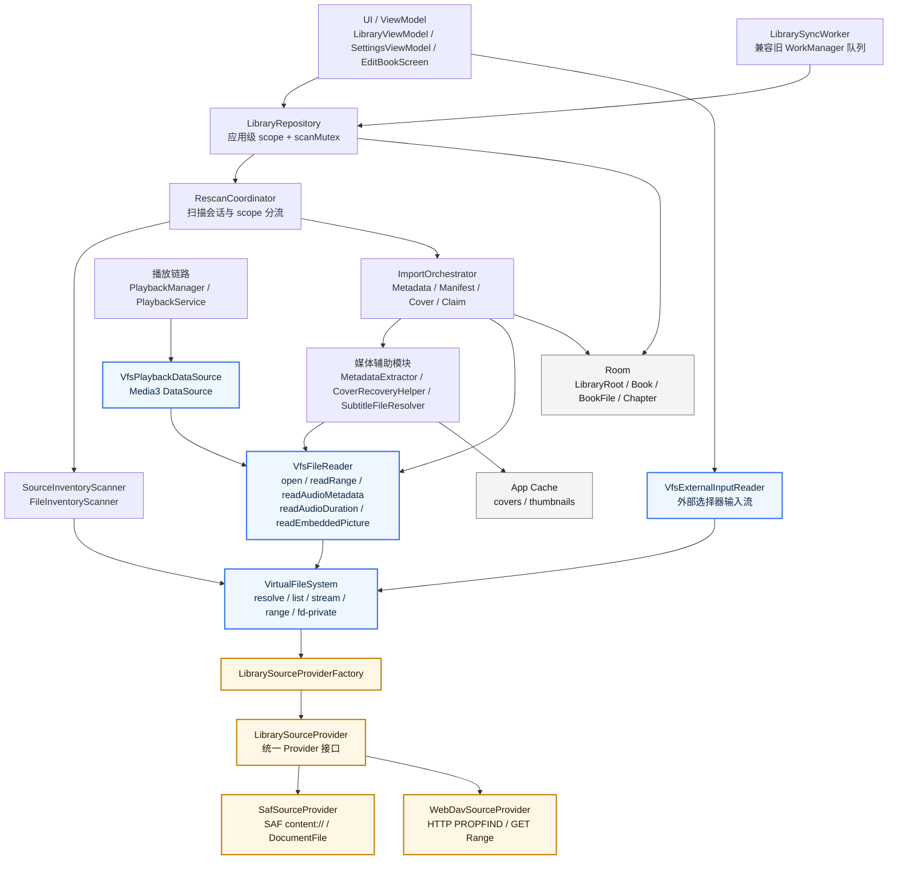
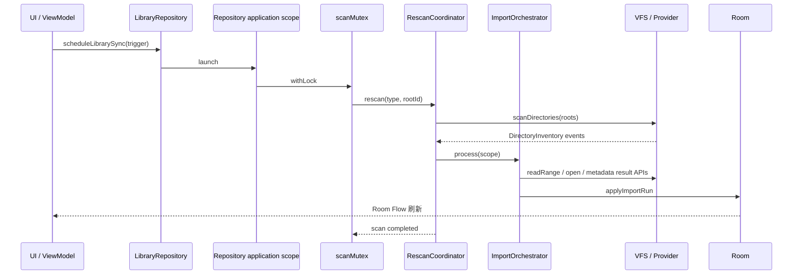
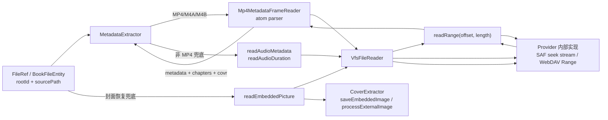
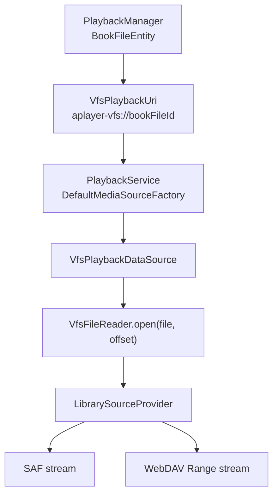

<!-- 注释：新增独立文档，记录当前 VFS 全代理存储模型，避免后续导入、播放、封面恢复再次绕回 provider URI 或 FD。 -->
# VFS 全代理存储架构

<!-- 注释：明确本文范围，避免把它误读成远程协议实现细节文档。 -->
本文档描述当前 APlayer 的文件访问边界：除 `library/source` Provider 层和 `library/vfs` VFS 层外，其余业务模块只通过 VFS 代理获取文件内容、元数据结果或播放流。

核心约束：

- 业务层不直接调用 `ContentResolver.openInputStream` / `openFileDescriptor`。
- 业务层不直接持有 `DocumentFile`、`ParcelFileDescriptor`、Provider 原生 URI。
- MP4/M4A/M4B 元数据和封面统一走 `VfsFileReader.readRange`。
- 非 MP4 旧格式的基础标签/内嵌图兜底由 `VfsFileReader` 返回结构化结果，不把 FD 泄漏给调用方。
- 播放器只持有应用内部 `aplayer-vfs://` 播放地址，真实读流由 `VfsPlaybackDataSource` 进入 VFS。

<!-- 注释：先用一张总览图说明所有文件访问必须穿过 VFS 边界。 -->
## 1. 总体架构

<!-- 注释：解释总览图中的边界层，便于代码审查时快速判断某个调用是否越界。 -->
图中的蓝色节点是 VFS 边界。业务层可以调用这些节点，但不能越过它们直接访问 SAF、WebDAV 或 Provider 原生对象。

橙色节点是 Provider 实现层。这里可以使用具体协议能力，例如 SAF 的 `content://`、`DocumentFile`、`ParcelFileDescriptor`，以及 WebDAV 的 `PROPFIND`、`GET Range`。

<!-- 注释：补充扫描链路，强调扫描已经提升到 Repository 应用级 scope，不再绑定页面生命周期。 -->
## 2. 扫描生命周期

<!-- 注释：明确页面切换不应取消扫描，避免后续把扫描重新绑回 viewModelScope。 -->
扫描由 `LibraryRepository` 的应用级协程队列执行，并通过 `scanMutex` 串行化。UI 只发起扫描请求；页面关闭、切换或重建不应该取消正在进行的扫描。

<!-- 注释：单独画元数据和封面读取，因为这里是此前本地 FD 快路被废除后的关键变化。 -->
## 3. 元数据与封面读取

<!-- 注释：记录 MP4 读取策略，和调试日志字段保持一致。 -->
MP4/M4A/M4B 当前统一使用 `mode=vfs-range`。日志中的 `elapsedMs` 是单文件一次解析耗时，`calls` 是 range 调用次数，`bytes` 是本次解析读取的字节总量。

对于 `purpose=metadata-cover` 的解析，元数据、章节和 `covr` 封面来自同一次 MP4 atom 解析。若没有 `covr`，仍保留原有封面恢复路径继续尝试 sidecar 图像或其他兜底来源。

<!-- 注释：播放链路单独列出，说明 Media3 不接触真实来源 URI。 -->
## 4. 播放读取链路

<!-- 注释：强调播放器队列里的 URI 是内部寻址，不是 provider URI。 -->
播放器队列不保存 SAF 或 WebDAV 原生地址，只保存内部 `aplayer-vfs://` 地址。`VfsPlaybackDataSource` 根据 `bookFileId` 查回 `BookFileEntity`，再用 `rootId + sourcePath` 通过 VFS 打开带偏移的流。

<!-- 注释：用表格把可用 API 与禁止事项写清楚，便于后续开发时对照。 -->
## 5. 边界规则

| 层级 | 可以做什么 | 不应该做什么 |
| --- | --- | --- |
| UI / ViewModel | 调用 Repository、提交用户选择结果、显示 Room Flow 数据 | 直接打开库文件 URI 或持有 Provider 文件对象 |
| Repository / Scanner / Orchestrator | 按 `rootId + sourcePath` 调用 VFS，调度应用级扫描 | 根据来源类型分支去读真实文件 |
| Metadata / Cover / Subtitle / Playback | 调用 `VfsFileReader`、`VfsPlaybackDataSource` 或 `VfsExternalInputReader` | 直接使用 `ContentResolver`、`DocumentFile`、`ParcelFileDescriptor` |
| `library/vfs` | 统一定位、枚举、流式读取、range 读取、结果型本地探测 | 把 FD 或 Provider 原生对象返回给业务层 |
| `library/source` | 实现 SAF/WebDAV/后续来源协议细节 | 泄漏协议对象到业务层 |

<!-- 注释：列出当前核心 API，帮助后续修改时保持同一个入口风格。 -->
## 6. 当前 VFS 入口

- `VfsFileReader.open(file)`：读取完整流，用于 manifest、sidecar、字幕等小文件或顺序读取场景。
- `VfsFileReader.open(file, offset)`：读取带偏移的流，用于播放 seek。
- `VfsFileReader.readRange(file, offset, length)`：读取有界小片段，用于 MP4 atom 元数据/封面解析。
- `VfsFileReader.readAudioMetadata(file)`：读取非 MP4 旧格式基础标签，返回结构化快照。
- `VfsFileReader.readAudioDuration(file)`：只读取 duration，用于 manifest 补时长。
- `VfsFileReader.readEmbeddedPicture(file)`：读取非 MP4 旧格式内嵌图片字节，用于封面恢复兜底。
- `VfsExternalInputReader.openInputStream(uri)`：处理用户从系统选择器传入的外部输入，例如自定义封面。
- `VfsPlaybackDataSource`：Media3 播放读取入口。

<!-- 注释：留下代码审查口径，后续可以直接用 rg 验证是否有人绕过边界。 -->
## 7. 审查口径

除 `app/src/main/java/com/viel/aplayer/library/source` 和 `app/src/main/java/com/viel/aplayer/library/vfs` 外，代码中不应新增以下库文件访问痕迹：

- `contentResolver.openInputStream`
- `contentResolver.openFileDescriptor`
- `DocumentFile`
- `ParcelFileDescriptor`
- `openFileDescriptor(`
- 业务层直接使用来源原生 URI 读取库文件

如果必须接入新的来源能力，应优先扩展 `LibrarySourceProvider` 或 `VfsFileReader` 的结果型 API，而不是让调用方绕过 VFS。
